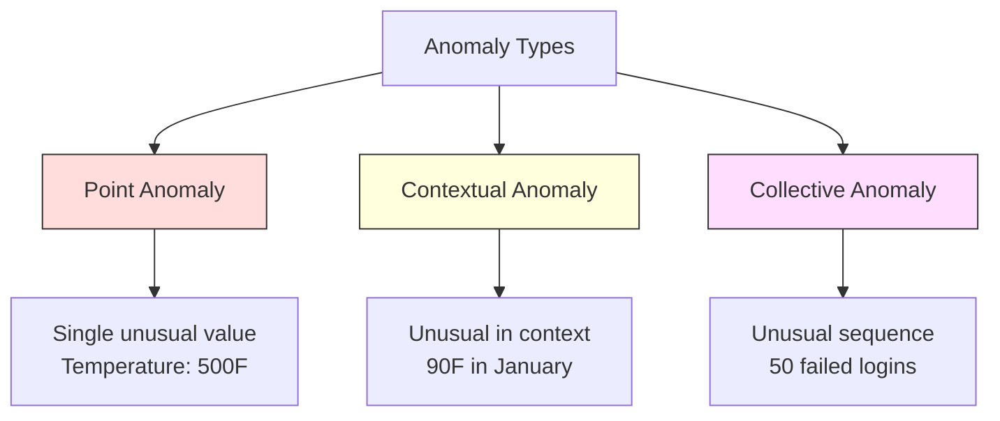
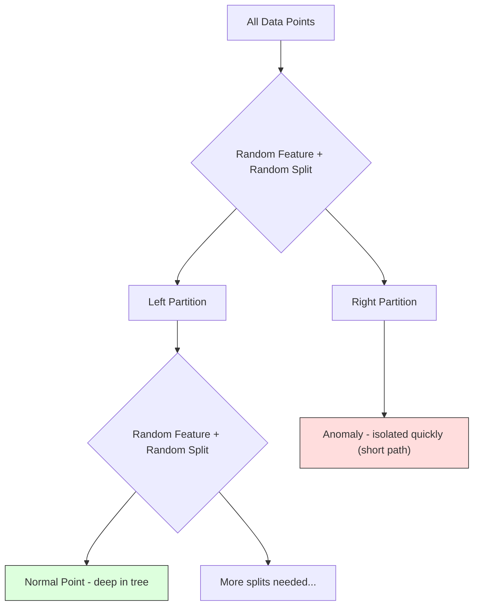
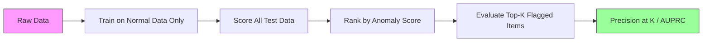

# Anomaly Detection

> Normal is easy to define. Abnormal is whatever doesn't fit.

**Type:** Build
**Language:** Python
**Prerequisites:** Phase 2, Lessons 01-09
**Time:** ~75 minutes

## Learning Objectives

- Implement Z-score, IQR, and Isolation Forest anomaly detection methods from scratch
- Distinguish between point, contextual, and collective anomalies and select the appropriate detection method for each
- Explain why anomaly detection is framed as modeling normal data rather than classifying anomalies
- Compare unsupervised anomaly detection with supervised classification and evaluate the tradeoff between novel anomaly coverage and precision

## The Problem

A credit card is used in New York at 2pm, then in Tokyo at 2:05pm. A factory sensor reads 150 degrees when the normal range is 80-120. A server sends 50,000 requests per second when the daily average is 200.

These are anomalies. Finding them matters. Fraud costs billions. Equipment failures cost downtime. Network intrusions cost data.

The challenge: you rarely have labeled examples of anomalies. Fraud makes up 0.1% of transactions. Equipment failures happen a few times per year. You cannot train a standard classifier because there is almost nothing in the "anomaly" class to learn from. Even if you have some labels, the anomalies you have seen are not the only types you will encounter. Tomorrow's fraud scheme looks different from today's.

Anomaly detection flips the problem. Instead of learning what is abnormal, learn what is normal. Anything that deviates from normal is suspicious. This works without labels, adapts to new types of anomalies, and scales to massive datasets.

## The Concept

### Types of Anomalies

Not all anomalies are the same:

- **Point anomalies.** A single data point that is unusual regardless of context. A temperature reading of 500 degrees. A transaction of $50,000 from an account that normally spends $50.
- **Contextual anomalies.** A data point that is unusual given its context. A temperature of 90 degrees is normal in summer, anomalous in winter. Same value, different context.
- **Collective anomalies.** A sequence of data points that is unusual as a group, even though each individual point might be normal. Five login failures is normal. Fifty in a row is a brute-force attack.

Most methods detect point anomalies. Contextual anomalies need time or location features. Collective anomalies need sequence-aware methods.



### The Unsupervised Framing

In standard classification, you have labels for both classes. In anomaly detection, you typically have one of three situations:

1. **Fully unsupervised.** No labels at all. You fit the detector on all data and hope anomalies are rare enough not to corrupt the "normal" model.
2. **Semi-supervised.** You have a clean dataset of normal data only. You fit on this clean set and score everything else. This is the strongest setup when possible.
3. **Weakly supervised.** You have a few labeled anomalies. Use them for evaluation, not training. Train unsupervised, then measure precision/recall on the labeled subset.

The key insight: anomaly detection is fundamentally different from classification. You are modeling the distribution of normal data, not the decision boundary between two classes.

### Supervised vs Unsupervised: The Tradeoff

If you do have labeled anomalies, should you use them for training (supervised classification) or for evaluation only (unsupervised detection)?

**Supervised (treat as classification):**
- Catches the exact types of anomalies you have seen before
- Higher precision on known anomaly types
- Misses novel anomaly types entirely
- Requires retraining when new anomaly types emerge
- Needs enough anomaly examples (often too few)

**Unsupervised (model normal, flag deviations):**
- Catches any deviation from normal, including novel types
- Does not require labeled anomalies
- Higher false positive rate (not everything unusual is bad)
- More robust to distribution shift

In practice, the best systems combine both: unsupervised detection for broad coverage, supervised models for known high-priority anomaly types, and human review for ambiguous cases.

### Z-Score Method

The simplest approach. Compute the mean and standard deviation of each feature. Flag any point more than k standard deviations from the mean.

```text
z_score = (x - mean) / std
anomaly if |z_score| > threshold
```

The default threshold is 3.0 (99.7% of normal data falls within 3 standard deviations for a Gaussian distribution).

**Strengths:** Simple. Fast. Interpretable ("this value is 4.5 standard deviations from normal").

**Weaknesses:** Assumes data is normally distributed. Sensitive to outliers in the training data (the outliers shift the mean and inflate the std, making them harder to detect). Fails on multimodal distributions.

**When it works well:** Single-feature monitoring where data is roughly bell-shaped. Server response times, manufacturing tolerances, sensor readings with stable baselines.

**When it fails:** Multi-cluster data (two office locations with different baseline temperatures), skewed data (transaction amounts where $1000 is rare but not anomalous), data with outliers in the training set.

### IQR Method

More robust than Z-score. Uses the interquartile range instead of mean and standard deviation.

```
Q1 = 25th percentile
Q3 = 75th percentile
IQR = Q3 - Q1
lower_bound = Q1 - factor * IQR
upper_bound = Q3 + factor * IQR
anomaly if x < lower_bound or x > upper_bound
```

The default factor is 1.5.

**Strengths:** Robust to outliers (percentiles are not affected by extreme values). Works on skewed distributions. No normality assumption.

**Weaknesses:** Univariate only (applies per feature independently). Cannot detect anomalies that are unusual only when features are considered together (a point might be normal in each feature individually but anomalous in the joint space).

**Practical note:** The 1.5 factor in IQR corresponds to the whiskers in a box plot. Points outside the whiskers are potential outliers. Using 3.0 instead of 1.5 makes the detector more conservative (fewer flags, fewer false positives). The right factor depends on your tolerance for false alarms.

### Isolation Forest

The key insight: anomalies are few and different. In a random partitioning of the data, anomalies are easier to isolate -- they need fewer random splits to be separated from the rest.



**How it works:**
1. Build many random trees (an isolation forest)
2. At each node, pick a random feature and a random split value between the feature's min and max
3. Keep splitting until every point is isolated (in its own leaf)
4. Anomalies have shorter average path lengths across all trees

**Why it works:** Normal points live in dense regions. Many random splits are needed to isolate one from its neighbors. Anomalies live in sparse regions. One or two random splits are enough to isolate them.

The anomaly score is based on the average path length across all trees, normalized by the expected path length of a random binary search tree:

```
score(x) = 2^(-average_path_length(x) / c(n))
```

Where `c(n)` is the expected path length for n samples. Score near 1 means anomaly. Score near 0.5 means normal. Score near 0 means very normal (deep in dense clusters).

**Strengths:** No distribution assumptions. Works in high dimensions. Scales well (sublinear in sample size because each tree uses a subsample). Handles mixed feature types.

**Weaknesses:** Struggles with anomalies in dense regions (masking effect). Random splitting is less effective when many features are irrelevant.

**Key hyperparameters:**
- `n_estimators`: Number of trees. 100 is usually enough. More trees give more stable scores but slower computation.
- `max_samples`: Number of samples per tree. 256 is the default in the original paper. Smaller values make individual trees less accurate but increase diversity. The subsampling is what makes Isolation Forest fast -- each tree sees a small fraction of the data.
- `contamination`: Expected fraction of anomalies. Used only for setting the threshold. Does not affect the scores themselves.

### Local Outlier Factor (LOF)

LOF compares the local density around a point to the density around its neighbors. A point in a sparse region surrounded by dense regions is anomalous.

**How it works:**
1. For each point, find its k nearest neighbors
2. Compute the local reachability density (how dense is the neighborhood)
3. Compare each point's density to its neighbors' densities
4. If a point has much lower density than its neighbors, it is an outlier

**LOF score:**
- LOF close to 1.0 means similar density as neighbors (normal)
- LOF greater than 1.0 means lower density than neighbors (potentially anomalous)
- LOF much greater than 1.0 (e.g., 2.0+) means significantly lower density (likely anomaly)

The "local" part is critical. Consider a dataset with two clusters: a dense cluster of 1000 points and a sparse cluster of 50 points. A point on the edge of the sparse cluster is not globally unusual -- it has 50 neighbors. But it is locally unusual if its immediate neighbors are denser than it is. LOF captures this nuance that global methods miss.

**Strengths:** Detects local anomalies (points that are unusual in their neighborhood, even if they are not globally unusual). Works on clusters of different densities.

**Weaknesses:** Slow on large datasets (O(n^2) for naive implementation). Sensitive to the choice of k. Does not work well in very high dimensions (curse of dimensionality affects distance calculations).

### Comparison

| Method | Assumptions | Speed | Handles High Dims | Detects Local Anomalies |
|--------|------------|-------|-------------------|------------------------|
| Z-score | Normal distribution | Very fast | Yes (per feature) | No |
| IQR | None (per feature) | Very fast | Yes (per feature) | No |
| Isolation Forest | None | Fast | Yes | Partially |
| LOF | Distance is meaningful | Slow | Poorly | Yes |

### Evaluation Challenges

Evaluating anomaly detectors is harder than evaluating classifiers:

- **Extreme class imbalance.** With 0.1% anomalies, predicting "normal" for everything gives 99.9% accuracy. Accuracy is useless.
- **AUROC is misleading.** With heavy imbalance, AUROC can look good even when the model misses most anomalies at practical thresholds.
- **Better metrics:** Precision@k (of the top k flagged items, how many are real anomalies), AUPRC (area under precision-recall curve), and recall at a fixed false positive rate.



### Anomaly Detection Pipeline

In practice, anomaly detection follows this workflow:

1. **Collect baseline data.** Ideally, a period where you know there are no (or very few) anomalies.
2. **Feature engineering.** Raw features plus derived features (rolling statistics, time features, ratios).
3. **Train the detector.** Fit on the baseline data. The model learns what "normal" looks like.
4. **Score new data.** Each new observation gets an anomaly score.
5. **Threshold selection.** Choose the score cutoff. This is a business decision: higher threshold means fewer false alarms but more missed anomalies.
6. **Alert and investigate.** Flagged points go to human review or automated response.
7. **Feedback collection.** Record whether flagged items were true anomalies or false alarms. Use this data to evaluate the detector and tune the threshold over time.

The pipeline is never "done." Data distributions shift, new anomaly types emerge, and thresholds need adjustment. Treat anomaly detection as a living system, not a one-time model.


## Further Reading

- [Liu et al., Isolation Forest (2008)](https://cs.nju.edu.cn/zhouzh/zhouzh.files/publication/icdm08b.pdf) -- the original Isolation Forest paper
- [Breunig et al., LOF: Identifying Density-Based Local Outliers (2000)](https://dl.acm.org/doi/10.1145/342009.335388) -- the original LOF paper
- [scikit-learn Outlier Detection docs](https://scikit-learn.org/stable/modules/outlier_detection.html) -- overview of all sklearn anomaly detectors
- [Chandola et al., Anomaly Detection: A Survey (2009)](https://dl.acm.org/doi/10.1145/1541880.1541882) -- comprehensive survey of anomaly detection methods
- [Goldstein and Uchida, A Comparative Evaluation of Unsupervised Anomaly Detection Algorithms (2016)](https://journals.plos.org/plosone/article?id=10.1371/journal.pone.0152173) -- empirical comparison of 10 methods on real datasets
