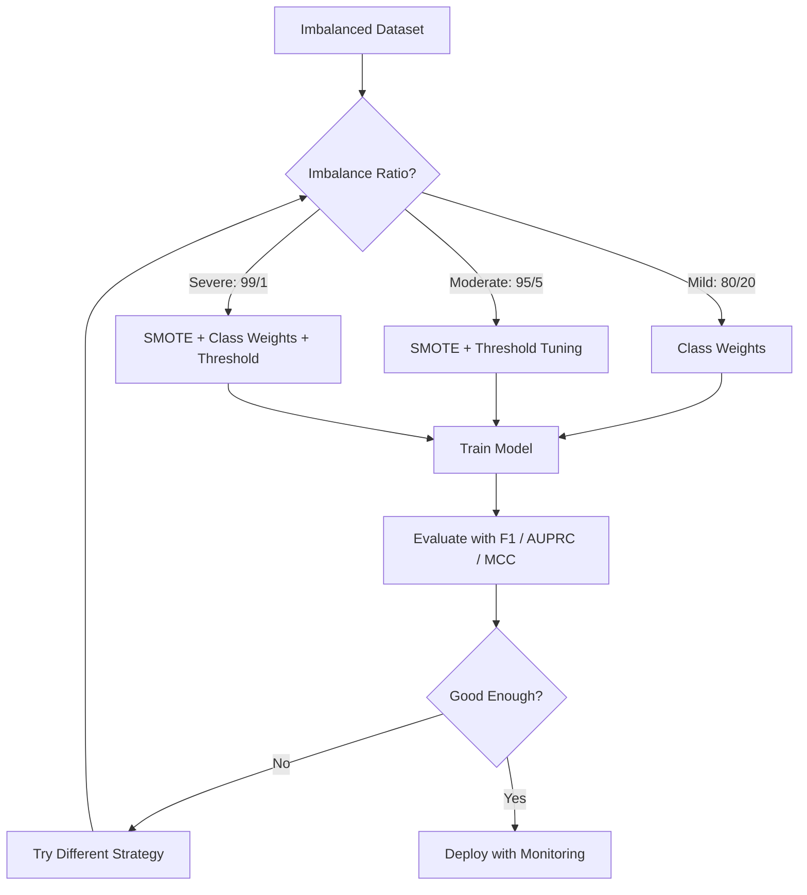
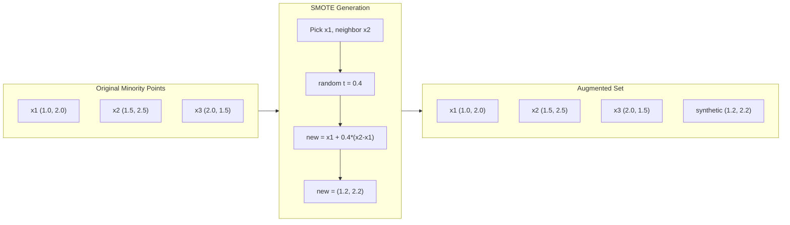
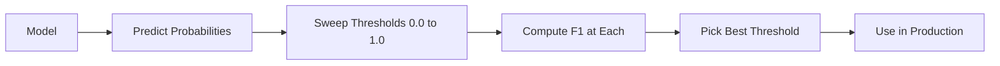
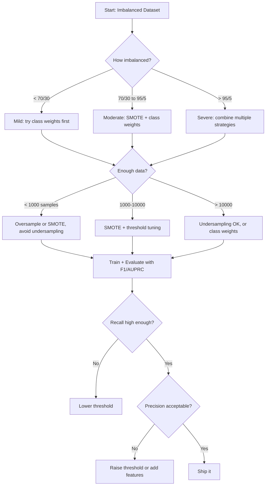

# Handling Imbalanced Data

> When 99% of your data is "normal," accuracy is a lie.

**Type:** Build
**Language:** Python
**Prerequisites:** Phase 2, Lessons 01-09 (especially evaluation metrics)
**Time:** ~90 minutes

## Learning Objectives

- Implement SMOTE from scratch and explain how synthetic oversampling differs from random duplication
- Evaluate imbalanced classifiers using F1, AUPRC, and Matthews Correlation Coefficient instead of accuracy
- Compare class weighting, threshold tuning, and resampling strategies and select the right approach for a given imbalance ratio
- Build a complete imbalanced data pipeline that combines SMOTE, class weights, and threshold optimization

## The Problem

You build a fraud detection model. It gets 99.9% accuracy. You celebrate. Then you realize it predicts "not fraud" for every single transaction.

This is not a bug. It is the rational thing to do when only 0.1% of transactions are fraudulent. The model learns that always guessing the majority class minimizes overall error. It is technically correct and completely useless.

This happens everywhere real classification matters. Disease diagnosis: 1% positive rate. Network intrusion: 0.01% attacks. Manufacturing defects: 0.5% defective. Spam filtering: 20% spam. Churn prediction: 5% churners. The more consequential the minority class, the rarer it tends to be.

Accuracy fails because it treats all correct predictions equally. Correctly labeling a legitimate transaction and correctly catching fraud both count as one point of accuracy. But catching fraud is the entire reason the model exists. We need metrics, techniques, and training strategies that force the model to pay attention to the rare but important class.

## The Concept

### Why Accuracy Fails

Consider a dataset with 1000 samples: 990 negative, 10 positive. A model that always predicts negative:

|  | Predicted Positive | Predicted Negative |
|--|---|---|
| Actually Positive | 0 (TP) | 10 (FN) |
| Actually Negative | 0 (FP) | 990 (TN) |

Accuracy = (0 + 990) / 1000 = 99.0%

The model catches zero fraud. Zero disease. Zero defects. But accuracy says 99%. This is why accuracy is dangerous for imbalanced problems.

### Better Metrics

**Precision** = TP / (TP + FP). Of everything flagged as positive, how many actually are? High precision means few false alarms.

**Recall** = TP / (TP + FN). Of everything actually positive, how many did we catch? High recall means few missed positives.

**F1 Score** = 2 * precision * recall / (precision + recall). The harmonic mean. Penalizes extreme imbalance between precision and recall more than the arithmetic mean would.

**F-beta Score** = (1 + beta^2) * precision * recall / (beta^2 * precision + recall). When beta > 1, recall matters more. When beta < 1, precision matters more. F2 is common in fraud detection (missing fraud is worse than a false alarm).

**AUPRC** (Area Under Precision-Recall Curve). Like AUC-ROC but more informative for imbalanced data. A random classifier has AUPRC equal to the positive class rate (not 0.5 like ROC). This makes improvements easier to see.

**Matthews Correlation Coefficient** = (TP * TN - FP * FN) / sqrt((TP+FP)(TP+FN)(TN+FP)(TN+FN)). Ranges from -1 to +1. Only gives a high score when the model does well on both classes. Balanced even when classes are very different sizes.

For the "always predict negative" model above: precision = 0/0 (undefined, often set to 0), recall = 0/10 = 0, F1 = 0, MCC = 0. These metrics correctly identify the model as worthless.

### The Imbalanced Data Pipeline



### SMOTE: Synthetic Minority Oversampling Technique

Random oversampling duplicates existing minority samples. This works but risks overfitting because the model sees identical points repeatedly.

SMOTE creates new synthetic minority samples that are plausible but not copies. The algorithm:

1. For each minority sample x, find its k nearest neighbors among other minority samples
2. Pick one neighbor at random
3. Create a new sample on the line segment between x and that neighbor

The formula: `new_sample = x + random(0, 1) * (neighbor - x)`

This interpolates between real minority points, creating samples in the same region of feature space without just copying existing data.



### Sampling Strategies Compared

**Random Oversampling**: duplicate minority samples to match majority count.
- Pros: simple, no information loss
- Cons: exact duplicates cause overfitting, increases training time

**Random Undersampling**: remove majority samples to match minority count.
- Pros: fast training, simple
- Cons: throws away potentially useful majority data, higher variance

**SMOTE**: create synthetic minority samples via interpolation.
- Pros: generates new data points, reduces overfitting compared to random oversampling
- Cons: can create noisy samples near the decision boundary, does not account for majority class distribution

| Strategy | Data Changed | Risk | When to Use |
|----------|-------------|------|-------------|
| Oversample | Minority duplicated | Overfitting | Small datasets, moderate imbalance |
| Undersample | Majority removed | Information loss | Large datasets, want fast training |
| SMOTE | Synthetic minority added | Boundary noise | Moderate imbalance, enough minority samples for k-NN |

### Class Weights

Instead of changing the data, change how the model treats errors. Assign higher weight to misclassifying the minority class.

For a binary problem with 950 negative and 50 positive samples:
- Weight for negative class = n_samples / (2 * n_negative) = 1000 / (2 * 950) = 0.526
- Weight for positive class = n_samples / (2 * n_positive) = 1000 / (2 * 50) = 10.0

The positive class gets 19x the weight. Misclassifying one positive sample costs as much as misclassifying 19 negative samples. The model is forced to pay attention to the minority class.

In logistic regression, this modifies the loss function:

```
weighted_loss = -sum(w_i * [y_i * log(p_i) + (1-y_i) * log(1-p_i)])
```

where w_i depends on the class of sample i.

Class weights are mathematically equivalent to oversampling in expectation, but without creating new data points. This makes them faster and avoids the overfitting risk of duplicated samples.

### Threshold Tuning

Most classifiers output a probability. The default threshold is 0.5: if P(positive) >= 0.5, predict positive. But 0.5 is arbitrary. When classes are imbalanced, the optimal threshold is usually much lower.

The process:
1. Train a model
2. Get predicted probabilities on the validation set
3. Sweep thresholds from 0.0 to 1.0
4. Compute F1 (or your chosen metric) at each threshold
5. Pick the threshold that maximizes your metric



A model might output P(fraud) = 0.15 for a fraudulent transaction. At threshold 0.5, this is classified as not fraud. At threshold 0.10, it is correctly caught. The probability calibration matters less than the ranking -- as long as fraud gets higher probabilities than non-fraud, there exists a threshold that separates them.

### Cost-Sensitive Learning

Generalization of class weights. Instead of uniform costs, assign specific misclassification costs:

| | Predict Positive | Predict Negative |
|--|---|---|
| Actually Positive | 0 (correct) | C_FN = 100 |
| Actually Negative | C_FP = 1 | 0 (correct) |

Missing a fraudulent transaction (FN) costs 100x more than a false alarm (FP). The model optimizes for total cost, not total error count.

This is the most principled approach when you can estimate real-world costs. A missed cancer diagnosis has a very different cost than a false alarm that leads to an extra biopsy. Making these costs explicit forces the right tradeoffs.

### Decision Flowchart




## Further Reading

- [SMOTE: Synthetic Minority Over-sampling Technique (Chawla et al., 2002)](https://arxiv.org/abs/1106.1813) -- the original SMOTE paper, still the most cited work on imbalanced learning
- [Learning from Imbalanced Data (He & Garcia, 2009)](https://ieeexplore.ieee.org/document/5128907) -- comprehensive survey covering sampling, cost-sensitive, and algorithmic approaches
- [imbalanced-learn documentation](https://imbalanced-learn.org/stable/) -- Python library with SMOTE variants, undersampling strategies, and pipeline integration
- [The Precision-Recall Plot Is More Informative than the ROC Plot (Saito & Rehmsmeier, 2015)](https://journals.plos.org/plosone/article?id=10.1371/journal.pone.0118432) -- when and why to prefer PR curves over ROC curves for imbalanced problems
