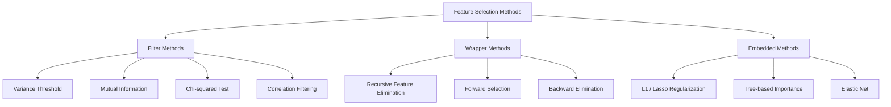
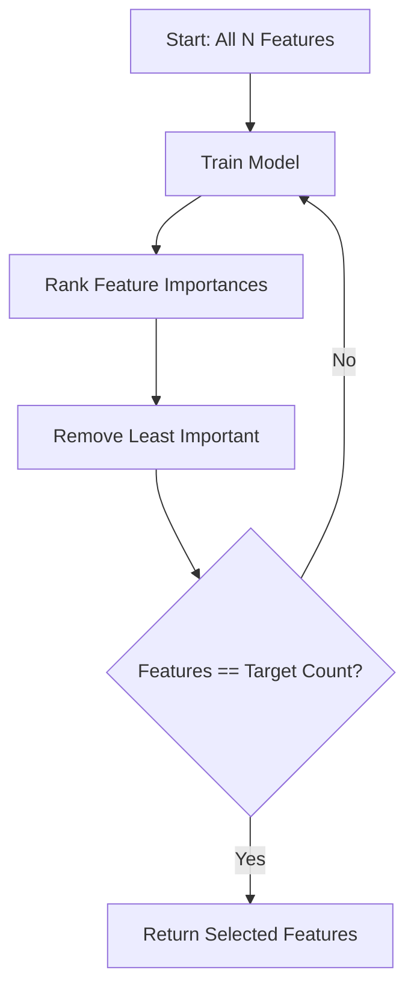
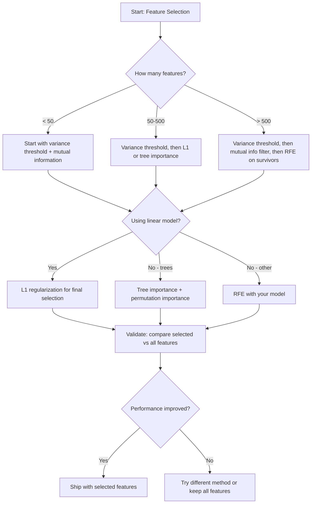

# Feature Selection

> More features is not better. The right features is better.

**Type:** Build
**Languages:** Python
**Language:** Python
**Prerequisites:** Phase 2, Lessons 01-09, 08 (feature engineering)
**Time:** ~75 minutes

## Learning Objectives

- Implement filter methods (variance threshold, mutual information, chi-squared) and wrapper methods (RFE, forward selection) from scratch
- Explain why mutual information captures nonlinear feature-target relationships that correlation misses
- Compare L1 regularization (embedded selection) with RFE (wrapper selection) and evaluate their computational tradeoffs
- Build a feature selection pipeline that combines multiple methods and demonstrate improved generalization on held-out data

## The Problem

You have 500 features. Your model trains slowly, overfits constantly, and nobody can explain what it learned. You add more features hoping to improve performance. It gets worse.

This is the curse of dimensionality in action. As the number of features grows, the volume of the feature space explodes. Data points become sparse. Distances between points converge. The model needs exponentially more data to find real patterns. Noise features drown out signal features. Overfitting becomes the default.

Feature selection is the antidote. Strip away the noise. Remove the redundancy. Keep the features that carry actual information about the target. The result: faster training, better generalization, and models you can actually explain.

The goal is not to use all available information. It is to use the right information.

## The Concept

### Three Categories of Feature Selection

Every feature selection method falls into one of three categories:



**Filter methods** score each feature independently using a statistical measure. They do not use a model. Fast, but they miss feature interactions.

**Wrapper methods** train a model to evaluate feature subsets. They use model performance as the score. Better results, but expensive because they retrain the model many times.

**Embedded methods** select features as part of model training. L1 regularization drives weights to zero. Decision trees split on the most useful features. Selection happens during fitting, not as a separate step.

### Variance Threshold

The simplest filter. If a feature barely varies across samples, it carries almost no information.

Consider a feature that is 0.0 for 999 out of 1000 samples. Its variance is near zero. No model can use it to distinguish between classes. Remove it.

```
variance(x) = mean((x - mean(x))^2)
```

Set a threshold (e.g., 0.01). Drop every feature with variance below it. This removes constant or near-constant features without looking at the target variable at all.

When to use it: as a preprocessing step before other methods. It catches obviously useless features at near-zero cost.

Limitation: a feature can have high variance and still be pure noise. Variance threshold is necessary but not sufficient.

### Mutual Information

Mutual information measures how much knowing the value of feature X reduces uncertainty about target Y.

```
I(X; Y) = sum_x sum_y p(x, y) * log(p(x, y) / (p(x) * p(y)))
```

If X and Y are independent, p(x, y) = p(x) * p(y), so the log term is zero and I(X; Y) = 0. The more X tells you about Y, the higher the mutual information.

Key advantage over correlation: mutual information captures nonlinear relationships. A feature might have zero correlation with the target but high mutual information because the relationship is quadratic or periodic.

For continuous features, discretize into bins first (histogram-based estimation). The number of bins affects the estimate -- too few bins lose information, too many bins add noise. A common choice: sqrt(n) bins or Sturges' rule (1 + log2(n)).


### Recursive Feature Elimination (RFE)

RFE is a wrapper method. It uses a model's own feature importance to iteratively prune:

1. Train the model with all features
2. Rank features by importance (coefficients for linear models, impurity reduction for trees)
3. Remove the least important feature(s)
4. Repeat until the desired number of features remains



RFE considers feature interactions because the model sees all remaining features together. Removing one feature changes the importance of others. This makes it more thorough than filter methods.

The cost: you train the model N - target times. With 500 features and a target of 10, that is 490 training runs. For expensive models, this is slow. You can speed it up by removing multiple features per step (e.g., remove the bottom 10% each round).

### L1 (Lasso) Regularization

L1 regularization adds the absolute value of weights to the loss function:

```
loss = prediction_error + alpha * sum(|w_i|)
```

The alpha parameter controls how aggressively features are pruned. Higher alpha means more weights go to exactly zero.

Why exactly zero? The L1 penalty creates a diamond-shaped constraint region in weight space. The optimal solution tends to land at a corner of this diamond, where one or more weights are zero. L2 regularization (ridge) creates a circular constraint where weights shrink but rarely hit zero.

This is embedded feature selection: the model learns during training which features to ignore. Features with zero weight are effectively removed.

Advantages: single training run, handles correlated features (picks one and zeros the others), built into most linear model implementations.

Limitation: only works for linear models. Cannot capture nonlinear feature importance.

### Tree-Based Feature Importance

Decision trees and their ensembles (random forests, gradient boosting) naturally rank features. Every split reduces impurity (Gini or entropy for classification, variance for regression). Features that produce larger impurity reductions are more important.

For a random forest with T trees:

```
importance(feature_j) = (1/T) * sum over all trees of
    sum over all nodes splitting on feature_j of
        (n_samples * impurity_decrease)
```

This gives a normalized importance score for each feature. It handles nonlinear relationships and feature interactions automatically.

Caution: tree-based importance is biased toward features with many unique values (high cardinality). A random ID column will appear important because it perfectly splits every sample. Use permutation importance as a sanity check.

### Permutation Importance

A model-agnostic method:

1. Train the model and record baseline performance on validation data
2. For each feature: shuffle its values randomly, measure the drop in performance
3. The bigger the drop, the more important the feature

If shuffling a feature does not hurt performance, the model does not depend on it. If performance collapses, that feature is critical.

Permutation importance avoids the cardinality bias of tree-based importance. But it is slow: one full evaluation per feature, repeated multiple times for stability.

### Comparison Table

| Method | Type | Speed | Nonlinear | Feature Interactions |
|--------|------|-------|-----------|---------------------|
| Variance threshold | Filter | Very fast | No | No |
| Mutual information | Filter | Fast | Yes | No |
| Correlation filter | Filter | Fast | No | No |
| RFE | Wrapper | Slow | Depends on model | Yes |
| L1 / Lasso | Embedded | Fast | No (linear) | No |
| Tree importance | Embedded | Medium | Yes | Yes |
| Permutation importance | Model-agnostic | Slow | Yes | Yes |

### Decision Flowchart




## Build It

Reconstruct **Feature Selection** by following `make_feature_selection_data` on the two-element input [1.0, 2.0]. Run `python3 main.py` and verify that the printed shape/value follows the stated formula, and the zero case does not produce an unexplained finite substitute for an undefined quantity.

## Use It

Call `make_feature_selection_data` from a small caller with the two-element input [1.0, 2.0]. Compare its result with the demo output, and record the input contract and the one field a downstream user should rely on.

## Ship It

Hand off `outputs/skill-feature-selector.md` with the command `python3 main.py`, the accepted input shape (the two-element input [1.0, 2.0]), the expected observable result, and a failure note for malformed inputs.

## Further Reading

- [An Introduction to Variable and Feature Selection (Guyon & Elisseeff, 2003)](https://jmlr.org/papers/v3/guyon03a.html) -- the foundational survey on feature selection methods, still widely referenced
- [scikit-learn Feature Selection Guide](https://scikit-learn.org/stable/modules/feature_selection.html) -- practical reference for filter, wrapper, and embedded methods with code examples
- [Stability Selection (Meinshausen & Buhlmann, 2010)](https://arxiv.org/abs/0809.2932) -- combines subsampling with feature selection for robust, reproducible results
- [Beware Default Random Forest Importances (Strobl et al., 2007)](https://bmcbioinformatics.biomedcentral.com/articles/10.1186/1471-2105-8-25) -- demonstrates the cardinality bias in tree-based importance and proposes conditional importance as an alternative

## Exercises

Work from the smallest fixture that the Feature Selection demo already understands, then make one deliberate change and record what moved.

1. **Run the smallest fixture.** From `code/`, run `python3 main.py` using the two-element input [1.0, 2.0]. Follow `make_feature_selection_data`, `variance_threshold`, `discretize`. Expect the printed shape/value follows the stated formula, and the zero case does not produce an unexplained finite substitute for an undefined quantity; capture the first printed shape, metric, status, or summary field and state which part supports **Implement filter methods (variance threshold, mutual information, chi-squared) and wrapper methods (RFE, forward selection) from scratch**.
2. **Perturb one field.** Repeat the command after changing only the second input value: use the same input with the second value changed to 3.0. Predict the direction of the change, then compare the two output values. Explain why **Explain why mutual information captures nonlinear feature-target relationships that correlation misses** says the other inputs should stay fixed.
3. **Check the failure boundary.** Feed the implementation the zero vector [0.0, 0.0]. Before running it, write down whether the relevant function should return an empty value, a zero-sized result, or a validation error. Check the observed status against **Compare L1 regularization (embedded selection) with RFE (wrapper selection) and evaluate their computational tradeoffs** and record the exception text if the code rejects the case.
4. **Make the result repeatable.** Open `outputs/skill-feature-selector.md` and add a worked example using the two-element input [1.0, 2.0]. Include the input contract, one expected output field, and a named acceptance check for **Build a feature selection pipeline that combines multiple methods and demonstrate improved generalization on held-out data**; note what the demo cannot establish.

## Reference Solution

A checkable result for **Feature Selection** should contain:

- the `python3 main.py` output for the two-element input [1.0, 2.0], with `make_feature_selection_data`, `variance_threshold`, `discretize` traced to the value or shape that supports **Implement filter methods (variance threshold, mutual information, chi-squared) and wrapper methods (RFE, forward selection) from scratch**;
- a before/after comparison for the second input value, where the same input with the second value changed to 3.0 changes the observation in the direction predicted by **Explain why mutual information captures nonlinear feature-target relationships that correlation misses**;
- a recorded result for the zero vector [0.0, 0.0] that matches the implementation’s validation or empty-result contract and explains the evidence for **Compare L1 regularization (embedded selection) with RFE (wrapper selection) and evaluate their computational tradeoffs**; and
- an updated `outputs/skill-feature-selector.md` example with a concrete input, expected output field, and acceptance check tied to **Build a feature selection pipeline that combines multiple methods and demonstrate improved generalization on held-out data**.

Run the lesson tests after the demo. If the boundary behaves differently from the prediction, keep the actual exception or output and explain the implementation path that produced it.
