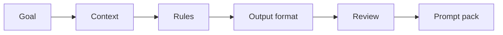

# Hands-on Prompt Clinic

> Prompt training becomes useful when people leave with reusable prompts, review habits, and a clear sense of what must be checked by a human.

**Type:** Build
**Languages:** Python
**Prerequisites:** Phase 11 Lesson 01 (Prompt Engineering), Phase 11 Lesson 03 (Structured Outputs)
**Time:** ~45 minutes
**Capability:** Foundation - Personal AI Productivity and Applied Prompting

## Learning Objectives

- Diagnose weak prompts by goal, audience, context, constraints, and evidence
- Build a small prompt-clinic planner in Python
- Convert vague requests into reusable prompt briefs
- Choose review controls for AI outputs
- Explain when prompting is awareness training, team practice, or a guided pilot

## The Problem

Many people know that better prompts create better outputs, but they still ask for vague summaries, accept confident mistakes, and repeat the same prompt work manually. A prompt clinic gives teams a shared way to improve prompts together.

## The Concept

A good prompt is a work contract. It states the goal, audience, context, constraints, source material, and output format. The clinic adds review discipline: every output needs a quality check that fits the risk of the task.

### Signals to Look For

- vague goal
- missing audience
- weak constraint
- no example

### Controls to Teach

- prompt brief
- iteration log
- output rubric
- source check

### Target Roles

- All roles
- Corporate Functions
- Project Management
- Consulting

## Use It

Use the artifact in enablement sessions, brown bags, and team retros. The goal is not to memorize prompt formulas. The goal is to make good prompting repeatable and reviewable.

## Reusable Artifact

Prompt clinic review sheet.

The template in `outputs/prompt-clinic-review-sheet.md` can be used to collect before and after prompts, review comments, and reusable prompt patterns.

## Key Takeaways

- Prompt quality depends on task framing, not magic wording.
- Output review is part of the prompt workflow.
- Teams should turn good prompts into maintained assets.
- The best prompt clinic uses real work examples.
