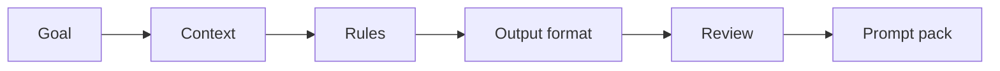

# Hands-on Prompt Clinic

> Prompt training becomes useful when people leave with reusable prompts, review habits, and a clear sense of what must be checked by a human.

**Type:** Build
**Languages:** Python
**Prerequisites:** Phase 11 Lesson 01 (Prompt Engineering), Phase 11 Lesson 03 (Structured Outputs)
**Time:** ~45 minutes
**Capability:** Foundation - Personal AI Productivity and Applied Prompting

## Learning Objectives

- Diagnose weak prompts by goal, audience, context, constraints, and evidence
- Build a small prompt-clinic planner in Python
- Convert vague requests into reusable prompt briefs
- Choose review controls for AI outputs
- Explain when prompting is awareness training, team practice, or a guided pilot

## The Problem

Many people know that better prompts create better outputs, but they still ask for vague summaries, accept confident mistakes, and repeat the same prompt work manually. A prompt clinic gives teams a shared way to improve prompts together.

## The Concept

A good prompt is a work contract. It states the goal, audience, context, constraints, source material, and output format. The clinic adds review discipline: every output needs a quality check that fits the risk of the task.

### Signals to Look For

- vague goal
- missing audience
- weak constraint
- no example

### Controls to Teach

- prompt brief
- iteration log
- output rubric
- source check

### Target Roles

- All roles
- Corporate Functions
- Project Management
- Consulting

## Use It

Use the artifact in enablement sessions, brown bags, and team retros. The goal is not to memorize prompt formulas. The goal is to make good prompting repeatable and reviewable.

## Reusable Artifact

Prompt clinic review sheet.

The template in `outputs/prompt-clinic-review-sheet.md` can be used to collect before and after prompts, review comments, and reusable prompt patterns.

## Key Takeaways

- Prompt quality depends on task framing, not magic wording.
- Output review is part of the prompt workflow.
- Teams should turn good prompts into maintained assets.
- The best prompt clinic uses real work examples.

## Build It

Reconstruct **Hands-on Prompt Clinic** by following `Scenario` on the text "red fox". Run `python3 main.py` and verify that the tokenizer/retriever reports zero or a clear empty-input result, rather than borrowing a result from the previous text.

## Ship It

Hand off `outputs/prompt-clinic-review-sheet.md` with the command `python3 main.py`, the accepted input shape (the text "red fox"), the expected observable result, and a failure note for malformed inputs.

## Exercises

Use `Scenario` as the trace: start from the text "red fox", keep the raw output, and tie each observation to a named objective.

1. **Reproduce the reference path.** From `code/`, run `python3 main.py` using the text "red fox". Follow `Scenario`, `Recommendation`, `normalize`. Expect the tokenizer/retriever reports zero or a clear empty-input result, rather than borrowing a result from the previous text; capture the first printed shape, metric, status, or summary field and state which part supports **Diagnose weak prompts by goal, audience, context, constraints, and evidence**.
2. **Vary one named input.** Repeat the command after changing only the input text: use the text "red fox runs". Predict the direction of the change, then compare the two output values. Explain why **Build a small prompt-clinic planner in Python** says the other inputs should stay fixed.
3. **Probe the empty case.** Feed the implementation an empty string. Before running it, write down whether the relevant function should return an empty value, a zero-sized result, or a validation error. Check the observed status against **Convert vague requests into reusable prompt briefs** and record the exception text if the code rejects the case.
4. **Package a usable handoff.** Open `outputs/prompt-clinic-review-sheet.md` and add a worked example using the text "red fox". Include the input contract, one expected output field, and a named acceptance check for **Choose review controls for AI outputs**; note what the demo cannot establish.

## Reference Solution

A checkable result for **Hands-on Prompt Clinic** should contain:

- the `python3 main.py` output for the text "red fox", with `Scenario`, `Recommendation`, `normalize` traced to the value or shape that supports **Diagnose weak prompts by goal, audience, context, constraints, and evidence**;
- a before/after comparison for the input text, where the text "red fox runs" changes the observation in the direction predicted by **Build a small prompt-clinic planner in Python**;
- a recorded result for an empty string that matches the implementation’s validation or empty-result contract and explains the evidence for **Convert vague requests into reusable prompt briefs**; and
- an updated `outputs/prompt-clinic-review-sheet.md` example with a concrete input, expected output field, and acceptance check tied to **Choose review controls for AI outputs**.

Run the lesson tests after the demo. If the boundary behaves differently from the prediction, keep the actual exception or output and explain the implementation path that produced it.
