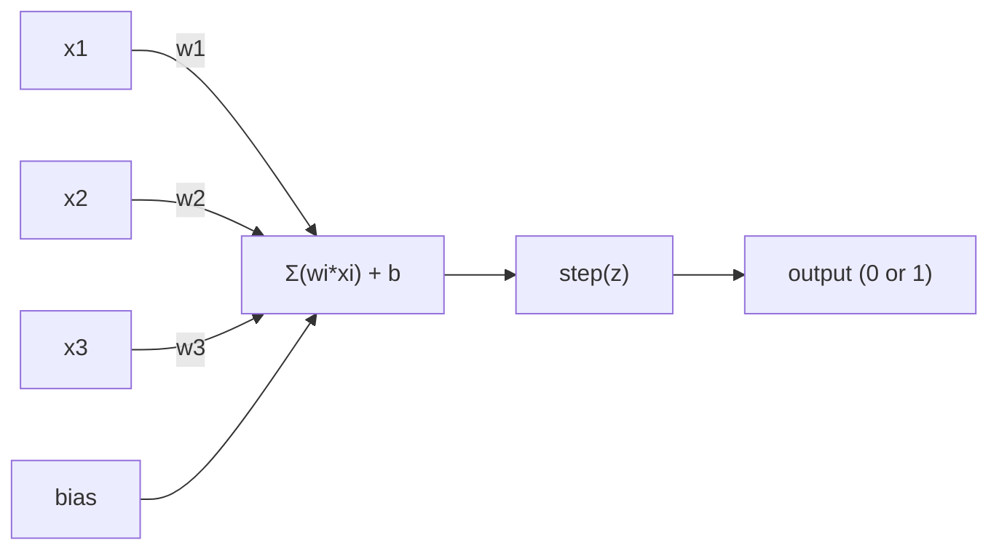

# The Perceptron

> The perceptron is the atom of neural networks. Split it open and you find weights, a bias, and a decision.

**Type:** Build
**Languages:** Julia
**Prerequisites:** Phase 1 (Linear Algebra Intuition)
**Time:** ~60 minutes

## Learning Objectives

- Implement a perceptron from scratch in Python, including the weight update rule and step activation function
- Explain why a single perceptron can only solve linearly separable problems and demonstrate the XOR failure case
- Construct a multi-layer perceptron by composing OR, NAND, and AND gates to solve XOR
- Train a two-layer network with sigmoid activation and backpropagation to learn XOR automatically

## The Problem

You know vectors and dot products. You know that a matrix transforms inputs into outputs. But how does a machine *learn* which transformation to use?

The perceptron answers this. It's the simplest possible learning machine: take some inputs, multiply by weights, add a bias, and make a binary decision. Then adjust. That's it. Every neural network ever built is layers of this idea stacked together.

Understanding the perceptron means understanding what "learning" actually means in code: adjusting numbers until the output matches reality.

## The Concept

### One Neuron, One Decision

A perceptron takes n inputs, multiplies each by a weight, sums them up, adds a bias, and passes the result through an activation function.



The step function is brutal: if the weighted sum plus bias is >= 0, output 1. Otherwise, output 0.

```
step(z) = 1  if z >= 0
           0  if z < 0
```

This is a linear classifier. The weights and bias define a line (or hyperplane in higher dimensions) that splits the input space into two regions.

### The Decision Boundary

For two inputs, the perceptron draws a line through 2D space:

```
  x2
  ┤
  │  Class 1        /
  │    (0)          /
  │                /
  │               / w1·x1 + w2·x2 + b = 0
  │              /
  │             /     Class 2
  │            /        (1)
  ┼───────────/──────────── x1
```

Everything on one side of the line outputs 0. Everything on the other side outputs 1. Training moves this line until it correctly separates the classes.

### The Learning Rule

The perceptron learning rule is simple:

```
For each training example (x, y_true):
    y_pred = predict(x)
    error = y_true - y_pred

    For each weight:
        w_i = w_i + learning_rate * error * x_i
    bias = bias + learning_rate * error
```

If the prediction is correct, error = 0, nothing changes. If it predicts 0 but should be 1, weights increase. If it predicts 1 but should be 0, weights decrease. The learning rate controls how big each adjustment is.

### The XOR Problem

Here's where it breaks. Look at these logic gates:

```
AND gate:           OR gate:            XOR gate:
x1  x2  out         x1  x2  out         x1  x2  out
0   0   0           0   0   0           0   0   0
0   1   0           0   1   1           0   1   1
1   0   0           1   0   1           1   0   1
1   1   1           1   1   1           1   1   0
```

AND and OR are linearly separable: you can draw a single line to separate the 0s from the 1s. XOR is not. No single line can separate [0,1] and [1,0] from [0,0] and [1,1].

```
AND (separable):        XOR (not separable):

  x2                      x2
  1 ┤  0     1            1 ┤  1     0
    │     /                 │
  0 ┤  0 / 0              0 ┤  0     1
    ┼──/──────── x1         ┼──────────── x1
       line works!          no single line works!
```

This is a fundamental limit. A single perceptron can only solve linearly separable problems. Minsky and Papert proved this in 1969 and it nearly killed neural network research for a decade.

The fix: stack perceptrons into layers. A multi-layer perceptron can solve XOR by combining two linear decisions into a nonlinear one.


## Further Reading

- Frank Rosenblatt, "The Perceptron: A Probabilistic Model for Information Storage and Organization in the Brain" (1958) -- the original paper that started it all
- Minsky & Papert, "Perceptrons" (1969) -- the book that proved XOR was unsolvable by single-layer networks and killed perceptron research for a decade
- Michael Nielsen, "Neural Networks and Deep Learning", Chapter 1 (http://neuralnetworksanddeeplearning.com/) -- free online, best visual explanation of how perceptrons compose into networks

## Exercises

1. **Establish a baseline.** Run the lesson demo, then capture the inputs, outputs, and one invariant that demonstrates this objective: Implement a perceptron from scratch in Python, including the weight update rule and step activation function.
2. **Change one variable.** Modify a single input or parameter and use the resulting evidence to investigate this objective: Explain why a single perceptron can only solve linearly separable problems and demonstrate the XOR failure case.
3. **Probe an edge case.** Predict the result before running it, compare prediction with observation, and explain the discrepancy while applying this objective: Construct a multi-layer perceptron by composing OR, NAND, and AND gates to solve XOR.

## Reference Solution

Use the canonical [main.jl](../code/main.jl) as the executable baseline. A complete solution records a successful run, identifies the invariant tied to “Implement a perceptron from scratch in Python, including the weight update rule and step activation function,” and changes only one variable for the comparison. The edge-case result must distinguish the prediction from the observation, explain the cause using “Construct a multi-layer perceptron by composing OR, NAND, and AND gates to solve XOR,” and cite a repeatable check rather than relying on visual inspection alone.
