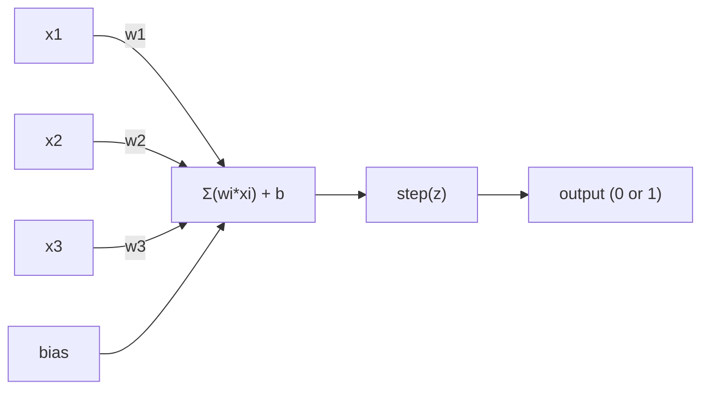

# The Perceptron

> The perceptron is the atom of neural networks. Split it open and you find weights, a bias, and a decision.

**Type:** Build
**Languages:** Julia
**Prerequisites:** Phase 1 (Linear Algebra Intuition)
**Time:** ~60 minutes

## Learning Objectives

- Implement a perceptron from scratch in Python, including the weight update rule and step activation function
- Explain why a single perceptron can only solve linearly separable problems and demonstrate the XOR failure case
- Construct a multi-layer perceptron by composing OR, NAND, and AND gates to solve XOR
- Train a two-layer network with sigmoid activation and backpropagation to learn XOR automatically

## The Problem

You know vectors and dot products. You know that a matrix transforms inputs into outputs. But how does a machine *learn* which transformation to use?

The perceptron answers this. It's the simplest possible learning machine: take some inputs, multiply by weights, add a bias, and make a binary decision. Then adjust. That's it. Every neural network ever built is layers of this idea stacked together.

Understanding the perceptron means understanding what "learning" actually means in code: adjusting numbers until the output matches reality.

## The Concept

### One Neuron, One Decision

A perceptron takes n inputs, multiplies each by a weight, sums them up, adds a bias, and passes the result through an activation function.



The step function is brutal: if the weighted sum plus bias is >= 0, output 1. Otherwise, output 0.

```
step(z) = 1  if z >= 0
           0  if z < 0
```

This is a linear classifier. The weights and bias define a line (or hyperplane in higher dimensions) that splits the input space into two regions.

### The Decision Boundary

For two inputs, the perceptron draws a line through 2D space:

```
  x2
  ┤
  │  Class 1        /
  │    (0)          /
  │                /
  │               / w1·x1 + w2·x2 + b = 0
  │              /
  │             /     Class 2
  │            /        (1)
  ┼───────────/──────────── x1
```

Everything on one side of the line outputs 0. Everything on the other side outputs 1. Training moves this line until it correctly separates the classes.

### The Learning Rule

The perceptron learning rule is simple:

```
For each training example (x, y_true):
    y_pred = predict(x)
    error = y_true - y_pred

    For each weight:
        w_i = w_i + learning_rate * error * x_i
    bias = bias + learning_rate * error
```

If the prediction is correct, error = 0, nothing changes. If it predicts 0 but should be 1, weights increase. If it predicts 1 but should be 0, weights decrease. The learning rate controls how big each adjustment is.

### The XOR Problem

Here's where it breaks. Look at these logic gates:

```
AND gate:           OR gate:            XOR gate:
x1  x2  out         x1  x2  out         x1  x2  out
0   0   0           0   0   0           0   0   0
0   1   0           0   1   1           0   1   1
1   0   0           1   0   1           1   0   1
1   1   1           1   1   1           1   1   0
```

AND and OR are linearly separable: you can draw a single line to separate the 0s from the 1s. XOR is not. No single line can separate [0,1] and [1,0] from [0,0] and [1,1].

```
AND (separable):        XOR (not separable):

  x2                      x2
  1 ┤  0     1            1 ┤  1     0
    │     /                 │
  0 ┤  0 / 0              0 ┤  0     1
    ┼──/──────── x1         ┼──────────── x1
       line works!          no single line works!
```

This is a fundamental limit. A single perceptron can only solve linearly separable problems. Minsky and Papert proved this in 1969 and it nearly killed neural network research for a decade.

The fix: stack perceptrons into layers. A multi-layer perceptron can solve XOR by combining two linear decisions into a nonlinear one.


## Build It

Reconstruct **The Perceptron** by following `Perceptron` on a graph with edges (0,1) and (1,2). Run `julia main.jl` and verify that degrees, adjacency, or connectivity expose the isolated/no-edge case explicitly.

## Use It

Call `Perceptron` from a small caller with a graph with edges (0,1) and (1,2). Compare its result with the demo output, and record the input contract and the one field a downstream user should rely on.

## Ship It

Hand off `outputs/skill-perceptron.md` with the command `julia main.jl`, the accepted input shape (a graph with edges (0,1) and (1,2)), the expected observable result, and a failure note for malformed inputs.

## Further Reading

- Frank Rosenblatt, "The Perceptron: A Probabilistic Model for Information Storage and Organization in the Brain" (1958) -- the original paper that started it all
- Minsky & Papert, "Perceptrons" (1969) -- the book that proved XOR was unsolvable by single-layer networks and killed perceptron research for a decade
- Michael Nielsen, "Neural Networks and Deep Learning", Chapter 1 (http://neuralnetworksanddeeplearning.com/) -- free online, best visual explanation of how perceptrons compose into networks

## Exercises

This lab follows `Perceptron` and `predict` on a controlled fixture; write down the value before changing the input.

1. **Trace the canonical fixture.** From `code/`, run `julia main.jl` using a graph with edges (0,1) and (1,2). Follow `Perceptron`, `predict`, `train`. Expect degrees, adjacency, or connectivity expose the isolated/no-edge case explicitly; capture the first printed shape, metric, status, or summary field and state which part supports **Implement a perceptron from scratch in Python, including the weight update rule and step activation function**.
2. **Change the controlled parameter.** Repeat the command after changing only the edge list: use the same graph with an isolated node 3. Predict the direction of the change, then compare the two output values. Explain why **Explain why a single perceptron can only solve linearly separable problems and demonstrate the XOR failure case** says the other inputs should stay fixed.
3. **Exercise the guard.** Feed the implementation a graph with no edges. Before running it, write down whether the relevant function should return an empty value, a zero-sized result, or a validation error. Check the observed status against **Construct a multi-layer perceptron by composing OR, NAND, and AND gates to solve XOR** and record the exception text if the code rejects the case.
4. **Prepare the artifact for reuse.** Open `outputs/skill-perceptron.md` and add a worked example using a graph with edges (0,1) and (1,2). Include the input contract, one expected output field, and a named acceptance check for **Train a two-layer network with sigmoid activation and backpropagation to learn XOR automatically**; note what the demo cannot establish.

## Reference Solution

A checkable result for **The Perceptron** should contain:

- the `julia main.jl` output for a graph with edges (0,1) and (1,2), with `Perceptron`, `predict`, `train` traced to the value or shape that supports **Implement a perceptron from scratch in Python, including the weight update rule and step activation function**;
- a before/after comparison for the edge list, where the same graph with an isolated node 3 changes the observation in the direction predicted by **Explain why a single perceptron can only solve linearly separable problems and demonstrate the XOR failure case**;
- a recorded result for a graph with no edges that matches the implementation’s validation or empty-result contract and explains the evidence for **Construct a multi-layer perceptron by composing OR, NAND, and AND gates to solve XOR**; and
- an updated `outputs/skill-perceptron.md` example with a concrete input, expected output field, and acceptance check tied to **Train a two-layer network with sigmoid activation and backpropagation to learn XOR automatically**.

Run the lesson tests after the demo. If the boundary behaves differently from the prediction, keep the actual exception or output and explain the implementation path that produced it.
