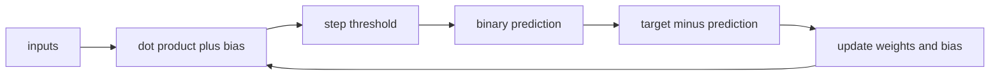

# The Perceptron

> A single threshold unit makes the update rule visible: a wrong class moves one boundary.

**Type:** Build
**Languages:** Python, Julia
**Prerequisites:** Phase 01 linear algebra and dot products
**Time:** ~60 minutes

## Learning Objectives

- Implement the binary step rule and the perceptron update without a framework.
- Trace one misclassified example through the weight and bias changes.
- Explain why one affine boundary cannot represent XOR.
- Compose OR, NAND, and AND units to compute XOR.
- Compare a deterministic gate network with a small sigmoid network trained by backpropagation.

## The model

For an input (x \in \mathbb{R}^d), the unit computes (z=w\cdot x+b) and returns 1 when (z\ge 0), otherwise 0. The training update is

```text
error = target - prediction
w[i] = w[i] + learning_rate * error * x[i]
b = b + learning_rate * error
```

The Python and Julia entry points use the same four AND examples. With zero weights and `learning_rate=0.1`, the first positive example `[1, 1] -> 1` moves both weights and the bias by `0.1`. The step function is discontinuous, so there is no useful derivative for a single unit.



AND and OR can be separated by one line. XOR cannot: the positive points `[0,1]` and `[1,0]` lie on opposite corners from the negative points `[0,0]` and `[1,1]`. The hand-wired Python function `xor_predict` and the Julia `xor_network` expose the usual two-layer workaround: OR and NAND feed an AND unit.

## Build It

Run `python3 main.py` from `code/` (or `julia main.jl` when Julia is installed). The Python demo prints AND predictions `[0, 0, 0, 1]`, hand-wired XOR `[0, 1, 1, 0]`, and a trained XOR loss near `0.0002`. The reusable functions are `Perceptron.predict`, `Perceptron.train`, `xor_predict`, and `TwoLayerNetwork.train`.

The input contract is an equally wide finite numeric vector. Perceptron targets are exactly integer `0` or `1`; an empty dataset, wrong width, fractional label, or non-finite value raises `ValueError`.

## Use It

1. In a Python shell, construct `Perceptron(2)` and call `train` on the four AND pairs. Record the returned convergence epoch and verify every prediction.
2. Manually trace the first update for input `[1, 1]`, target `1`: the zero prediction gives `error=1`, so both weights and the bias become `0.1`.
3. Call `xor_predict` on the four binary inputs. Inspect the two hidden gate outputs for `[1,0]`: OR and NAND are both 1, so the final AND returns 1.
4. Train `TwoLayerNetwork(seed=0)` on XOR for 5,000 epochs and report its final loss and thresholded classes. This is a tiny demonstration, not a claim about generalization.

## Ship It

`outputs/skill-perceptron.md` is a handoff card for the two canonical commands and their observed outputs. A downstream caller can rely on the binary prediction and on `ValueError` for malformed shapes or labels; it must not treat the trained XOR loss as a production quality guarantee.

## Exercises

1. For `Perceptron(2)` with zero parameters, compute the update for `([1, 0], 1)` and then verify the new prediction in the test suite.
2. Replace the AND labels with OR labels and identify the first example that changes the bias. Explain why the update depends on `target - prediction`, not only on the input.
3. Evaluate all four XOR points with a single trained `Perceptron(2)`. Keep the observed mistake and explain it using the affine-boundary argument rather than changing the threshold.
4. Add a test for `Perceptron(2).predict([1])` and for a target of `2`; both should fail before any arithmetic is performed.

## Reference Solution

The expected trace is `error=1` and parameters `(w,b)=([0.1,0.0],0.1)` for the first `[1,0]` positive update. The AND model predicts `[0,0,0,1]`; the composed OR/NAND/AND circuit predicts `[0,1,1,0]`. A single perceptron cannot satisfy those four XOR inequalities simultaneously. The supplied tests also verify finite-width inputs, binary labels, deterministic seeded training, and the explicit failure contract. The final sigmoid loss is an illustrative local fixture, not an external benchmark.
