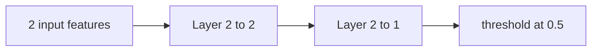

# Multi-Layer Networks

> A dense layer is a shape-preserving contract wrapped around an affine map and a nonlinearity.

**Type:** Build
**Languages:** Python
**Prerequisites:** Lesson 03.01 The Perceptron and Phase 01 matrix multiplication
**Time:** ~70 minutes

## Learning Objectives

- Derive the parameter shape of a fully connected layer from its input and output widths.
- Implement a numerically safe sigmoid and a checked forward pass.
- Compose layers while preserving the intermediate activation width.
- Count weights and biases for a multi-layer architecture.
- Inspect why hidden nonlinearities let a 2-2-1 network represent XOR.

## Layer semantics

`Layer(n_inputs, n_neurons)` stores `n_neurons` rows of `n_inputs` weights and one bias per row. A forward call accepts exactly `n_inputs` finite numbers and returns exactly `n_neurons` sigmoid outputs. For one neuron, `z = w0*x0 + w1*x1 + b`; the sigmoid maps that scalar to `(0,1)`.

The `Network` class composes layers and checks that the previous layer's output width equals the next layer's input width. A layer with shape `2 -> 3` therefore has `3 * 2 + 3 = 9` trainable values. A `2-3-1` network has `9 + (1*3+1) = 13` values.

The hand-tuned XOR fixture uses hidden weights `[[20,20],[-20,-20]]`, hidden biases `[-10,30]`, output weights `[20,20]`, and output bias `-30`. For `[1,1]`, the hidden logits are `30` and `-10`; their sigmoid outputs are approximately `1` and `0`, so the output class is 0. For `[0,1]` and `[1,0]`, one hidden unit is high and the output class is 1.

## Build It

From `code/`, run `python3 main.py`. It prints probabilities approximately `[0.000045, 0.999955, 0.999955, 0.000045]` for XOR inputs in lexicographic order, followed by `parameters=9`. `parameter_count((784,256,128,10))` returns `235146`; this is a count of scalar weights and biases, not memory usage.

The implementation raises `ValueError` for non-positive widths, malformed weight matrices, disconnected adjacent layers, wrong input length, and non-finite values. There is no training shortcut in this lesson: the network is a deterministic forward-pass fixture.

## Use It

1. Construct `Layer(2, 3, weights=((1,0),(0,1),(1,1)), biases=(0,0,0))` and evaluate `(2,3)`. Check that three probabilities are returned.
2. Create `Network((Layer(2,3), Layer(3,1)))` and call `count_parameters`; calculate 13 before running it.
3. Call `xor_network().forward((1,1))`; inspect `layers[0].last_output` and relate the two hidden values to the final class.
4. Try a two-value layer with a one-value input and record the explicit width error. Do not pad or truncate the input.

## Ship It

`outputs/prompt-network-architect.md` describes how to choose widths and audit parameter counts. The shipped artifact is the local `Network` object plus the integer count; it does not promise a trained accuracy metric or compatibility with tensor libraries.

## Exercises

1. Derive the 13 parameters in `2-3-1` by writing the two layer contributions separately, then confirm with `Network.count_parameters()`.
2. Change only the first hidden bias in the XOR fixture from `-10` to `0`. Predict what happens to the `[0,0]` probability and verify the output rather than assuming the gate remains unchanged.
3. Build `Network((Layer(2,3), Layer(3,2)))` and check that one input produces a two-element output. Then deliberately connect `Layer(2,3)` to `Layer(2,1)` and capture the constructor error.
4. Add a finite-value regression test using `float("nan")` as an input; the layer should reject it before computing a sigmoid.

## Reference Solution

`Layer(2,3)` returns three values, and `2-3-1` contains 13 trainable scalars including biases. The hand-tuned network predicts XOR as `[0,1,1,0]`; at `[1,1]`, sigmoid(30) is effectively 1 and sigmoid(-10) is effectively 0, so the output logit is near -10 and the class is 0. Shape and finiteness tests demonstrate the actual boundary instead of silently truncating vectors.
