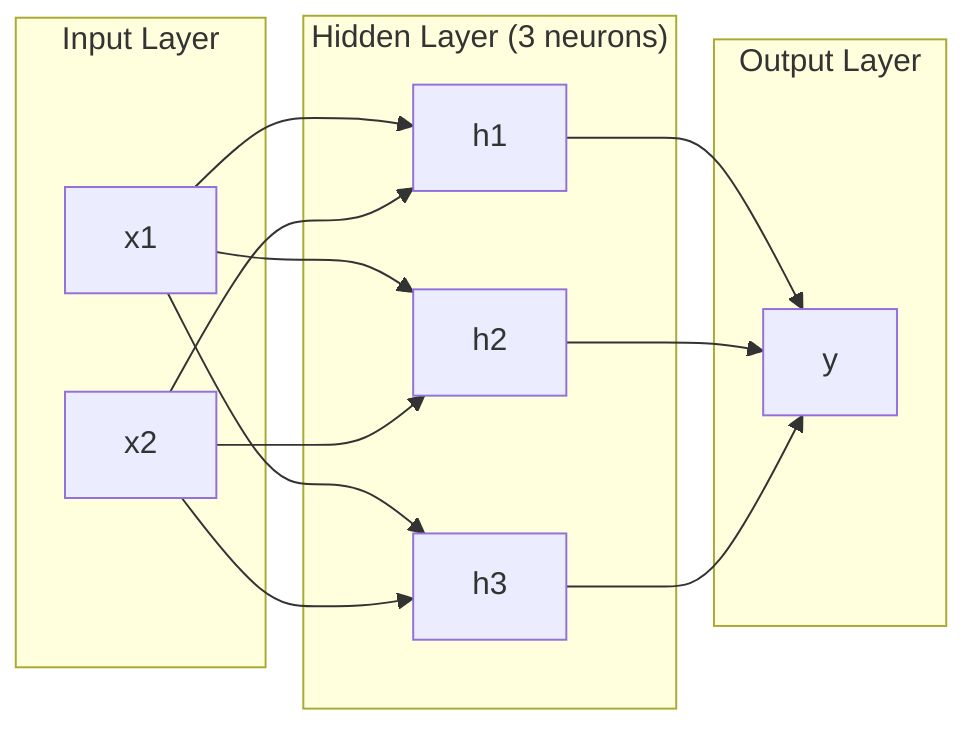
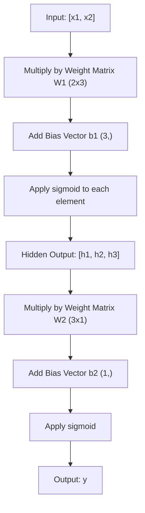
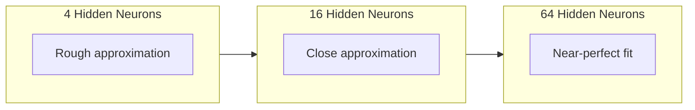

# Multi-Layer Networks and Forward Pass

> One neuron draws a line. Stack them, and you can draw anything.

**Type:** Build
**Languages:** Python
**Prerequisites:** Phase 01 (Math Foundations), Lesson 03.01 (The Perceptron)
**Time:** ~90 minutes

## Learning Objectives

- Build a multi-layer network from scratch with Layer and Network classes that perform a complete forward pass
- Trace matrix dimensions through each layer of a network and identify shape mismatches
- Explain how stacking nonlinear activations enables a network to learn curved decision boundaries
- Solve the XOR problem using a 2-2-1 architecture with hand-tuned sigmoid weights

## The Problem

A single neuron is a line drawer. That's it. One straight line through your data. Every real problem in AI -- image recognition, language understanding, playing Go -- requires curves. Stacking neurons into layers is how you get curves.

In 1969, Minsky and Papert proved this limitation was fatal: a single-layer network cannot learn XOR. Not "struggles to learn" -- mathematically cannot. The XOR truth table places [0,1] and [1,0] on one side, [0,0] and [1,1] on the other. No single line separates them.

This killed neural network funding for over a decade. The fix was obvious in hindsight: stop using one layer. Stack neurons into layers. Let the first layer carve the input space into new features, and let the second layer combine those features into decisions no single line could make.

That stack is the multi-layer network. It is the foundation of every deep learning model in production today. The forward pass -- data flowing from input through hidden layers to output -- is the first thing you need to build before anything else works.

## The Concept

### Layers: Input, Hidden, Output

A multi-layer network has three types of layers:

**Input layer** -- not really a layer. It holds your raw data. Two features means two input nodes. No computation happens here.

**Hidden layers** -- where the work happens. Each neuron takes every output from the previous layer, applies weights and a bias, then passes the result through an activation function. "Hidden" because you never see these values directly in the training data.

**Output layer** -- the final answer. For binary classification, one neuron with sigmoid. For multi-class, one neuron per class.



This is a 2-3-1 network. Two inputs, three hidden neurons, one output. Every connection carries a weight. Every neuron (except input) carries a bias.

Each layer produces a vector of numbers called a hidden state. For text, hidden states increase dimensionality -- encoding a word as 768 numbers to capture semantic meaning. For images, they reduce dimensionality -- compressing millions of pixels into a manageable representation. The hidden state is where the learning lives.

### Neurons and Activations

Each neuron does three things:

1. Multiply every input by its corresponding weight
2. Sum all the products and add a bias
3. Pass the sum through an activation function

For now, the activation is sigmoid:

```
sigmoid(z) = 1 / (1 + e^(-z))
```

Sigmoid squashes any number into the range (0, 1). Large positive inputs push toward 1. Large negative inputs push toward 0. Zero maps to 0.5. This smooth curve is what makes learning possible -- unlike the perceptron's hard step, sigmoid has a gradient everywhere.

### Forward Pass: How Data Flows

The forward pass pushes input data through the network, layer by layer, until it reaches the output. No learning happens during the forward pass. It is pure computation: multiply, add, activate, repeat.



At each layer, three operations happen in sequence:

```
z = W * input + b       (linear transformation)
a = sigmoid(z)           (activation)
```

The output of one layer becomes the input to the next. That is the entire forward pass.

### Matrix Dimensions

Tracking dimensions is the single most important debugging skill in deep learning. Here is the 2-3-1 network:

| Step | Operation | Dimensions | Result Shape |
|------|-----------|------------|-------------|
| Input | x | -- | (2,) |
| Hidden linear | W1 * x + b1 | W1: (3, 2), b1: (3,) | (3,) |
| Hidden activation | sigmoid(z1) | -- | (3,) |
| Output linear | W2 * h + b2 | W2: (1, 3), b2: (1,) | (1,) |
| Output activation | sigmoid(z2) | -- | (1,) |

The rule: weight matrix W at layer k has shape (neurons_in_layer_k, neurons_in_layer_k_minus_1). Rows match the current layer. Columns match the previous layer. If the shapes do not line up, you have a bug.

### Universal Approximation Theorem

In 1989, George Cybenko proved something remarkable: a neural network with a single hidden layer and enough neurons can approximate any continuous function to any desired accuracy.

This does not mean one hidden layer is always best. It means the architecture is theoretically capable. In practice, deeper networks (more layers, fewer neurons per layer) learn the same functions with far fewer total parameters than shallow-wide networks. That is why deep learning works.

The intuition: each neuron in the hidden layer learns one "bump" or feature. Enough bumps placed in the right locations can approximate any smooth curve. More neurons, more bumps, better approximation.



### Composability

Neural networks are composable. You can stack them, chain them, run them in parallel. A Whisper model uses an encoder network to process audio and a separate decoder network to generate text. Modern LLMs are decoder-only. BERT is encoder-only. T5 is encoder-decoder. The architecture choice defines what the model can do.


## Build It

Reconstruct **Multi-Layer Networks and Forward Pass** by following `sigmoid` on a graph with edges (0,1) and (1,2). Run `python3 main.py` and verify that degrees, adjacency, or connectivity expose the isolated/no-edge case explicitly.

## Use It

Call `sigmoid` from a small caller with a graph with edges (0,1) and (1,2). Compare its result with the demo output, and record the input contract and the one field a downstream user should rely on.

## Ship It

Hand off `outputs/prompt-network-architect.md` with the command `python3 main.py`, the accepted input shape (a graph with edges (0,1) and (1,2)), the expected observable result, and a failure note for malformed inputs.

## Further Reading

- Michael Nielsen, "Neural Networks and Deep Learning", Chapter 1-2 (http://neuralnetworksanddeeplearning.com/) -- the clearest free explanation of forward passes and network structure, with interactive visualizations
- Cybenko, "Approximation by Superpositions of a Sigmoidal Function" (1989) -- the original universal approximation theorem paper, surprisingly readable
- 3Blue1Brown, "But what is a neural network?" (https://www.youtube.com/watch?v=aircAruvnKk) -- 20-minute visual walkthrough of layers, weights, and forward passes that builds the right mental model
- Goodfellow, Bengio, Courville, "Deep Learning", Chapter 6 (https://www.deeplearningbook.org/) -- the standard reference for multi-layer networks, free online

## Exercises

Keep two runs side by side for **Multi-Layer Networks and Forward Pass**. The important evidence is the named field, shape, or status—not a polished paragraph about the run.

1. **Read the first result.** From `code/`, run `python3 main.py` using a graph with edges (0,1) and (1,2). Follow `sigmoid`, `Layer`, `forward`. Expect degrees, adjacency, or connectivity expose the isolated/no-edge case explicitly; capture the first printed shape, metric, status, or summary field and state which part supports **Build a multi-layer network from scratch with Layer and Network classes that perform a complete forward pass**.
2. **Run a two-value comparison.** Repeat the command after changing only the edge list: use the same graph with an isolated node 3. Predict the direction of the change, then compare the two output values. Explain why **Trace matrix dimensions through each layer of a network and identify shape mismatches** says the other inputs should stay fixed.
3. **Try an adversarial fixture.** Feed the implementation a graph with no edges. Before running it, write down whether the relevant function should return an empty value, a zero-sized result, or a validation error. Check the observed status against **Explain how stacking nonlinear activations enables a network to learn curved decision boundaries** and record the exception text if the code rejects the case.
4. **Write the operator note.** Open `outputs/prompt-network-architect.md` and add a worked example using a graph with edges (0,1) and (1,2). Include the input contract, one expected output field, and a named acceptance check for **Solve the XOR problem using a 2-2-1 architecture with hand-tuned sigmoid weights**; note what the demo cannot establish.

## Reference Solution

A checkable result for **Multi-Layer Networks and Forward Pass** should contain:

- the `python3 main.py` output for a graph with edges (0,1) and (1,2), with `sigmoid`, `Layer`, `forward` traced to the value or shape that supports **Build a multi-layer network from scratch with Layer and Network classes that perform a complete forward pass**;
- a before/after comparison for the edge list, where the same graph with an isolated node 3 changes the observation in the direction predicted by **Trace matrix dimensions through each layer of a network and identify shape mismatches**;
- a recorded result for a graph with no edges that matches the implementation’s validation or empty-result contract and explains the evidence for **Explain how stacking nonlinear activations enables a network to learn curved decision boundaries**; and
- an updated `outputs/prompt-network-architect.md` example with a concrete input, expected output field, and acceptance check tied to **Solve the XOR problem using a 2-2-1 architecture with hand-tuned sigmoid weights**.

Run the lesson tests after the demo. If the boundary behaves differently from the prediction, keep the actual exception or output and explain the implementation path that produced it.
