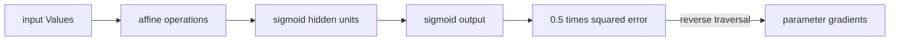

# Backpropagation

> Reverse-mode autodiff is the chain rule plus a topological traversal of a scalar computation graph.

**Type:** Build
**Languages:** Python, Julia
**Prerequisites:** Lesson 03.02 Multi-Layer Networks
**Time:** ~90 minutes

## Learning Objectives

- Record scalar operations as a directed acyclic graph with local derivatives.
- Accumulate gradients for shared values instead of overwriting them.
- Traverse the graph in reverse topological order from one objective.
- Implement sigmoid and squared-error derivatives and check them numerically.
- Train a small 2-4-1 network on the four XOR examples.

## The scalar engine

`Value(data)` stores a finite scalar, its gradient, its parents, and a closure for the local backward rule. Addition sends the upstream gradient unchanged to both parents. Multiplication sends `other.data * upstream` to the left parent and `self.data * upstream` to the right parent. For `y=x*x` at `x=3`, the two graph edges contribute `3 + 3`, so `x.grad=6`.

Calling `y.backward()` builds a post-order list of the reachable nodes, clears every non-leaf adjoint, seeds the objective with 1, and invokes each closure in reverse order. Leaf gradients (inputs and parameters) remain additive between calls; `Network.zero_grad()` is still required before a fresh training objective when parameter gradients should start at zero.

The Python and Julia MLPs use (L=\frac12(a-y)^2). If (a=\sigma(z)), then (\partial L/\partial z=(a-y)a(1-a)). The finite-difference check in the Julia demo compares one `w1` entry with `(L(w+h)-L(w-h))/(2h)`; the Python tests verify the simpler scalar cases directly.

## Build It

Run `python3 main.py` in `code/`; it trains a seeded 2-4-1 network for 400 batch epochs and prints four probabilities with classes `[0,1,1,0]`. `julia main.jl` runs the equivalent XOR, circle, and finite-difference demonstrations when Julia is installed. Both paths use only standard-library functionality.

`Value` rejects non-finite data, `Neuron` rejects a wrong input width, and `train_xor` rejects non-positive epochs or learning rates. `mse_loss` is the half-squared scalar objective; `squared_error` is an alias expressing the same convention.

## Use It

1. Build `a=Value(3)` and `b=Value(4)`, compute `a*b`, call `backward`, and read `a.grad=4`, `b.grad=3`.
2. Compute `(Value(3) * Value(3)).backward()` and explain why the shared value receives two contributions.
3. Run `train_xor(epochs=400)` and compare the four thresholded predictions. Repeat with `seed=42` via `Network((2,4,1), seed=42)` to reproduce initialization.
4. Build `x=Value(2)`, `a=x*x`, and `y=a*x`. Run `y.backward()` twice: `a.grad` must be 2 on both passes while `x.grad` grows from 12 to 24. Then call `zero_grad` before a new objective.

## Ship It

`outputs/prompt-gradient-debugger.md` turns the graph rules into a debugging checklist: inspect the scalar objective, clear gradients, compare one analytical derivative with a finite difference, and only then change the learning rate. The artifact is diagnostic guidance, not an autodiff replacement for tensor workloads.

## Exercises

1. Extend `Value` with a test for `a+b+c` and verify that the shared `b` receives one contribution from each edge.
2. Use `h=1e-5` around a network weight and compare the numerical derivative with the corresponding `backward` gradient; report the absolute difference.
3. Change the XOR objective from half-squared error to an intentionally unscaled squared error in a scratch copy. Predict the factor-of-two change in every gradient before running it.
4. Add a test that `Value(float("nan"))`, `Network((2,0,1))`, and `train_xor(epochs=0)` each fail with a clear `ValueError`.

## Reference Solution

The product example yields gradients `(4,3)`, and the square at 3 yields 6 because both edges are traversed. In the shared deeper graph, the internal `a` adjoint is recomputed as 2 while the leaf `x` accumulates to 24 after two calls. The sigmoid derivative at zero is 0.25. With the documented seed and 400 epochs, the Python network separates all four XOR cases; `zero_grad` starts a new parameter objective cleanly.
