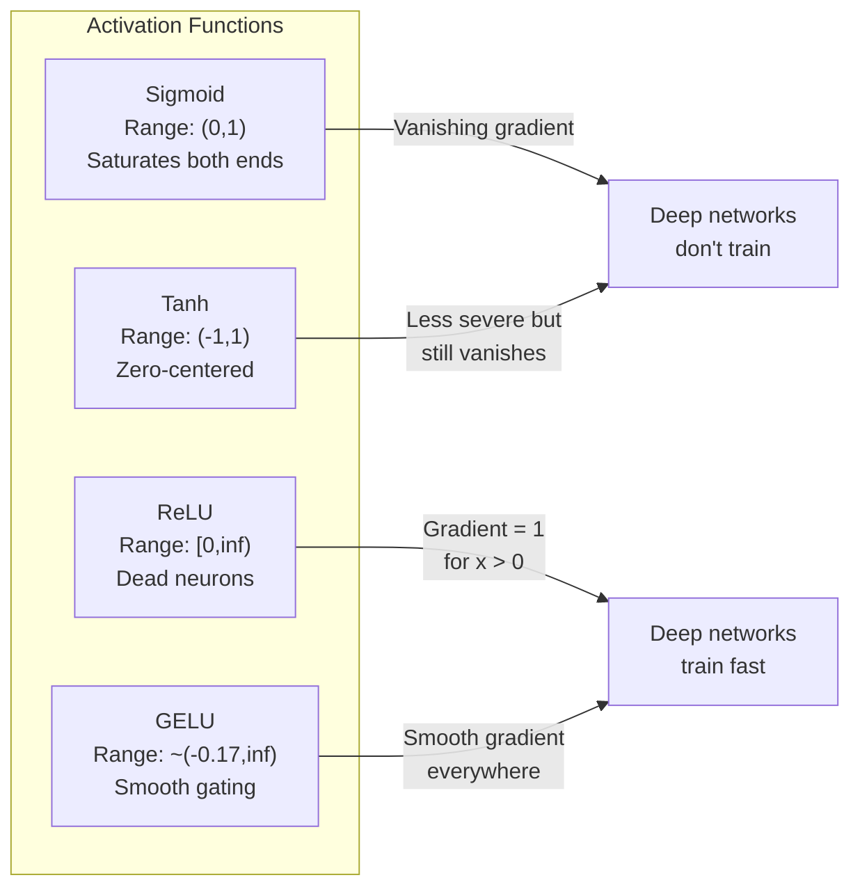
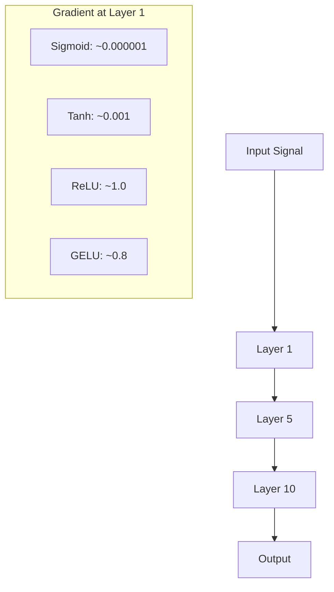
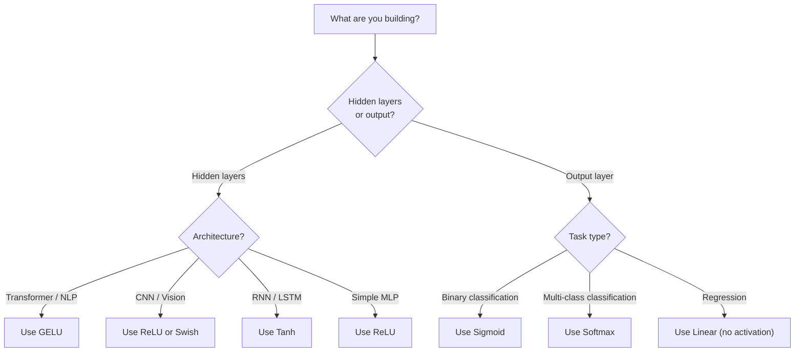

# Activation Functions

> Without nonlinearity, your 100-layer network is a fancy matrix multiply. Activations are the gates that let neural networks think in curves.

**Type:** Build
**Languages:** Python, Julia
**Prerequisites:** Lesson 03.03 (Backpropagation)
**Time:** ~75 minutes

## Learning Objectives

- Implement sigmoid, tanh, ReLU, Leaky ReLU, GELU, Swish, and softmax with their derivatives from scratch
- Diagnose the vanishing gradient problem by measuring activation magnitudes through 10+ layers with different activations
- Detect dead neurons in a ReLU network and explain why GELU avoids this failure mode
- Select the correct activation function for a given architecture (transformer, CNN, RNN, output layer)

## The Problem

Stack two linear transformations: y = W2(W1x + b1) + b2. Expand it: y = W2W1x + W2b1 + b2. That's just y = Ax + c -- a single linear transformation. No matter how many linear layers you stack, the result collapses to one matrix multiply. Your 100-layer network has the same representational power as a single layer.

This is not a theoretical curiosity. It means a deep linear network literally cannot learn XOR, cannot classify a spiral dataset, cannot recognize a face. Without activation functions, depth is an illusion.

Activation functions break the linearity. They warp the output of each layer through a nonlinear function, giving the network the ability to bend decision boundaries, approximate arbitrary functions, and actually learn. But pick the wrong activation and your gradients vanish to zero (sigmoid in deep networks), explode to infinity (unbounded activations without careful initialization), or your neurons die permanently (ReLU with large negative biases). The choice of activation function directly determines whether your network learns at all.

## The Concept

### Why Nonlinearity Is Necessary

Matrix multiplication is composable. Multiplying a vector by matrix A then matrix B is identical to multiplying by AB. This means stacking ten linear layers is mathematically equivalent to one linear layer with one big matrix. All those parameters, all that depth -- wasted. You need something to break the chain. That's what activation functions do.

Here is the proof. A linear layer computes f(x) = Wx + b. Stack two:

```
Layer 1: h = W1 * x + b1
Layer 2: y = W2 * h + b2
```

Substitute:

```
y = W2 * (W1 * x + b1) + b2
y = (W2 * W1) * x + (W2 * b1 + b2)
y = A * x + c
```

One layer. Insert a nonlinear activation g() between layers:

```
h = g(W1 * x + b1)
y = W2 * h + b2
```

Now the substitution breaks. W2 * g(W1 * x + b1) + b2 cannot be reduced to a single linear transformation. The network can represent nonlinear functions. Each additional layer with an activation adds representational capacity.

### Sigmoid

The original activation function for neural networks.

```
sigmoid(x) = 1 / (1 + e^(-x))
```

Output range: (0, 1). Smooth, differentiable, maps any real number to a probability-like value.

The derivative:

```
sigmoid'(x) = sigmoid(x) * (1 - sigmoid(x))
```

The maximum value of this derivative is 0.25, occurring at x = 0. In backpropagation, gradients multiply through layers. Ten layers of sigmoid means the gradient gets multiplied by at most 0.25 ten times:

```
0.25^10 = 0.000000953674
```

Less than one millionth of the original signal. This is the vanishing gradient problem. Gradients in early layers become so small that weights barely update. The network appears to learn -- loss decreases in later layers -- but the first layers are frozen. Deep sigmoid networks simply do not train.

Additional problem: sigmoid outputs are always positive (0 to 1), which means gradients on weights are always the same sign. This causes zig-zagging during gradient descent.

### Tanh

The centered version of sigmoid.

```
tanh(x) = (e^x - e^(-x)) / (e^x + e^(-x))
```

Output range: (-1, 1). Zero-centered, which eliminates the zig-zag problem.

The derivative:

```
tanh'(x) = 1 - tanh(x)^2
```

Maximum derivative is 1.0 at x = 0 -- four times better than sigmoid. But the vanishing gradient problem still exists. For large positive or negative inputs, the derivative approaches zero. Ten layers still crush the gradient, just less aggressively.

### ReLU: The Breakthrough

Rectified Linear Unit. Popularized for deep learning by Nair and Hinton in 2010 (the function itself dates to Fukushima's 1969 work), it changed everything.

```
relu(x) = max(0, x)
```

Output range: [0, infinity). The derivative is trivially simple:

```
relu'(x) = 1  if x > 0
            0  if x <= 0
```

No vanishing gradient for positive inputs. The gradient is exactly 1, passed straight through. This is why deep networks became trainable -- ReLU preserves gradient magnitude across layers.

But there is a failure mode: the dead neuron problem. If a neuron's weighted input is always negative (due to a large negative bias or unfortunate weight initialization), its output is always zero, its gradient is always zero, and it never updates. It is permanently dead. In practice, 10-40% of neurons in a ReLU network can die during training.

### Leaky ReLU

The simplest fix for dead neurons.

```
leaky_relu(x) = x        if x > 0
                alpha * x if x <= 0
```

Where alpha is a small constant, typically 0.01. The negative side has a small slope instead of zero, so dead neurons still get a gradient signal and can recover.

### GELU: The Modern Default

Gaussian Error Linear Unit. Introduced by Hendrycks and Gimpel in 2016. Default activation in BERT, GPT, and most modern transformers.

```
gelu(x) = x * Phi(x)
```

Where Phi(x) is the cumulative distribution function of the standard normal distribution. The approximation used in practice:

```
gelu(x) ~= 0.5 * x * (1 + tanh(sqrt(2/pi) * (x + 0.044715 * x^3)))
```

GELU is smooth everywhere, allows small negative values (unlike ReLU which hard-clips to zero), and has a probabilistic interpretation: it weights each input by how likely it is to be positive under a Gaussian distribution. This smooth gating outperforms ReLU in transformer architectures because it provides better gradient flow and avoids the dead neuron problem entirely.

### Swish / SiLU

Self-gated activation discovered by Ramachandran et al. in 2017 through automated search.

```
swish(x) = x * sigmoid(x)
```

Swish is formally x * sigmoid(x). Google discovered it through automated search over activation function space -- a neural network designing parts of neural networks.

Like GELU, it is smooth, non-monotonic, and allows small negative values. The difference is subtle: Swish uses sigmoid for gating while GELU uses the Gaussian CDF. In practice, performance is nearly identical. Swish is used in EfficientNet and some vision models. GELU dominates in language models.

### Softmax: The Output Activation

Not used in hidden layers. Softmax converts a vector of raw scores (logits) into a probability distribution.

```
softmax(x_i) = e^(x_i) / sum(e^(x_j) for all j)
```

Every output is between 0 and 1. All outputs sum to 1. This makes it the standard final activation for multi-class classification. The largest logit gets the highest probability, but unlike argmax, softmax is differentiable and preserves information about relative confidence.

### Comparison of Shapes



### Gradient Flow Comparison



### Which Activation When




## Further Reading

- Nair & Hinton, "Rectified Linear Units Improve Restricted Boltzmann Machines" (2010) -- the paper that introduced ReLU and enabled training of deep networks
- Hendrycks & Gimpel, "Gaussian Error Linear Units (GELUs)" (2016) -- introduced the activation function that became the default for transformers
- Ramachandran et al., "Searching for Activation Functions" (2017) -- used automated search to discover Swish, showing that activation design can be automated
- Glorot & Bengio, "Understanding the difficulty of training deep feedforward neural networks" (2010) -- the paper that diagnosed vanishing/exploding gradients and proposed Xavier initialization
- Goodfellow, Bengio, Courville, "Deep Learning" Chapter 6.3 (https://www.deeplearningbook.org/) -- rigorous treatment of hidden units and activation functions
