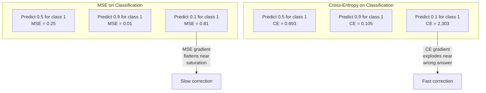
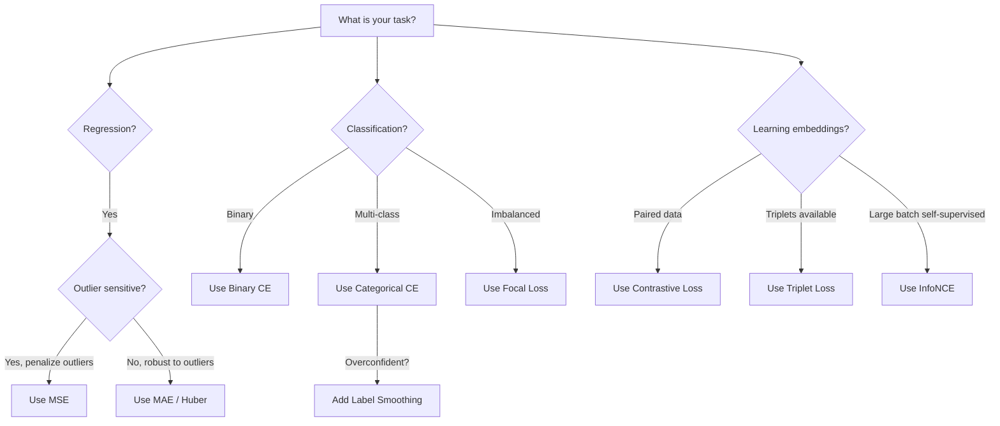
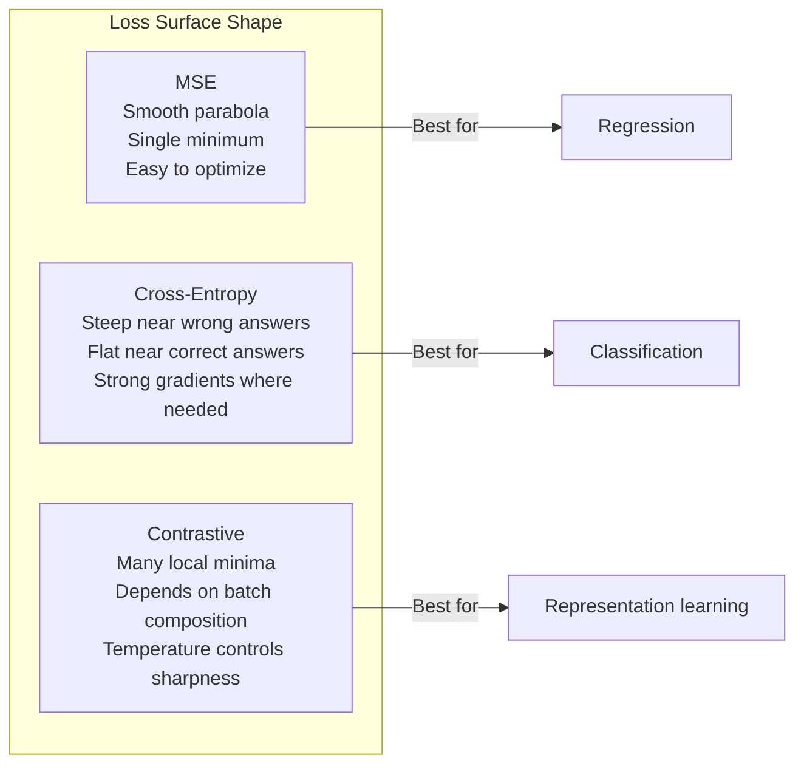

# Loss Functions

> Your network makes a prediction. The ground truth says otherwise. How wrong is it? That number is the loss. Pick the wrong loss function and your model optimizes for the wrong thing entirely.

**Type:** Build
**Languages:** Python, Julia
**Prerequisites:** Lesson 03.04 (Activation Functions)
**Time:** ~75 minutes

## Learning Objectives

- Implement MSE, binary cross-entropy, categorical cross-entropy, and contrastive loss (InfoNCE) from scratch with their gradients
- Explain why MSE fails for classification by demonstrating the "predict 0.5 for everything" failure mode
- Apply label smoothing to cross-entropy and describe how it prevents overconfident predictions
- Choose the correct loss function for regression, binary classification, multi-class classification, and embedding learning tasks

## The Problem

A model minimizing MSE on a classification problem will confidently predict 0.5 for everything. It's minimizing loss. It's also useless.

The loss function is the only thing your model actually optimizes. Not accuracy. Not F1 score. Not whatever metric you report to your manager. The optimizer takes the gradient of the loss function and adjusts weights to make that number smaller. If the loss function doesn't capture what you care about, the model will find the mathematically cheapest way to satisfy it, and that way is almost never what you wanted.

Here is a concrete example. You have a binary classification task. Two classes, 50/50 split. You use MSE as your loss. The model predicts 0.5 for every single input. The average MSE is 0.25, which is the minimum possible without actually learning anything. The model has zero discriminative ability but it has technically minimized your loss function. Switch to cross-entropy and the same model is forced to push predictions toward 0 or 1, because -log(0.5) = 0.693 is a terrible loss, while -log(0.99) = 0.01 rewards confident correct predictions. The choice of loss function is the difference between a model that learns and a model that games the metric.

It gets worse. In self-supervised learning, you don't even have labels. Contrastive loss defines the learning signal entirely: what counts as similar, what counts as different, and how hard the model should push them apart. Get contrastive loss wrong and your embeddings collapse to a single point -- every input maps to the same vector. Technically zero loss. Completely worthless.

## The Concept

### Mean Squared Error (MSE)

The default for regression. Compute the squared difference between prediction and target, average over all samples.

```
MSE = (1/n) * sum((y_pred - y_true)^2)
```

Why squaring matters: it penalizes large errors quadratically. An error of 2 costs 4x as much as an error of 1. An error of 10 costs 100x. This makes MSE sensitive to outliers -- a single wildly wrong prediction dominates the loss.

Real numbers: if your model predicts housing prices and is off by $10,000 on most houses but off by $200,000 on one mansion, MSE will aggressively try to fix that one mansion, potentially hurting performance on the other 99 houses.

The gradient of MSE with respect to a prediction is:

```
dMSE/dy_pred = (2/n) * (y_pred - y_true)
```

Linear in the error. Bigger errors get bigger gradients. This is a feature for regression (large errors need large corrections) and a bug for classification (you want to penalize confident wrong answers exponentially, not linearly).

### Cross-Entropy Loss

The loss function for classification. Rooted in information theory -- it measures the divergence between the predicted probability distribution and the true distribution.

**Binary Cross-Entropy (BCE):**

```
BCE = -(y * log(p) + (1 - y) * log(1 - p))
```

Where y is the true label (0 or 1) and p is the predicted probability.

Why -log(p) works: when the true label is 1 and you predict p = 0.99, the loss is -log(0.99) = 0.01. When you predict p = 0.01, the loss is -log(0.01) = 4.6. That 460x difference is why cross-entropy works. It brutally punishes confident wrong predictions while barely penalizing confident correct ones.

The gradient tells the same story:

```
dBCE/dp = -(y/p) + (1-y)/(1-p)
```

When y = 1 and p is near zero, the gradient is -1/p which approaches negative infinity. The model gets an enormous signal to fix its mistake. When p is near 1, the gradient is tiny. Already correct, nothing to fix.

**Categorical Cross-Entropy:**

For multi-class classification with one-hot encoded targets.

```
CCE = -sum(y_i * log(p_i))
```

Only the true class contributes to the loss (because all other y_i are zero). If there are 10 classes and the correct class gets probability 0.1 (random guessing), the loss is -log(0.1) = 2.3. If the correct class gets probability 0.9, the loss is -log(0.9) = 0.105. The model learns to concentrate probability mass on the right answer.

### Why MSE Fails for Classification



MSE gradients flatten when predictions are near 0 or 1 (due to sigmoid saturation). Cross-entropy gradients compensate for this -- the -log cancels the sigmoid's flat regions, giving strong gradients exactly where they are needed most.

### Label Smoothing

Standard one-hot labels say "this is 100% class 3 and 0% everything else." That's a strong claim. Label smoothing softens it:

```
smooth_label = (1 - alpha) * one_hot + alpha / num_classes
```

With alpha = 0.1 and 10 classes: instead of [0, 0, 1, 0, ...], the target becomes [0.01, 0.01, 0.91, 0.01, ...]. The model targets 0.91 instead of 1.0.

Why this works: a model trying to output exactly 1.0 through a softmax needs to push logits to infinity. This causes overconfidence, hurts generalization, and makes the model brittle to distribution shift. Label smoothing caps the target at 0.9 (with alpha=0.1), keeping logits in a reasonable range. GPT and most modern models use label smoothing or its equivalent.

### Contrastive Loss

No labels. No classes. Just pairs of inputs and the question: are these similar or different?

**SimCLR-style contrastive loss (NT-Xent / InfoNCE):**

Take one image. Create two augmented views of it (crop, rotate, color jitter). These are the "positive pair" -- they should have similar embeddings. Every other image in the batch forms a "negative pair" -- they should have different embeddings.

```
L = -log(exp(sim(z_i, z_j) / tau) / sum(exp(sim(z_i, z_k) / tau)))
```

Where sim() is cosine similarity, z_i and z_j are the positive pair, the sum is over all negatives, and tau (temperature) controls how sharp the distribution is. Lower temperature = harder negatives = more aggressive separation.

Real numbers: batch size 256 means 255 negatives per positive pair. Temperature tau = 0.07 (SimCLR default). The loss looks like a softmax over similarities -- it wants the positive pair's similarity to be highest among all 256 options.

**Triplet Loss:**

Takes three inputs: anchor, positive (same class), negative (different class).

```
L = max(0, d(anchor, positive) - d(anchor, negative) + margin)
```

The margin (typically 0.2-1.0) enforces a minimum gap between positive and negative distances. If the negative is already far enough away, the loss is zero -- no gradient, no update. This makes training efficient but requires careful triplet mining (choosing hard negatives that are close to the anchor).

### Focal Loss

For imbalanced datasets. Standard cross-entropy treats all correctly classified examples equally. Focal loss down-weights easy examples:

```
FL = -alpha * (1 - p_t)^gamma * log(p_t)
```

Where p_t is the predicted probability of the true class and gamma controls the focusing. With gamma = 0, this is standard cross-entropy. With gamma = 2 (the default):

- Easy example (p_t = 0.9): weight = (0.1)^2 = 0.01. Effectively ignored.
- Hard example (p_t = 0.1): weight = (0.9)^2 = 0.81. Full gradient signal.

Focal loss was introduced by Lin et al. for object detection, where 99% of candidate regions are background (easy negatives). Without focal loss, the model drowns in easy background examples and never learns to detect objects. With it, the model focuses its capacity on the hard, ambiguous cases that matter.

### Loss Function Decision Tree



### Loss Landscape




## Further Reading

- Lin et al., "Focal Loss for Dense Object Detection" (2017) -- introduced focal loss for handling extreme class imbalance in object detection (RetinaNet)
- Chen et al., "A Simple Framework for Contrastive Learning of Visual Representations" (SimCLR, 2020) -- defined the modern contrastive learning pipeline with NT-Xent loss
- Szegedy et al., "Rethinking the Inception Architecture" (2016) -- introduced label smoothing as a regularization technique, now standard in most large models
- Hinton et al., "Distilling the Knowledge in a Neural Network" (2015) -- knowledge distillation using soft targets and KL divergence, foundational for model compression

## Exercises

1. **Establish a baseline.** Run the lesson demo, then capture the inputs, outputs, and one invariant that demonstrates this objective: Implement MSE, binary cross-entropy, categorical cross-entropy, and contrastive loss (InfoNCE) from scratch with their gradients.
2. **Change one variable.** Modify a single input or parameter and use the resulting evidence to investigate this objective: Explain why MSE fails for classification by demonstrating the "predict 0.5 for everything" failure mode.
3. **Probe an edge case.** Predict the result before running it, compare prediction with observation, and explain the discrepancy while applying this objective: Apply label smoothing to cross-entropy and describe how it prevents overconfident predictions.

## Reference Solution

Use the canonical [main.py](../code/main.py) as the executable baseline. A complete solution records a successful run, identifies the invariant tied to “Implement MSE, binary cross-entropy, categorical cross-entropy, and contrastive loss (InfoNCE) from scratch with their gradients,” and changes only one variable for the comparison. The edge-case result must distinguish the prediction from the observation, explain the cause using “Apply label smoothing to cross-entropy and describe how it prevents overconfident predictions,” and cite a repeatable check rather than relying on visual inspection alone.
