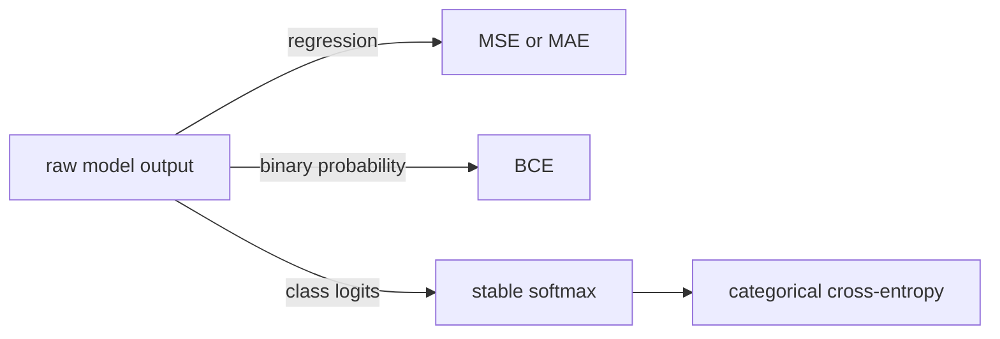

# Loss Functions

> A loss turns a prediction into a scalar training signal; its domain and reduction are part of the API.

**Type:** Build
**Languages:** Python, Julia
**Prerequisites:** Lesson 03.04 Activation Functions
**Time:** ~75 minutes

## Learning Objectives

- Calculate MSE, MAE, binary cross-entropy, and categorical cross-entropy by hand.
- Match each loss gradient to the prediction representation it expects.
- Keep softmax and cross-entropy numerically stable for large logits.
- Use label smoothing and contrastive temperature as explicit hyperparameters.
- Validate lengths, label domains, class indices, vector norms, and temperatures.

## Scalar and probabilistic losses

For predictions (p_i) and targets (y_i), this lesson defines `mse` as the mean of ((p_i-y_i)^2), with gradient (2(p_i-y_i)/n). Thus `mse([1,3],[0,2])=1` and its gradient is `[1,1]`. MAE uses the sign of the residual and is not differentiable at zero.

`binary_cross_entropy` consumes probabilities in `[0,1]` and exact binary targets. It clips only at the logarithm boundary with a positive finite `eps` below `0.5`; it does not silently turn an invalid label into a valid one. The CCE and label-smoothing variants apply the same `eps` contract and require an integer in-range class index. For logits, the stable route is sigmoid followed by BCE. `softmax` subtracts the largest logit before exponentiation, and `cce_gradient` is `softmax(logits) - one_hot(target_index)`.

Label smoothing with `alpha=0.1` and four classes assigns `0.925` to the target and `0.025` to each other class (the smoothing mass is distributed across all classes). `contrastive_loss` divides cosine similarities by a positive temperature and applies a stable log-sum-exp denominator.

## Build It

Run `python3 main.py` from `code/`. The output includes `mse([1,3],[0,2])=1.000`, `bce([0.9],[1])≈0.105`, normalized three-class probabilities, smoothed CCE, and a cosine contrastive loss. The Julia entry point implements the same families with standard-library arrays.

All paired losses reject empty or mismatched sequences and non-finite values. BCE rejects probabilities outside `[0,1]` and labels other than 0 or 1. CCE and label smoothing reject non-integer/out-of-range class indices and non-finite or out-of-range `eps`; cosine rejects unequal, non-finite, or zero-norm vectors; contrastive loss rejects an empty negative set or non-positive temperature.

## Use It

1. Compute MSE and its gradient for `[1,3]` versus `[0,2]`; verify the reduction by `n=2`.
2. Evaluate BCE for `(0.9,1)` and compare with `-log(0.9)`. Then try target `2` and record the validation error.
3. Run `softmax((1000,999,998))`; verify every result is finite and the sum is 1. Use `cce_gradient` for target index 0 and check its entries sum to zero.
4. Compare contrastive loss with temperature `0.07` and `0.7` for the same similarities; explain why the smaller temperature emphasizes the largest score more strongly.

## Ship It

`outputs/prompt-loss-debugger.md` and `outputs/prompt-loss-function-selector.md` are reusable checklists. A caller must state whether its values are probabilities or logits, keep the class index convention, and preserve the explicit validation errors; the toy logistic class is not a production optimizer.

## Exercises

1. Use a finite difference around one prediction to check `mse_gradient`; include the reduction factor in the calculation.
2. Compare `binary_cross_entropy((1e-20,), (1,))` with the unclipped logarithm and explain why the implementation stays finite.
3. For logits `(0,0)` and target index 0, calculate the CCE gradient `[−0.5,0.5]` before calling `cce_gradient`.
4. Add tests for an empty negative list, a zero cosine vector, a mismatched prediction/target pair, and a class index equal to `len(logits)`.

## Reference Solution

The MSE fixture returns 1 and gradient `[1,1]`; BCE for a positive target at 0.9 is `-log(0.9)`. Equal logits produce probabilities `[0.5,0.5]` and a target-zero CCE gradient `[-0.5,0.5]`. Stable softmax handles logits near 1000 without overflow. Domain errors are explicit rather than hidden by `zip` truncation or arbitrary clipping.
