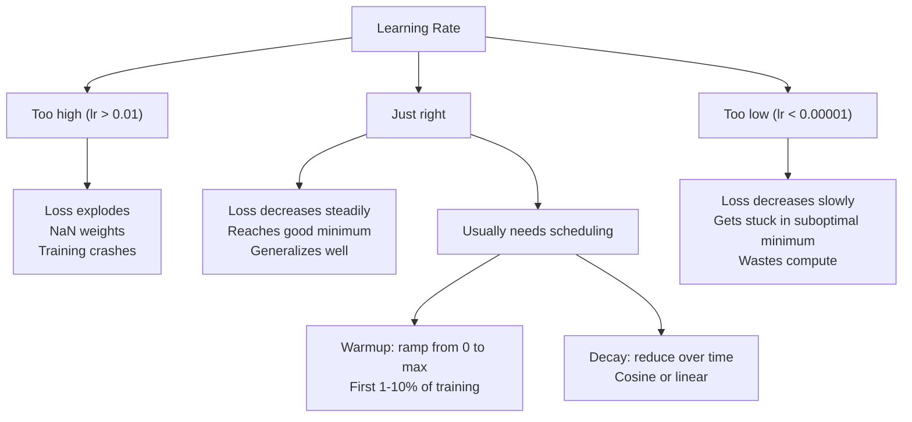
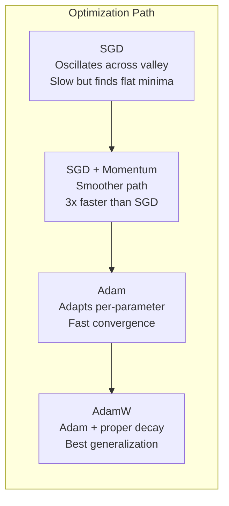
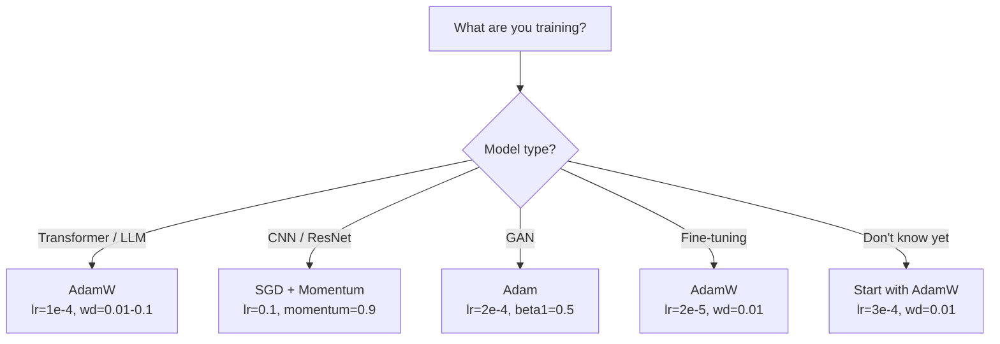

# Optimizers

> Gradient descent tells you which direction to move. It says nothing about how far or how fast. SGD is a compass. Adam is GPS with traffic data.

**Type:** Build
**Languages:** Python
**Prerequisites:** Lesson 03.05 (Loss Functions)
**Time:** ~75 minutes

## Learning Objectives

- Implement SGD, SGD with momentum, Adam, and AdamW optimizers from scratch in Python
- Explain how Adam's bias correction compensates for zero-initialized moment estimates in early training steps
- Demonstrate why AdamW produces better generalization than Adam with L2 regularization on the same task
- Select the appropriate optimizer and default hyperparameters for transformers, CNNs, GANs, and fine-tuning

## The Problem

You computed the gradients. You know that weight #4,721 should decrease by 0.003 to reduce the loss. But 0.003 in what units? Scaled by what? And should you move the same amount on step 1 as on step 1,000?

Vanilla gradient descent applies the same learning rate to every parameter on every step: w = w - lr * gradient. This creates three problems that make training neural networks painful in practice.

First, oscillation. The loss landscape is rarely shaped like a smooth bowl. It's more like a long, narrow valley. The gradient points across the valley (steep direction), not along it (shallow direction). Gradient descent bounces back and forth across the narrow dimension while making tiny progress along the useful one. You've seen this: loss drops fast then plateaus, not because the model converged but because it's oscillating.

Second, one learning rate for all parameters is wrong. Some weights need large updates (they're in the early, underfitting stage). Others need tiny updates (they're near their optimal value). A learning rate that works for the former destroys the latter, and vice versa.

Third, saddle points. In high dimensions, the loss landscape has vast flat regions where the gradient is near zero. Vanilla SGD crawls through these at the speed of the gradient, which is effectively zero. The model looks stuck. It isn't stuck -- it's in a flat region with useful descent on the other side. But SGD has no mechanism to push through.

Adam solves all three. It maintains two running averages per parameter -- the mean gradient (momentum, handles oscillation) and the mean squared gradient (adaptive rate, handles different scales). Combined with bias correction for the first few steps, it gives you a single optimizer that works on 80% of problems with default hyperparameters. This lesson builds it from scratch so you understand exactly when and why it fails on the other 20%.

## The Concept

### Stochastic Gradient Descent (SGD)

The simplest optimizer. Compute the gradient on a mini-batch and step in the opposite direction.

```
w = w - lr * gradient
```

The "stochastic" means you use a random subset (mini-batch) of data to estimate the gradient, rather than the full dataset. This noise is actually useful -- it helps escape sharp local minima. But the noise also causes oscillation.

Learning rate is the only knob. Too high: the loss diverges. Too low: training takes forever. The optimal value depends on the architecture, the data, the batch size, and the current stage of training. For vanilla SGD on modern networks, typical values range from 0.01 to 0.1. But even within a single training run, the ideal learning rate changes.

### Momentum

The ball-rolling-downhill analogy is overused but accurate. Instead of stepping by the gradient alone, you maintain a velocity that accumulates past gradients.

```
m_t = beta * m_{t-1} + gradient
w = w - lr * m_t
```

Beta (typically 0.9) controls how much history to keep. With beta = 0.9, the momentum is roughly the average of the last 10 gradients (1 / (1 - 0.9) = 10).

Why this fixes oscillation: gradients that point in the same direction accumulate. Gradients that flip direction cancel out. In that narrow valley, the "across" component flips sign each step and gets dampened. The "along" component stays consistent and gets amplified. The result is smooth acceleration in the useful direction.

Real numbers: SGD alone on a badly conditioned loss landscape might take 10,000 steps. SGD with momentum (beta=0.9) typically takes 3,000-5,000 steps on the same problem. The speedup is not marginal.

### RMSProp

The first per-parameter adaptive learning rate method that actually worked. Proposed by Hinton in a Coursera lecture (never formally published).

```
s_t = beta * s_{t-1} + (1 - beta) * gradient^2
w = w - lr * gradient / (sqrt(s_t) + epsilon)
```

s_t tracks the running average of squared gradients. Parameters with consistently large gradients get divided by a large number (smaller effective learning rate). Parameters with small gradients get divided by a small number (larger effective learning rate).

This solves the "one learning rate for all parameters" problem. A weight that's already been getting large updates is probably near its target -- slow it down. A weight that's been getting tiny updates might be undertrained -- speed it up.

Epsilon (typically 1e-8) prevents division by zero when a parameter hasn't been updated.

### Adam: Momentum + RMSProp

Adam combines both ideas. It maintains two exponential moving averages per parameter:

```
m_t = beta1 * m_{t-1} + (1 - beta1) * gradient        (first moment: mean)
v_t = beta2 * v_{t-1} + (1 - beta2) * gradient^2       (second moment: variance)
```

**Bias correction** is the key detail most explanations skip. At step 1, m_1 = (1 - beta1) * gradient. With beta1 = 0.9, that's 0.1 * gradient -- ten times too small. The moving average hasn't warmed up yet. Bias correction compensates:

```
m_hat = m_t / (1 - beta1^t)
v_hat = v_t / (1 - beta2^t)
```

At step 1 with beta1 = 0.9: m_hat = m_1 / (1 - 0.9) = m_1 / 0.1 = the actual gradient. At step 100: (1 - 0.9^100) is approximately 1.0, so the correction vanishes. Bias correction matters for the first ~10 steps and is irrelevant after ~50.

The update:

```
w = w - lr * m_hat / (sqrt(v_hat) + epsilon)
```

Adam defaults: lr = 0.001, beta1 = 0.9, beta2 = 0.999, epsilon = 1e-8. These defaults work for 80% of problems. When they don't, change lr first. Then beta2. Almost never change beta1 or epsilon.

### AdamW: Weight Decay Done Right

L2 regularization adds lambda * w^2 to the loss. In vanilla SGD, this is equivalent to weight decay (subtracting lambda * w from the weight at each step). In Adam, this equivalence breaks.

The Loshchilov & Hutter insight: when you add L2 to the loss and then Adam processes the gradient, the adaptive learning rate scales the regularization term too. Parameters with large gradient variance get less regularization. Parameters with small variance get more. This is not what you want -- you want uniform regularization regardless of the gradient statistics.

AdamW fixes this by applying weight decay directly to the weights, after the Adam update:

```
w = w - lr * m_hat / (sqrt(v_hat) + epsilon) - lr * lambda * w
```

The weight decay term (lr * lambda * w) is not scaled by Adam's adaptive factor. Every parameter gets the same proportional shrinkage.

This seems like a minor detail. It's not. AdamW converges to better solutions than Adam + L2 regularization on virtually every task. It's the default optimizer in PyTorch for training transformers, diffusion models, and most modern architectures. BERT, GPT, LLaMA, Stable Diffusion -- all trained with AdamW.

### Learning Rate: The Most Important Hyperparameter



If you tune one hyperparameter, tune the learning rate. A 10x change in learning rate matters more than any architectural decision you'll make. Common defaults:

- SGD: lr = 0.01 to 0.1
- Adam/AdamW: lr = 1e-4 to 3e-4
- Fine-tuning pretrained models: lr = 1e-5 to 5e-5
- Learning rate warmup: linear ramp over first 1-10% of steps

### Optimizer Comparison



### When Each Optimizer Wins




## Build It

Reconstruct **Optimizers** by following `SGD` on tokens=["red","fox"]. Run `python3 main.py` and verify that the attention/embedding shape follows the token count and each valid attention row remains normalized.

## Use It

Call `SGD` from a small caller with tokens=["red","fox"]. Compare its result with the demo output, and record the input contract and the one field a downstream user should rely on.

## Ship It

Hand off `outputs/prompt-optimizer-selector.md` with the command `python3 main.py`, the accepted input shape (tokens=["red","fox"]), the expected observable result, and a failure note for malformed inputs.

## Further Reading

- Kingma & Ba, "Adam: A Method for Stochastic Optimization" (2014) -- the original Adam paper with convergence analysis and the bias correction derivation
- Loshchilov & Hutter, "Decoupled Weight Decay Regularization" (2017) -- proved that L2 regularization and weight decay are not equivalent in Adam, and proposed AdamW
- Smith, "Cyclical Learning Rates for Training Neural Networks" (2017) -- introduced the LR range test and cyclical schedules that remove the need to tune a fixed learning rate
- Ruder, "An Overview of Gradient Descent Optimization Algorithms" (2016) -- the best single survey of all optimizer variants, with clear comparisons and intuitions

## Exercises

Use `SGD` as the trace: start from tokens=["red","fox"], keep the raw output, and tie each observation to a named objective.

1. **Reproduce the reference path.** From `code/`, run `python3 main.py` using tokens=["red","fox"]. Follow `SGD`, `step`, `SGDMomentum`. Expect the attention/embedding shape follows the token count and each valid attention row remains normalized; capture the first printed shape, metric, status, or summary field and state which part supports **Implement SGD, SGD with momentum, Adam, and AdamW optimizers from scratch in Python**.
2. **Vary one named input.** Repeat the command after changing only the token sequence: use tokens=["red","fox","runs"]. Predict the direction of the change, then compare the two output values. Explain why **Explain how Adam's bias correction compensates for zero-initialized moment estimates in early training steps** says the other inputs should stay fixed.
3. **Probe the empty case.** Feed the implementation tokens=[]. Before running it, write down whether the relevant function should return an empty value, a zero-sized result, or a validation error. Check the observed status against **Demonstrate why AdamW produces better generalization than Adam with L2 regularization on the same task** and record the exception text if the code rejects the case.
4. **Package a usable handoff.** Open `outputs/prompt-optimizer-selector.md` and add a worked example using tokens=["red","fox"]. Include the input contract, one expected output field, and a named acceptance check for **Select the appropriate optimizer and default hyperparameters for transformers, CNNs, GANs, and fine-tuning**; note what the demo cannot establish.

## Reference Solution

A checkable result for **Optimizers** should contain:

- the `python3 main.py` output for tokens=["red","fox"], with `SGD`, `step`, `SGDMomentum` traced to the value or shape that supports **Implement SGD, SGD with momentum, Adam, and AdamW optimizers from scratch in Python**;
- a before/after comparison for the token sequence, where tokens=["red","fox","runs"] changes the observation in the direction predicted by **Explain how Adam's bias correction compensates for zero-initialized moment estimates in early training steps**;
- a recorded result for tokens=[] that matches the implementation’s validation or empty-result contract and explains the evidence for **Demonstrate why AdamW produces better generalization than Adam with L2 regularization on the same task**; and
- an updated `outputs/prompt-optimizer-selector.md` example with a concrete input, expected output field, and acceptance check tied to **Select the appropriate optimizer and default hyperparameters for transformers, CNNs, GANs, and fine-tuning**.

Run the lesson tests after the demo. If the boundary behaves differently from the prediction, keep the actual exception or output and explain the implementation path that produced it.
