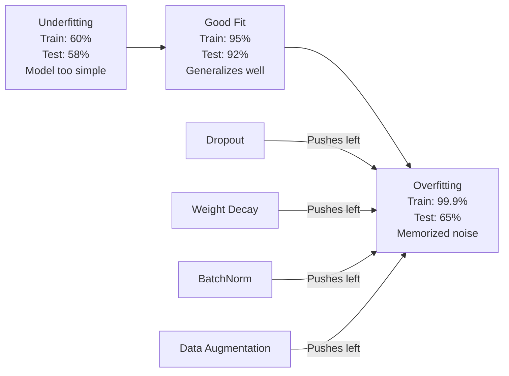
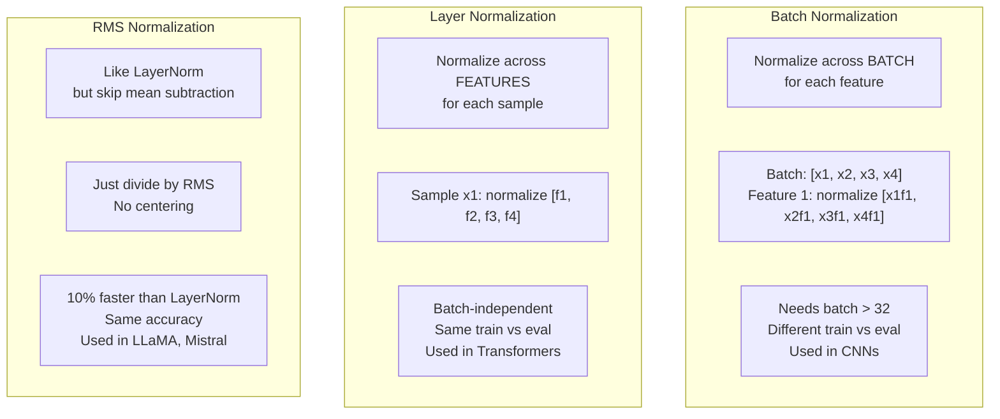
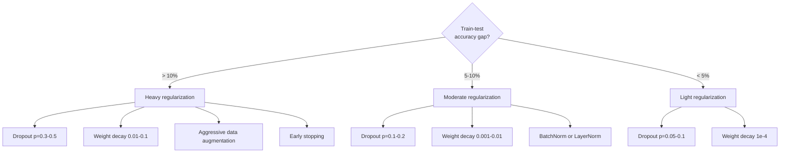

# Regularization

> Your model gets 99% on training data and 60% on test data. It memorized instead of learning. Regularization is the tax you impose on complexity to force generalization.

**Type:** Build
**Languages:** Python
**Prerequisites:** Lesson 03.06 (Optimizers)
**Time:** ~75 minutes

## Learning Objectives

- Implement dropout with inverted scaling, L2 weight decay, batch normalization, layer normalization, and RMSNorm from scratch
- Measure the train-test accuracy gap and diagnose overfitting using regularization experiments
- Explain why transformers use LayerNorm instead of BatchNorm and why modern LLMs prefer RMSNorm
- Apply the correct combination of regularization techniques based on the severity of overfitting

## The Problem

A neural network with enough parameters can memorize any dataset. This is not a hypothetical -- Zhang et al. (2017) proved it by training standard networks on ImageNet with random labels. The networks reached near-zero training loss on completely random label assignments. They memorized a million random input-output pairs with no pattern to learn. Training loss was perfect. Test accuracy was zero.

This is the overfitting problem, and it gets worse as models get larger. GPT-3 has 175 billion parameters. The training set has about 500 billion tokens. With that many parameters, the model has enough capacity to memorize significant chunks of the training data verbatim. Without regularization, it would just regurgitate training examples instead of learning generalizable patterns.

The gap between training performance and test performance is the overfitting gap. Every technique in this lesson attacks that gap from a different angle. Dropout forces the network to not rely on any single neuron. Weight decay prevents any single weight from growing too large. Batch normalization smooths the loss landscape so the optimizer finds flatter, more generalizable minima. Layer normalization does the same thing but works where batch normalization fails (small batches, variable-length sequences). RMSNorm does it 10% faster by dropping the mean calculation. Each technique is simple. Together, they're the difference between a model that memorizes and one that generalizes.

## The Concept

### The Overfitting Spectrum

Every model sits somewhere on a spectrum from underfitting (too simple to capture the pattern) to overfitting (so complex it captures noise). The sweet spot is in between, and regularization pushes models toward it from the overfit side.



### Dropout

The simplest regularization technique with the most elegant interpretation. During training, randomly set each neuron's output to zero with probability p.

```
output = activation(z) * mask    where mask[i] ~ Bernoulli(1 - p)
```

With p = 0.5, half the neurons are zeroed on every forward pass. The network must learn redundant representations because it can't predict which neurons will be available. This prevents co-adaptation -- neurons learning to rely on specific other neurons being present.

The ensemble interpretation: a network with N neurons and dropout creates 2^N possible subnetworks (every combination of which neurons are on or off). Training with dropout approximately trains all 2^N subnetworks simultaneously, each on different mini-batches. At test time, you use all neurons (no dropout) and scale outputs by (1 - p) to match the expected value during training. This is equivalent to averaging the predictions of 2^N subnetworks -- a massive ensemble from a single model.

In practice, the scaling is applied during training instead of testing (inverted dropout):

```
During training:  output = activation(z) * mask / (1 - p)
During testing:   output = activation(z)   (no change needed)
```

This is cleaner because test code doesn't need to know about dropout at all.

Default rates: p = 0.1 for transformers, p = 0.5 for MLPs, p = 0.2-0.3 for CNNs. Higher dropout = stronger regularization = more underfitting risk.

### Weight Decay (L2 Regularization)

Add the squared magnitude of all weights to the loss:

```
total_loss = task_loss + (lambda / 2) * sum(w_i^2)
```

The gradient of the regularization term is lambda * w. This means at every step, each weight is shrunk toward zero by a fraction proportional to its magnitude. Large weights get penalized more. The model is pushed toward solutions where no single weight dominates.

Why this helps generalization: overfit models tend to have large weights that amplify noise in the training data. Weight decay keeps weights small, which limits the model's effective capacity and forces it to rely on robust, generalizable features rather than memorized quirks.

The lambda hyperparameter controls the strength. Typical values:

- 0.01 for AdamW on transformers
- 1e-4 for SGD on CNNs
- 0.1 for heavily overfit models

As discussed in lesson 06: weight decay and L2 regularization are equivalent in SGD but not in Adam. Always use AdamW (decoupled weight decay) when training with Adam.

### Batch Normalization

Normalize the output of each layer across the mini-batch before passing it to the next layer.

For a mini-batch of activations at some layer:

```
mu = (1/B) * sum(x_i)           (batch mean)
sigma^2 = (1/B) * sum((x_i - mu)^2)   (batch variance)
x_hat = (x_i - mu) / sqrt(sigma^2 + eps)   (normalize)
y = gamma * x_hat + beta        (scale and shift)
```

Gamma and beta are learnable parameters that let the network undo the normalization if that's optimal. Without them, you'd be forcing every layer's output to be zero-mean unit-variance, which might not be what the network wants.

**Training vs inference split:** During training, mu and sigma come from the current mini-batch. During inference, you use running averages accumulated during training (exponential moving average with momentum = 0.1, meaning 90% old + 10% new).

Why BatchNorm works is still debated. The original paper claimed it reduces "internal covariate shift" (the distribution of layer inputs changing as earlier layers update). Santurkar et al. (2018) showed this explanation is wrong. The actual reason: BatchNorm makes the loss landscape smoother. The gradients are more predictive, the Lipschitz constants are smaller, and the optimizer can take larger steps safely. This is why BatchNorm lets you use higher learning rates and converge faster.

BatchNorm has a fundamental limitation: it depends on batch statistics. With batch size 1, the mean and variance are meaningless. With small batches (< 32), the statistics are noisy and hurt performance. This matters for tasks like object detection (where memory limits batch size) and language modeling (where sequence lengths vary).

### Layer Normalization

Normalize across features instead of across the batch. For a single sample:

```
mu = (1/D) * sum(x_j)           (feature mean)
sigma^2 = (1/D) * sum((x_j - mu)^2)   (feature variance)
x_hat = (x_j - mu) / sqrt(sigma^2 + eps)
y = gamma * x_hat + beta
```

D is the feature dimension. Each sample is normalized independently -- no dependence on batch size. This is why transformers use LayerNorm instead of BatchNorm. Sequences have variable lengths, batch sizes are often small (or 1 during generation), and the computation is identical between training and inference.

LayerNorm in transformers is applied after each self-attention block and each feed-forward block (Post-LN), or before them (Pre-LN, which is more stable for training).

### RMSNorm

LayerNorm without the mean subtraction. Proposed by Zhang & Sennrich (2019).

```
rms = sqrt((1/D) * sum(x_j^2))
y = gamma * x / rms
```

That's it. No mean computation, no beta parameter. The observation: the re-centering (mean subtraction) in LayerNorm contributes very little to the model's performance, but costs computation. Removing it gives the same accuracy with about 10% less overhead.

LLaMA, LLaMA 2, LLaMA 3, Mistral, and most modern LLMs use RMSNorm instead of LayerNorm. At the scale of billions of parameters and trillions of tokens, that 10% savings is significant.

### Normalization Comparison



### Data Augmentation as Regularization

Not a model modification but a data modification. Transform training inputs while preserving labels:

- Images: random crop, flip, rotation, color jitter, cutout
- Text: synonym replacement, back-translation, random deletion
- Audio: time stretch, pitch shift, noise addition

The effect is identical to regularization: it increases the effective size of the training set, making it harder for the model to memorize specific examples. A model that only sees each image once in its original form can memorize it. A model that sees 50 augmented versions of each image is forced to learn the invariant structure.

### Early Stopping

The simplest regularizer: stop training when validation loss starts increasing. The model hasn't overfit yet at that point. In practice, you track validation loss every epoch, save the best model, and continue training for a "patience" window (typically 5-20 epochs). If validation loss doesn't improve within the patience window, you stop and load the best saved model.

### When to Apply What




## Further Reading

- Srivastava et al., "Dropout: A Simple Way to Prevent Neural Networks from Overfitting" (2014) -- the original dropout paper with the ensemble interpretation and extensive experiments
- Ioffe & Szegedy, "Batch Normalization: Accelerating Deep Network Training by Reducing Internal Covariate Shift" (2015) -- introduced BatchNorm and its training procedure, one of the most cited deep learning papers
- Zhang & Sennrich, "Root Mean Square Layer Normalization" (2019) -- showed RMSNorm matches LayerNorm accuracy with reduced computation; adopted by LLaMA and Mistral
- Zhang et al., "Understanding Deep Learning Requires Rethinking Generalization" (2017) -- the landmark paper showing neural networks can memorize random labels, challenging traditional views of generalization

## Exercises

1. **Establish a baseline.** Run the lesson demo, then capture the inputs, outputs, and one invariant that demonstrates this objective: Implement dropout with inverted scaling, L2 weight decay, batch normalization, layer normalization, and RMSNorm from scratch.
2. **Change one variable.** Modify a single input or parameter and use the resulting evidence to investigate this objective: Measure the train-test accuracy gap and diagnose overfitting using regularization experiments.
3. **Probe an edge case.** Predict the result before running it, compare prediction with observation, and explain the discrepancy while applying this objective: Explain why transformers use LayerNorm instead of BatchNorm and why modern LLMs prefer RMSNorm.

## Reference Solution

Use the canonical [main.py](../code/main.py) as the executable baseline. A complete solution records a successful run, identifies the invariant tied to “Implement dropout with inverted scaling, L2 weight decay, batch normalization, layer normalization, and RMSNorm from scratch,” and changes only one variable for the comparison. The edge-case result must distinguish the prediction from the observation, explain the cause using “Explain why transformers use LayerNorm instead of BatchNorm and why modern LLMs prefer RMSNorm,” and cite a repeatable check rather than relying on visual inspection alone.
