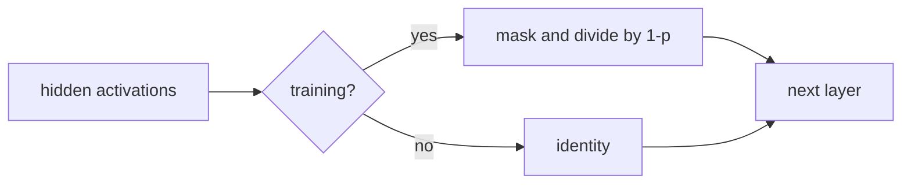

# Regularization

> Regularization changes the training objective or representation so memorizing the training set is less attractive.

**Type:** Build
**Languages:** Python
**Prerequisites:** Lesson 03.06 Optimizers
**Time:** ~75 minutes

## Learning Objectives

- Implement inverted Dropout with separate training and evaluation behavior.
- Calculate L2 penalty and gradient and distinguish them from AdamW decay.
- Normalize a batch, a single feature vector, and an uncentered vector with the correct statistics.
- Explain why LayerNorm and RMSNorm do not use BatchNorm's batch statistics.
- Compare a seeded train/evaluation path without treating a toy accuracy gap as a benchmark.

## Three kinds of regularization

During training, `Dropout(p)` samples a binary mask and divides retained activations by `1-p`. Thus a retained activation of 2 with `p=0.5` becomes 4; in evaluation mode the same input is returned unchanged. Its backward pass uses the same mask and scale, and it fails clearly if called before a forward pass.

For weights (w), `l2_regularization(w, lambda)` returns (\lambda/2\sum_i w_i^2), and `l2_gradient` returns (\lambda w_i). The penalty is part of a loss; AdamW's decoupled decay is an optimizer operation and should not be counted twice.

BatchNorm computes a mean and variance per feature across a nonempty batch and maintains running statistics for evaluation. LayerNorm computes mean and variance across the features of each one sample. RMSNorm computes only the root mean square and preserves the feature mean. All three return the same feature width they receive.

## Build It

Run `python3 main.py` from `code/`. It prints a seeded Dropout train/eval pair, the penalty and gradient for weights `[3,-4]` with `lambda=0.1` (`1.25`, approximately `[0.3,-0.4]`), and LayerNorm/RMSNorm outputs. `RegularizedNetwork.train_model` then performs five local updates before `evaluate`; the sample is intentionally not a claim about generalization.

The code rejects invalid dropout probabilities, negative/non-finite regularization strengths, empty batches, wrong feature widths, non-positive normalization dimensions, empty evaluation data, and non-binary targets. A local RNG makes seeded dropout and network initialization reproducible.

## Use It

1. Seed `Dropout(0.5, seed=42)`, call `forward([1,2,3,4], training=True)`, and identify which retained entries are doubled. Call it again with `training=False` and verify identity behavior.
2. Compute `l2_regularization([3,-4],0.1)` by hand: (0.05(9+16)=1.25). Compare each gradient with `0.1*w`.
3. Run LayerNorm on `[1,2,3]` and check its output mean is near zero. Run RMSNorm on the same vector and check its output RMS is near one, not its mean.
4. Train a seeded `RegularizedNetwork(dropout_p=0.2, weight_decay=0.01)` for five epochs, then evaluate the same `make_circle_data(20, seed=9)` twice and record the identical `(loss, accuracy)` pair.

## Ship It

`outputs/prompt-regularization-advisor.md` asks for the observed train/eval mode, penalty, and normalization invariants before selecting a regularizer. It explicitly keeps dropout mode and weight decay separate and does not infer a deployment guarantee from the circle fixture.

## Exercises

1. Use a fixed seed to show that two Dropout calls can have different masks in training but equal outputs in evaluation; keep the input vector unchanged.
2. Change `lambda` from `0.1` to `0.2` and predict the penalty and gradient scaling before running the two functions.
3. Feed a one-row batch to BatchNorm and a three-value vector to LayerNorm. Explain why their statistics are over different axes.
4. Add negative tests for `Dropout(1.0)`, `LayerNorm(3).forward([1,2])`, an empty BatchNorm batch, an `evaluate` target of `2`, and `train_model(..., epochs=0)`.

## Reference Solution

With `p=0.5`, every retained training activation is doubled and evaluation returns the original vector. The L2 fixture gives penalty 1.25 and gradient approximately `[0.3,-0.4]`. LayerNorm centers `[1,2,3]` while RMSNorm scales its RMS without subtracting the mean. Repeating the seeded evaluation returns the same local metrics, and invalid shape/mode inputs produce explicit errors.
