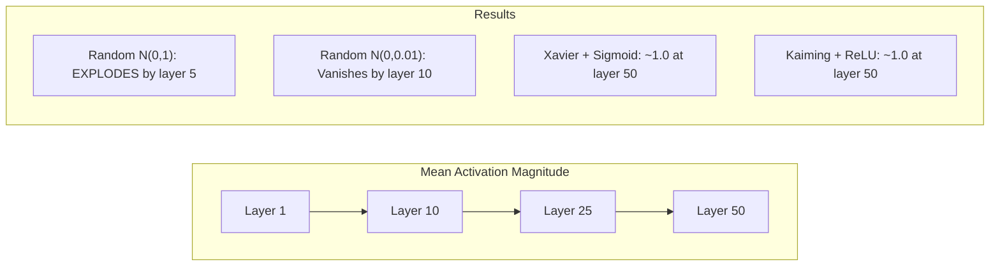
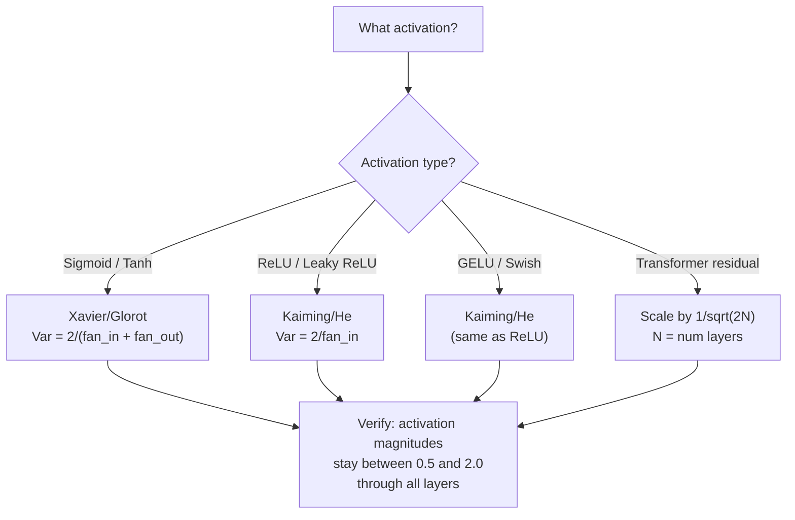

# Weight Initialization and Training Stability

> Initialize wrong and training never starts. Initialize right and 50 layers train as smoothly as 3.

**Type:** Build
**Languages:** Python
**Prerequisites:** Lesson 03.04 (Activation Functions), Lesson 03.07 (Regularization)
**Time:** ~90 minutes

## Learning Objectives

- Implement zero, random, Xavier/Glorot, and Kaiming/He initialization strategies and measure their effect on activation magnitudes through 50 layers
- Derive why Xavier init uses Var(w) = 2/(fan_in + fan_out) and Kaiming uses Var(w) = 2/fan_in
- Demonstrate the symmetry problem with zero initialization and explain why random scale alone is insufficient
- Match the correct initialization strategy to the activation function: Xavier for sigmoid/tanh, Kaiming for ReLU/GELU

## The Problem

Initialize all weights to zero. Nothing learns. Every neuron computes the same function, receives the same gradient, and updates identically. After 10,000 epochs, your 512-neuron hidden layer is still 512 copies of the same neuron. You paid for 512 parameters and got 1.

Initialize them too large. Activations explode through the network. By layer 10, values hit 1e15. By layer 20, they overflow to infinity. Gradients follow the same trajectory in reverse.

Initialize them randomly from a standard normal distribution. Works for 3 layers. At 50 layers, the signal collapses to zero or detonates to infinity depending on whether the random scale was slightly too small or slightly too large. The boundary between "works" and "broken" is razor-thin.

Weight initialization is the most underrated decision in deep learning. Architecture gets papers. Optimizers get blog posts. Initialization gets a footnote. But get it wrong and nothing else matters -- your network is dead before training begins.

## The Concept

### The Symmetry Problem

Every neuron in a layer has the same structure: multiply inputs by weights, add bias, apply activation. If all weights start at the same value (zero is the extreme case), every neuron computes the same output. During backpropagation, every neuron receives the same gradient. During the update step, every neuron changes by the same amount.

You're stuck. The network has hundreds of parameters, but they all move in lockstep. This is called symmetry, and random initialization is the brute-force way to break it. Each neuron starts at a different point in weight space, so each learns a different feature.

But "random" is not enough. The *scale* of the randomness determines whether the network trains.

### Variance Propagation Through Layers

Consider a single layer with fan_in inputs:

```
z = w1*x1 + w2*x2 + ... + w_n*x_n
```

If each weight wi is drawn from a distribution with variance Var(w) and each input xi has variance Var(x), the output variance is:

```
Var(z) = fan_in * Var(w) * Var(x)
```

If Var(w) = 1 and fan_in = 512, the output variance is 512x the input variance. After 10 layers: 512^10 = 1.2e27. Your signal has exploded.

If Var(w) = 0.001, the output variance shrinks by 0.001 * 512 = 0.512 per layer. After 10 layers: 0.512^10 = 0.00013. Your signal has vanished.

The goal: choose Var(w) so that Var(z) = Var(x). Signal magnitude stays constant across layers.

### Xavier/Glorot Initialization

Glorot and Bengio (2010) derived the solution for sigmoid and tanh activations. To keep variance constant in both the forward and backward pass:

```
Var(w) = 2 / (fan_in + fan_out)
```

In practice, weights are drawn from:

```
w ~ Uniform(-limit, limit)  where limit = sqrt(6 / (fan_in + fan_out))
```

or:

```
w ~ Normal(0, sqrt(2 / (fan_in + fan_out)))
```

This works because sigmoid and tanh are roughly linear near zero, where properly initialized activations live. The variance stays stable through dozens of layers.

### Kaiming/He Initialization

ReLU kills half the outputs (everything negative becomes zero). The effective fan_in is halved because on average half the inputs are zeroed. Xavier init doesn't account for this -- it underestimates the variance needed.

He et al. (2015) adjusted the formula:

```
Var(w) = 2 / fan_in
```

Weights are drawn from:

```
w ~ Normal(0, sqrt(2 / fan_in))
```

The factor of 2 compensates for ReLU zeroing half the activations. Without it, the signal shrinks by ~0.5x per layer. With 50 layers: 0.5^50 = 8.8e-16. Kaiming init prevents this.

### Transformer Initialization

GPT-2 introduced a different pattern. Residual connections add the output of each sub-layer to its input:

```
x = x + sublayer(x)
```

Each addition increases variance. With N residual layers, variance grows proportionally to N. GPT-2 scales the weights of residual layers by 1/sqrt(2N), where N is the number of layers. This keeps the accumulated signal magnitude stable.

Llama 3 (405B parameters, 126 layers) uses a similar scheme. Without this scaling, the residual stream would grow unbounded through 126 layers of attention and feedforward blocks.

```mermaid
flowchart TD
    subgraph "Zero Init"
        Z1["Layer 1<br/>All weights = 0"] --> Z2["Layer 2<br/>All neurons identical"]
        Z2 --> Z3["Layer 3<br/>Still identical"]
        Z3 --> ZR["Result: 1 effective neuron<br/>regardless of width"]
    end

    subgraph "Xavier Init"
        X1["Layer 1<br/>Var = 2/(fan_in+fan_out)"] --> X2["Layer 2<br/>Signal stable"]
        X2 --> X3["Layer 50<br/>Signal stable"]
        X3 --> XR["Result: Trains with<br/>sigmoid/tanh"]
    end

    subgraph "Kaiming Init"
        K1["Layer 1<br/>Var = 2/fan_in"] --> K2["Layer 2<br/>Signal stable"]
        K2 --> K3["Layer 50<br/>Signal stable"]
        K3 --> KR["Result: Trains with<br/>ReLU/GELU"]
    end
```



### Activation Magnitude Through 50 Layers



### Choosing the Right Init




## Further Reading

- Glorot & Bengio, "Understanding the difficulty of training deep feedforward neural networks" (2010) -- the original Xavier initialization paper with variance analysis
- He et al., "Delving Deep into Rectifiers" (2015) -- introduced Kaiming initialization for ReLU networks
- Radford et al., "Language Models are Unsupervised Multitask Learners" (2019) -- GPT-2 paper with residual scaling initialization
- Mishkin & Matas, "All You Need is a Good Init" (2016) -- layer-sequential unit-variance initialization, an empirical alternative to analytical formulas

## Exercises

1. **Establish a baseline.** Run the lesson demo, then capture the inputs, outputs, and one invariant that demonstrates this objective: Implement zero, random, Xavier/Glorot, and Kaiming/He initialization strategies and measure their effect on activation magnitudes through 50 layers.
2. **Change one variable.** Modify a single input or parameter and use the resulting evidence to investigate this objective: Derive why Xavier init uses Var(w) = 2/(fan_in + fan_out) and Kaiming uses Var(w) = 2/fan_in.
3. **Probe an edge case.** Predict the result before running it, compare prediction with observation, and explain the discrepancy while applying this objective: Demonstrate the symmetry problem with zero initialization and explain why random scale alone is insufficient.

## Reference Solution

Use the canonical [main.py](../code/main.py) as the executable baseline. A complete solution records a successful run, identifies the invariant tied to “Implement zero, random, Xavier/Glorot, and Kaiming/He initialization strategies and measure their effect on activation magnitudes through 50 layers,” and changes only one variable for the comparison. The edge-case result must distinguish the prediction from the observation, explain the cause using “Demonstrate the symmetry problem with zero initialization and explain why random scale alone is insufficient,” and cite a repeatable check rather than relying on visual inspection alone.
