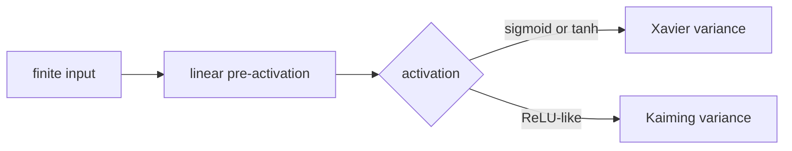

# Weight Initialization and Training Stability

> The first forward pass already reveals whether a network's scale is plausible.

**Type:** Build
**Languages:** Python
**Prerequisites:** Lesson 03.04 Activation Functions, Lesson 03.07 Regularization
**Time:** ~75 minutes

## Learning Objectives

- Implement zero, Gaussian, Xavier, and Kaiming matrix initializers.
- Derive the fan-in variance rule for a linear pre-activation.
- Explain why equal rows preserve neuron symmetry even when a layer has many parameters.
- Compare Xavier with sigmoid/tanh and Kaiming with ReLU on one seeded forward fixture.
- Reject malformed dimensions, scales, matrices, and non-finite activation inputs.

## Why the scale matters

For a row of weights and an input with independent, centered coordinates,

```text
Var(sum_j w_j x_j) = fan_in * Var(w) * Var(x)
```

If `Var(w)` is one, a width-64 layer multiplies the input variance by roughly 64. If it is too small, the signal shrinks at every layer. The experiment in this lesson measures the effect; it does not claim that one initializer wins for every architecture or dataset.

Zero initialization has a different failure: all rows are equal, so all neurons receive the same forward value and the same gradient. `zero_init(2, 4)` therefore has four identical rows. Randomness breaks that symmetry; its scale still has to match the activation's useful region.

## Two variance conventions

Xavier/Glorot uses

```text
Var(w) = 2 / (fan_in + fan_out)
```

for a balanced forward/backward scale around sigmoid or tanh. Kaiming/He uses

```text
Var(w) = 2 / fan_in
```

for ReLU-like activations, whose zero branch removes roughly half the signal in a centered fixture. `xavier_init` and `kaiming_init` draw normal weights with those variances. `random_init` is deliberately a control, not a recommended default.



## Build It

From `code/`, run:

```bash
python3 main.py
```

The demo prints the four-neuron zero-symmetry signature, observed pre-activation variances for three controls, and mean absolute activations at layers 1, 10, and 20 for Xavier+sigmoid and Kaiming+ReLU. The matrices are Python lists with shape `(fan_out, fan_in)` and all random draws use a local `random.Random` instance.

`matrix_variance` reports population variance for a non-empty rectangular matrix. The public functions raise `ValueError` for non-positive integer dimensions, non-positive/non-finite scales, ragged matrices, and non-finite scalar activations.

## Use It

1. Call `xavier_init(4, 3, random.Random(8))`; check that there are three rows and four entries per row.
2. Compute `2/(4+3)` by hand and compare it with `matrix_variance` on a larger seeded Xavier matrix.
3. Run `forward_deep(kaiming_init, relu, n_layers=6, width=8, n_samples=4, seed=5)` and record all six magnitudes.
4. Replace Kaiming with `zero_init` and inspect the first layer: symmetry is visible before any optimizer is involved.

## Ship It

`outputs/prompt-init-strategy.md` is a compact intake card. It asks for fan-in, fan-out, activation, seed, and a first-pass variance observation before a training run is trusted. The observed values are local diagnostics, not a production benchmark.

## Exercises

1. For `fan_in=8` and unit input variance, calculate the pre-activation variance produced by `random_init(scale=1)` and by Kaiming.
2. Use one `random.Random` object to initialize two consecutive layers. Show that the layers differ while the global random stream is unchanged.
3. Add a test for a ragged matrix and a `nan` activation input; both should fail before arithmetic proceeds.
4. Compare layer-20 magnitudes for Xavier+sigmoid and Kaiming+ReLU with the exact fixture above. Explain the observation without turning it into a universal ranking.

## Reference Solution

The matrix shape is `(fan_out, fan_in)`. For `fan_in=8`, unit-scale Gaussian weights predict variance `8`; Kaiming predicts `2/8 * 8 = 2` before the activation. A seeded local RNG makes consecutive layers different without touching the caller's RNG. The tests assert finite six-layer traces and explicit `ValueError` contracts; the measured layer-20 values are reported as fixture observations only.
