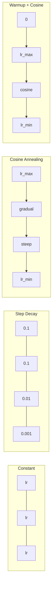
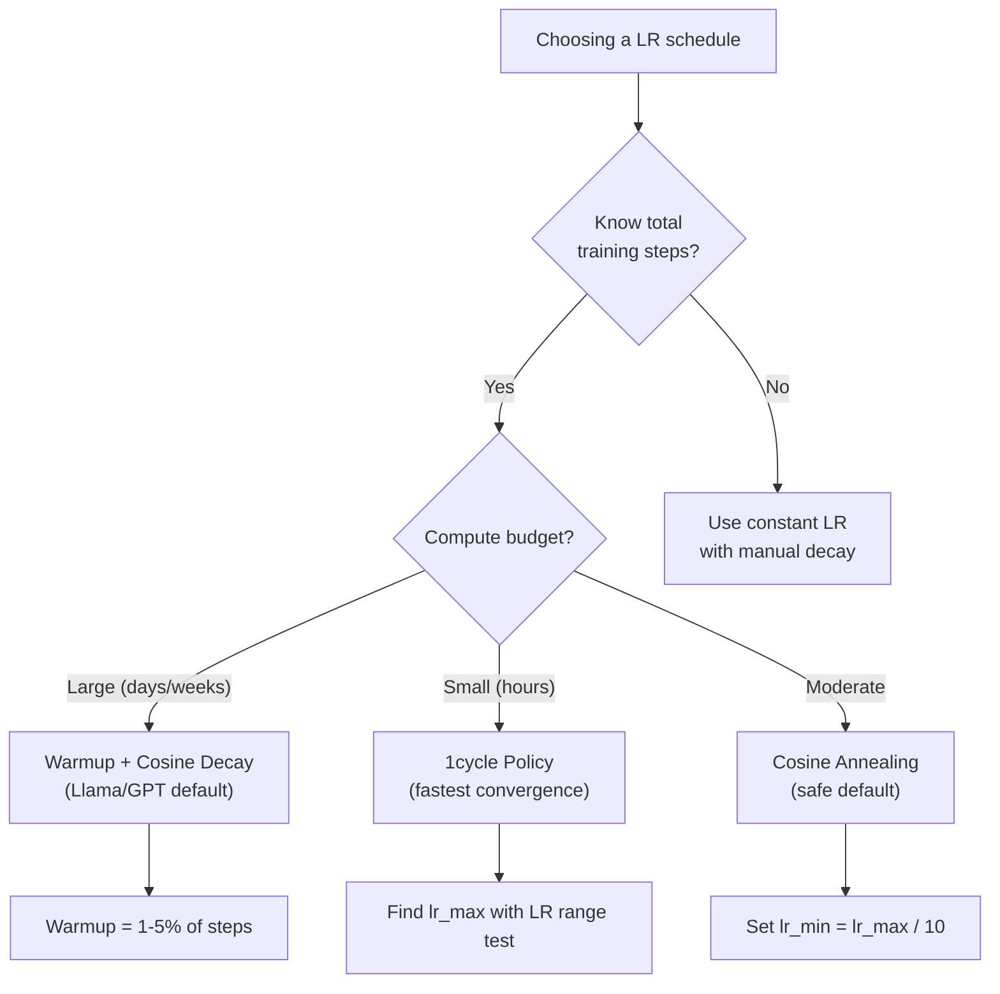
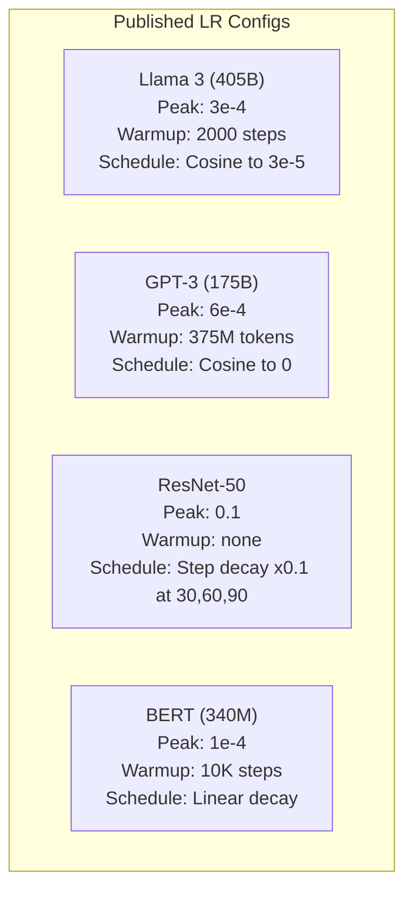

# Learning Rate Schedules and Warmup

> The learning rate is the single most important hyperparameter. Not the architecture. Not the dataset size. Not the activation function. The learning rate. If you tune nothing else, tune this.

**Type:** Build
**Languages:** Python
**Prerequisites:** Lesson 03.06 (Optimizers), Lesson 03.08 (Weight Initialization)
**Time:** ~90 minutes

## Learning Objectives

- Implement constant, step decay, cosine annealing, warmup + cosine, and 1cycle learning rate schedules from scratch
- Demonstrate the three failure modes of learning rate selection: divergence (too high), stalling (too low), and oscillation (no decay)
- Explain why warmup is necessary for Adam-based optimizers and how it stabilizes early training
- Compare convergence speed across all five schedules on the same task and select the appropriate one for a given training budget

## The Problem

Set the learning rate to 0.1. Training diverges -- loss jumps to infinity in 3 steps. Set it to 0.0001. Training crawls -- after 100 epochs, the model has barely moved from random. Set it to 0.01. Training works for 50 epochs, then the loss oscillates around a minimum it can never reach because the steps are too large.

The optimal learning rate is not a constant. It changes during training. Early on, you want large steps to cover ground quickly. Late in training, you want tiny steps to settle into a sharp minimum. The difference between a 90% accurate model and a 95% accurate model is often just the schedule.

Every major model published in the last three years uses a learning rate schedule. Llama 3 used peak lr=3e-4 with 2000 warmup steps and cosine decay to 3e-5. GPT-3 used lr=6e-4 with warmup over 375 million tokens. These are not arbitrary choices. They are the result of extensive hyperparameter sweeps that cost millions of dollars.

You need to understand schedules because the defaults will not work for your problem. When you fine-tune a pretrained model, the right schedule is different than training from scratch. When you increase batch size, the warmup period needs to change. When training breaks at step 10,000, you need to know whether it's a schedule problem or something else.

## The Concept

### Constant Learning Rate

The simplest approach. Pick a number, use it for every step.

```
lr(t) = lr_0
```

Rarely optimal. It's either too high for the end of training (oscillation around the minimum) or too low for the beginning (wasted compute on tiny steps). Works fine for small models and debugging. A terrible choice for anything that trains for more than an hour.

### Step Decay

The old-school approach from the ResNet era. Cut the learning rate by a factor (usually 10x) at fixed epochs.

```
lr(t) = lr_0 * gamma^(floor(epoch / step_size))
```

Where gamma = 0.1 and step_size = 30 means: lr drops by 10x every 30 epochs. ResNet-50 used this -- lr=0.1, drop by 10x at epochs 30, 60, and 90.

The problem: the optimal decay points depend on the dataset and architecture. Move to a different problem and you need to re-tune when to drop. The transitions are abrupt -- loss can spike when the rate suddenly changes.

### Cosine Annealing

Smooth decay from the maximum learning rate to a minimum, following a cosine curve:

```
lr(t) = lr_min + 0.5 * (lr_max - lr_min) * (1 + cos(pi * t / T))
```

Where t is the current step and T is the total number of steps.

At t=0, the cosine term is 1, so lr = lr_max. At t=T, the cosine term is -1, so lr = lr_min. The decay is gentle at first, accelerates in the middle, and becomes gentle again near the end.

This is the default for most modern training runs. No hyperparameters to tune beyond lr_max and lr_min. The cosine shape matches the empirical observation that most learning happens in the middle of training -- you want reasonable step sizes during that critical period.

### Warmup: Why You Start Small

Adam and other adaptive optimizers maintain running estimates of gradient mean and variance. At step 0, these estimates are initialized to zero. The first few gradient updates are based on garbage statistics. If your learning rate is large during this period, the model takes huge, poorly-directed steps.

Warmup fixes this. Start with a tiny learning rate (often lr_max / warmup_steps or even zero) and linearly ramp up to lr_max over the first N steps. By the time you reach the full learning rate, Adam's statistics have stabilized.

```
lr(t) = lr_max * (t / warmup_steps)     for t < warmup_steps
```

Typical warmup: 1-5% of total training steps. Llama 3 trained for ~1.8 trillion tokens and warmed up for 2000 steps. GPT-3 warmed up over 375 million tokens.

### Linear Warmup + Cosine Decay

The modern default. Ramp up linearly, then decay with cosine:

```
if t < warmup_steps:
    lr(t) = lr_max * (t / warmup_steps)
else:
    progress = (t - warmup_steps) / (total_steps - warmup_steps)
    lr(t) = lr_min + 0.5 * (lr_max - lr_min) * (1 + cos(pi * progress))
```

This is what Llama, GPT, PaLM, and most modern transformers use. The warmup prevents early instability. The cosine decay settles the model into a good minimum.

### 1cycle Policy

Leslie Smith's discovery (2018): ramp the learning rate up from a low value to a high value in the first half of training, then ramp it back down in the second half. Counterintuitive -- why would you *increase* the learning rate midway through?

The theory: a high learning rate acts as regularization by adding noise to the optimization trajectory. The model explores more of the loss landscape during the ramp-up phase, finding better basins. The ramp-down phase then refines within the best basin found.

```
Phase 1 (0 to T/2):    lr ramps from lr_max/25 to lr_max
Phase 2 (T/2 to T):    lr ramps from lr_max to lr_max/10000
```

1cycle often trains faster than cosine annealing for a fixed compute budget. The tradeoff: you must know the total number of steps in advance.

### Schedule Shapes



### Decision Flowchart



### Real Numbers from Published Models




## Build It

Reconstruct **Learning Rate Schedules and Warmup** by following `constant_schedule` on x=0.5 with the demo defaults. Run `python3 main.py` and verify that the update or loss change agrees with the gradient sign; a zero gradient produces no accidental jump.

## Use It

Call `constant_schedule` from a small caller with x=0.5 with the demo defaults. Compare its result with the demo output, and record the input contract and the one field a downstream user should rely on.

## Ship It

Hand off `outputs/prompt-lr-schedule-advisor.md` with the command `python3 main.py`, the accepted input shape (x=0.5 with the demo defaults), the expected observable result, and a failure note for malformed inputs.

## Further Reading

- Loshchilov & Hutter, "SGDR: Stochastic Gradient Descent with Warm Restarts" (2017) -- introduced cosine annealing and warm restarts
- Smith, "Super-Convergence: Very Fast Training of Neural Networks Using Large Learning Rates" (2018) -- the 1cycle policy paper
- Touvron et al., "Llama 2: Open Foundation and Fine-Tuned Chat Models" (2023) -- documents the warmup + cosine schedule used at scale
- Goyal et al., "Accurate, Large Minibatch SGD: Training ImageNet in 1 Hour" (2017) -- linear scaling rule and warmup for large batch training

## Exercises

Work from the smallest fixture that the Learning Rate Schedules and Warmup demo already understands, then make one deliberate change and record what moved.

1. **Run the smallest fixture.** From `code/`, run `python3 main.py` using x=0.5 with the demo defaults. Follow `constant_schedule`, `step_decay_schedule`, `cosine_schedule`. Expect the update or loss change agrees with the gradient sign; a zero gradient produces no accidental jump; capture the first printed shape, metric, status, or summary field and state which part supports **Implement constant, step decay, cosine annealing, warmup + cosine, and 1cycle learning rate schedules from scratch**.
2. **Perturb one field.** Repeat the command after changing only the learning rate: use the same run with learning rate 0.1 instead of 0.01. Predict the direction of the change, then compare the two output values. Explain why **Demonstrate the three failure modes of learning rate selection: divergence (too high), stalling (too low), and oscillation (no decay)** says the other inputs should stay fixed.
3. **Check the failure boundary.** Feed the implementation a zero gradient or an already-minimized point. Before running it, write down whether the relevant function should return an empty value, a zero-sized result, or a validation error. Check the observed status against **Explain why warmup is necessary for Adam-based optimizers and how it stabilizes early training** and record the exception text if the code rejects the case.
4. **Make the result repeatable.** Open `outputs/prompt-lr-schedule-advisor.md` and add a worked example using x=0.5 with the demo defaults. Include the input contract, one expected output field, and a named acceptance check for **Compare convergence speed across all five schedules on the same task and select the appropriate one for a given training budget**; note what the demo cannot establish.

## Reference Solution

A checkable result for **Learning Rate Schedules and Warmup** should contain:

- the `python3 main.py` output for x=0.5 with the demo defaults, with `constant_schedule`, `step_decay_schedule`, `cosine_schedule` traced to the value or shape that supports **Implement constant, step decay, cosine annealing, warmup + cosine, and 1cycle learning rate schedules from scratch**;
- a before/after comparison for the learning rate, where the same run with learning rate 0.1 instead of 0.01 changes the observation in the direction predicted by **Demonstrate the three failure modes of learning rate selection: divergence (too high), stalling (too low), and oscillation (no decay)**;
- a recorded result for a zero gradient or an already-minimized point that matches the implementation’s validation or empty-result contract and explains the evidence for **Explain why warmup is necessary for Adam-based optimizers and how it stabilizes early training**; and
- an updated `outputs/prompt-lr-schedule-advisor.md` example with a concrete input, expected output field, and acceptance check tied to **Compare convergence speed across all five schedules on the same task and select the appropriate one for a given training budget**.

Run the lesson tests after the demo. If the boundary behaves differently from the prediction, keep the actual exception or output and explain the implementation path that produced it.
