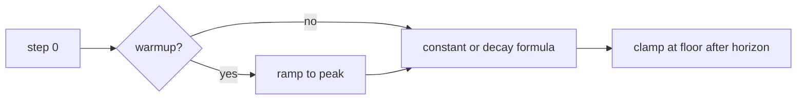

# Learning Rate Schedules and Warmup

> A schedule is a time-indexed function; its endpoint and boundary rules are part of the training contract.

**Type:** Build
**Languages:** Python
**Prerequisites:** Lesson 03.06 Optimizers, Lesson 03.08 Weight Initialization
**Time:** ~70 minutes

## Learning Objectives

- Implement constant, step, cosine, warmup-plus-cosine, and one-cycle schedules.
- Derive each schedule's value at an exact integer step.
- Distinguish the peak, floor, warmup boundary, and post-training behavior.
- Validate non-negative steps, positive horizons, and ordered rate bounds.
- Compare schedules on a seeded one-parameter quadratic without treating the fixture as a benchmark.

## A schedule is a function

The code evaluates `schedule(step, ...)` for integer steps starting at zero. `constant_schedule` always returns `lr`. `step_decay_schedule` returns

```text
lr * gamma ** (step // step_size)
```

with `0 <= gamma <= 1`. It changes only when the integer bucket changes; there is no interpolation between buckets.

Cosine decay uses

```text
lr_min + 0.5 * (lr - lr_min) * (1 + cos(pi * step / total_steps))
```

for `0 <= step < total_steps` and returns `lr_min` at or beyond the horizon. Thus step zero is the peak and the horizon is an explicit clamp, not an accidental division-by-zero case.

## Warmup and one cycle

`warmup_cosine_schedule` uses `lr * (step + 1) / warmup_steps` for the warmup steps, reaches the peak at the boundary, then follows cosine decay. A zero warmup skips the ramp. The implementation requires `0 <= warmup_steps < total_steps`; it does not silently reinterpret an impossible horizon.

`one_cycle_schedule` starts at `lr/div_factor`, rises smoothly to `lr` at the midpoint, then falls to `lr/final_div_factor` at the last in-horizon step. These are explicit scalar formulas for a small experiment, not a claim that one schedule is universally best.



## Build It

From `code/`, run:

```bash
python3 main.py
```

The demo prints step zero and final rates for five schedules and applies each to the same quadratic fixture. `train_quadratic` updates `x` with `x -= rate * 2*(x-target)` and returns `parameter`, `losses`, and `rates` for inspection.

All public schedules reject negative steps, non-finite or non-positive peaks, invalid horizons, a floor outside `[0, lr]`, invalid warmup boundaries, and invalid decay factors. `schedule_values` checks the returned trace for finite non-negative rates.

## Use It

1. Evaluate `cosine_schedule(0, lr=0.1, total_steps=10, lr_min=0.01)` and the same call at step 10.
2. Print the ten values from `warmup_cosine_schedule(... warmup_steps=3)`; identify the first ramp value and the first cosine value.
3. Compare `step_decay_schedule(step_size=4, gamma=0.5)` at steps 3, 4, and 8.
4. Run `train_quadratic(cosine_schedule, steps=20, base_lr=0.1, lr_min=0.01)` and report the first and last losses.

## Ship It

`outputs/prompt-lr-schedule-advisor.md` is a reusable review card. It requests the total step budget, peak/floor, warmup boundary, exact endpoint convention, and one observed loss trace before a schedule is selected.

## Exercises

1. Derive the cosine value at step 5 for `lr=0.1`, `lr_min=0.01`, `total_steps=10`.
2. Show why step decay with `step_size=4` has the same value at steps 4, 5, and 7.
3. Add negative tests for `warmup_steps=total_steps`, `lr_min>lr`, and a NaN learning rate.
4. Change only the schedule in the quadratic fixture; keep the seed and target fixed, then compare the two loss traces without declaring a universal winner.

## Reference Solution

Cosine starts at `0.1` and clamps to `0.01` at step 10. A three-step warmup returns `0.1/3`, `2*0.1/3`, and `0.1` for steps 0–2; step 3 begins the cosine segment at the peak. Step decay with size four changes buckets at steps 0, 4, and 8. The tests assert these values and the explicit validation errors, while the quadratic trace records only this lesson's local behavior.
