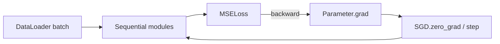

# Build Your Own Mini Framework

> A framework is a small set of contracts that lets layers, losses, data, and updates compose.

**Type:** Build
**Languages:** Python
**Prerequisites:** Phase 03 Lessons 01–09
**Time:** ~100 minutes

## Learning Objectives

- Implement `Module`, `Linear`, activations, `Sequential`, and scalar `Parameter` objects.
- Accumulate parameter gradients during backward and clear them before the next update.
- Propagate `train()`/`eval()` to a container and make Dropout change behavior accordingly.
- Batch a finite local dataset with a deterministic `DataLoader`.
- Train the four XOR examples with the framework's own MSE loss and SGD.

## The contracts that make a framework

Each `Module` has `forward`, `backward`, `parameters`, and a `training` flag. `Linear(2,4)` maps a two-value vector to four values and stores the input needed for its backward pass. `Tanh` and `Sigmoid` keep their forward outputs so their local derivatives can be evaluated later. `Sequential` runs modules in order and reverses them during backward.

`Parameter` separates `data` from an accumulated `grad`. `SGD.zero_grad()` clears every gradient, while `SGD.step()` subtracts `lr * grad` and rejects non-finite gradients. The separation is the same idea as a larger framework's optimizer state, but every operation remains inspectable Python.

Dropout uses an inverted mask only in training mode. In evaluation mode it returns the input unchanged. `DataLoader` validates a non-empty list of `(features, label)` pairs, yields the final short batch, and uses `seed + epoch` for reproducible but distinct shuffled epochs.



## Build It

From `code/`, run:

```bash
python3 main.py
```

The bounded demo builds `Linear(2,4) -> Tanh -> Linear(4,1) -> Sigmoid`, trains the four XOR points for 800 epochs, and prints `parameters=17`, the batch count from a three-row loader, the classes `[0, 1, 1, 0]`, and the final local MSE. No external package is imported.

The implementation rejects empty sequences, wrong widths, non-finite values, backward calls before forward, invalid dropout probabilities, empty parameter lists, non-positive rates, and non-finite gradients. These are API errors, not accidental `IndexError` or `ZeroDivisionError` paths.

## Use It

1. Construct `Linear(2,2,seed=1)`, run it on `(1,-2)`, and call `backward((1,1))`; inspect its two input gradients.
2. Build the XOR `Sequential` and compare `len(model.parameters())` with the `8+4+4+1=17` scalar count.
3. Call `model.eval()` around a `Dropout(0.5, seed=4)` module and verify that the same vector is returned without a mask.
4. Iterate `DataLoader` over five rows with `batch_size=2`; the batch lengths must be `[2,2,1]`.

## Ship It

`outputs/prompt-framework-architect.md` is a design review card for a small from-scratch model. It asks for the forward/backward interface, parameter ownership, gradient-clearing point, train/eval boundary, and final short-batch behavior before a framework is reused.

## Exercises

1. Use a finite difference on one `Linear` weight and compare it with the gradient after `MSELoss.backward()`.
2. Call `Sequential.backward` twice without `zero_grad`; show why the parameter gradient doubles, then add the missing clear.
3. Add a test that `Dropout.backward` before `forward` and `MSELoss.backward` before a loss call each raise `RuntimeError`.
4. Change only the loader seed and record the first shuffled batch for two epochs; explain why the sequence is reproducible across fresh loaders.

## Reference Solution

The XOR model has 17 scalar parameters and reaches `[0,1,1,0]` in the supplied 800-epoch seeded fixture. Linear backward returns a two-value input gradient and accumulates weight/bias gradients. Evaluation Dropout is identity, and five rows at batch size two yield `[2,2,1]`. The tests enforce these observations and the explicit failure contracts.
