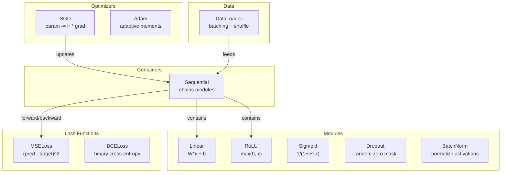
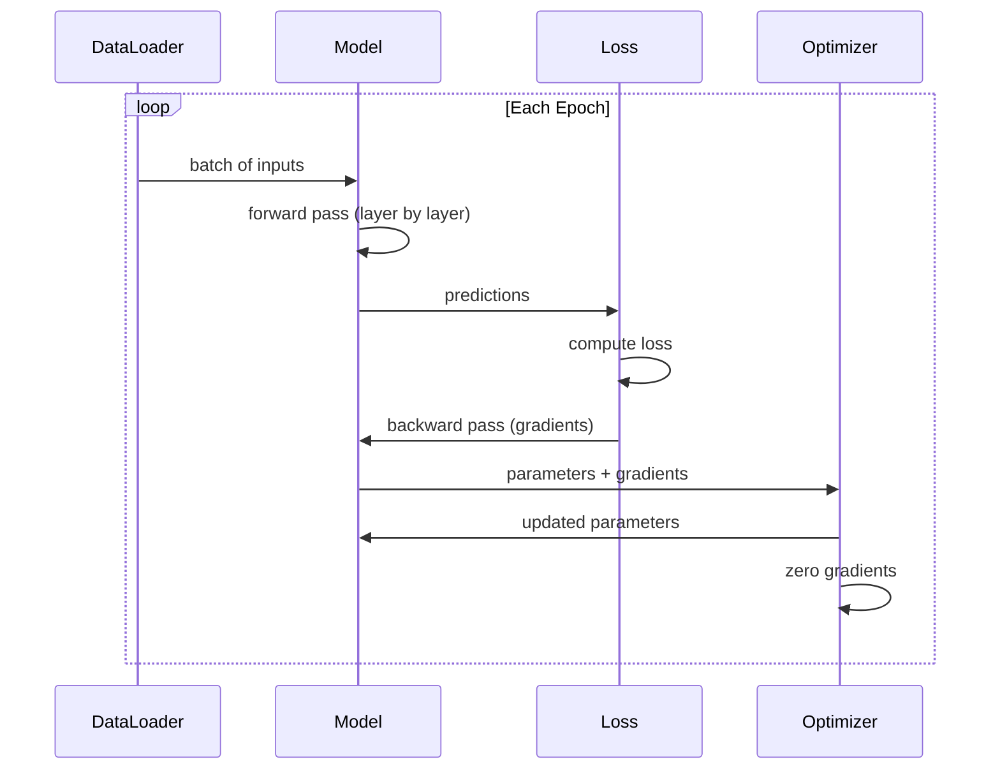
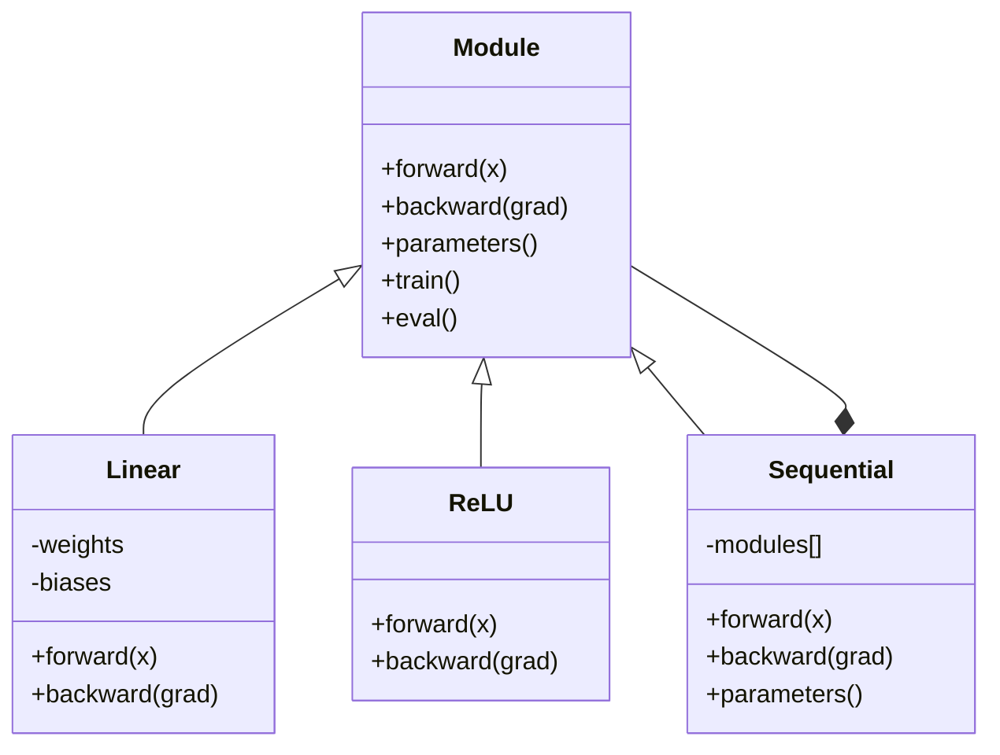

# Build Your Own Mini Framework

> You have built neurons, layers, networks, backprop, activations, loss functions, optimizers, regularization, initialization, and LR schedules. All as separate pieces. Now wire them together into a framework. Not PyTorch. Not TensorFlow. Yours.

**Type:** Build
**Languages:** Python
**Prerequisites:** All of Phase 03 (Lessons 01-09)
**Time:** ~120 minutes

## Learning Objectives

- Build a complete deep learning framework (~500 lines) with Module, Linear, ReLU, Sigmoid, Dropout, BatchNorm, Sequential, loss functions, optimizers, and DataLoader
- Explain the Module abstraction (forward, backward, parameters) and why train/eval mode toggling is necessary
- Wire all components into a working training loop that trains a 4-layer network on circle classification
- Map each component of your framework to its PyTorch equivalent (nn.Module, nn.Sequential, optim.Adam, DataLoader)

## The Problem

You have ten lessons of building blocks scattered across separate files. A `Value` class here, a training loop there, weight initialization in another file, learning rate schedules in yet another. To train a network, you copy-paste from five different lessons and wire them together by hand.

That is what frameworks solve. PyTorch gives you `nn.Module`, `nn.Sequential`, `optim.Adam`, `DataLoader`, and a training loop pattern that ties them together. TensorFlow gives you `keras.Layer`, `keras.Sequential`, `keras.optimizers.Adam`. These are not magic. They are organizational patterns that make it possible to define, train, and evaluate networks without reinventing the plumbing every time.

You are going to build the same thing in ~500 lines of Python. No numpy. No external dependencies. A framework that can define any feedforward network, train it with SGD or Adam, batch the data, apply dropout and batch normalization, use any activation, and schedule the learning rate.

When you finish, you will understand exactly what happens when you write `model = nn.Sequential(...)` in PyTorch. You will understand why `model.train()` and `model.eval()` exist. You will understand why `optimizer.zero_grad()` is a separate call. You will understand all of it, because you built all of it.

## The Concept

### The Module Abstraction

Every layer in PyTorch inherits from `nn.Module`. A Module has three responsibilities:

1. **forward()** -- compute the output given inputs
2. **parameters()** -- return all trainable weights
3. **backward()** -- compute gradients (handled by autograd in PyTorch, explicit in ours)

A Linear layer is a Module. A ReLU activation is a Module. A dropout layer is a Module. A batch normalization layer is a Module. They all have the same interface.

### Sequential Container

`nn.Sequential` chains Modules. Forward pass: feed data through Module 1, then Module 2, then Module 3. Backward pass: reverse the chain. The container itself is a Module -- it has forward(), parameters(), and backward(). This is the composite pattern: a sequence of Modules is itself a Module.

### Training vs Evaluation Mode

Dropout randomly zeroes neurons during training but passes everything through during evaluation. Batch normalization uses batch statistics during training but running averages during evaluation. The `train()` and `eval()` methods toggle this behavior. Every Module has a `training` flag.

### Optimizer

The optimizer updates parameters using their gradients. SGD: `param -= lr * grad`. Adam: maintains momentum and variance estimates, then updates. The optimizer does not know about the network architecture -- it only sees a flat list of parameters and their gradients.

### DataLoader

Batching matters for two reasons. First, you cannot fit the entire dataset in memory for large problems. Second, mini-batch gradient descent provides noise that helps escape local minima. The DataLoader splits data into batches and optionally shuffles between epochs.

### Framework Architecture

### Training Loop

### Module Hierarchy

## Build It

Reconstruct **Build Your Own Mini Framework** by following `Module` on a graph with edges (0,1) and (1,2). Run `python3 main.py` and verify that degrees, adjacency, or connectivity expose the isolated/no-edge case explicitly.

## Use It

Call `Module` from a small caller with a graph with edges (0,1) and (1,2). Compare its result with the demo output, and record the input contract and the one field a downstream user should rely on.

## Ship It

Hand off `outputs/prompt-framework-architect.md` with the command `python3 main.py`, the accepted input shape (a graph with edges (0,1) and (1,2)), the expected observable result, and a failure note for malformed inputs.

## Further Reading

- Paszke et al., "PyTorch: An Imperative Style, High-Performance Deep Learning Library" (2019) -- the paper describing PyTorch's design decisions
- Chollet, "Deep Learning with Python, Second Edition" (2021) -- Chapter 3 covers Keras internals with the same module/layer abstraction
- Johnson, "Tiny-DNN" (https://github.com/tiny-dnn/tiny-dnn) -- a header-only C++ deep learning framework for understanding framework internals

## Exercises

Use `Module` as the trace: start from a graph with edges (0,1) and (1,2), keep the raw output, and tie each observation to a named objective.

1. **Reproduce the reference path.** From `code/`, run `python3 main.py` using a graph with edges (0,1) and (1,2). Follow `Module`, `forward`, `backward`. Expect degrees, adjacency, or connectivity expose the isolated/no-edge case explicitly; capture the first printed shape, metric, status, or summary field and state which part supports **Build a complete deep learning framework (~500 lines) with Module, Linear, ReLU, Sigmoid, Dropout, BatchNorm, Sequential, loss functions, optimizers, and DataLoader**.
2. **Vary one named input.** Repeat the command after changing only the edge list: use the same graph with an isolated node 3. Predict the direction of the change, then compare the two output values. Explain why **Explain the Module abstraction (forward, backward, parameters) and why train/eval mode toggling is necessary** says the other inputs should stay fixed.
3. **Probe the empty case.** Feed the implementation a graph with no edges. Before running it, write down whether the relevant function should return an empty value, a zero-sized result, or a validation error. Check the observed status against **Wire all components into a working training loop that trains a 4-layer network on circle classification** and record the exception text if the code rejects the case.
4. **Package a usable handoff.** Open `outputs/prompt-framework-architect.md` and add a worked example using a graph with edges (0,1) and (1,2). Include the input contract, one expected output field, and a named acceptance check for **Map each component of your framework to its PyTorch equivalent (nn.Module, nn.Sequential, optim.Adam, DataLoader)**; note what the demo cannot establish.

## Reference Solution

A checkable result for **Build Your Own Mini Framework** should contain:

- the `python3 main.py` output for a graph with edges (0,1) and (1,2), with `Module`, `forward`, `backward` traced to the value or shape that supports **Build a complete deep learning framework (~500 lines) with Module, Linear, ReLU, Sigmoid, Dropout, BatchNorm, Sequential, loss functions, optimizers, and DataLoader**;
- a before/after comparison for the edge list, where the same graph with an isolated node 3 changes the observation in the direction predicted by **Explain the Module abstraction (forward, backward, parameters) and why train/eval mode toggling is necessary**;
- a recorded result for a graph with no edges that matches the implementation’s validation or empty-result contract and explains the evidence for **Wire all components into a working training loop that trains a 4-layer network on circle classification**; and
- an updated `outputs/prompt-framework-architect.md` example with a concrete input, expected output field, and acceptance check tied to **Map each component of your framework to its PyTorch equivalent (nn.Module, nn.Sequential, optim.Adam, DataLoader)**.

Run the lesson tests after the demo. If the boundary behaves differently from the prediction, keep the actual exception or output and explain the implementation path that produced it.
## Guided Demo

Use the [10–15 minute guided demo](demo.md) to predict an invariant, run the canonical entrypoint, change one variable, and probe a failure case.
