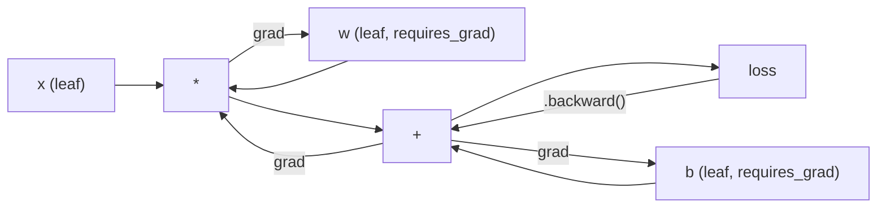
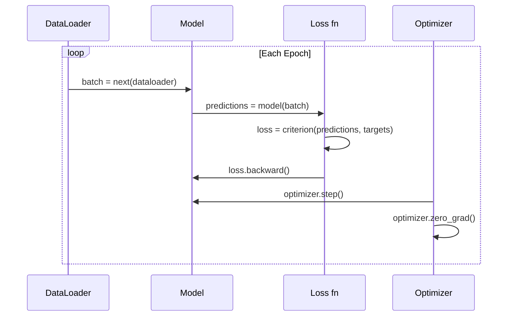

# Introduction to PyTorch

> You built the engine from pistons and crankshafts. Now learn the one everyone actually drives.

**Type:** Build
**Languages:** Python
**Prerequisites:** Lesson 03.10 (Build Your Own Mini Framework)
**Time:** ~75 minutes

## Learning Objectives

- Build and train neural networks using PyTorch's nn.Module, nn.Sequential, and autograd
- Use PyTorch tensors, GPU acceleration, and the standard training loop (zero_grad, forward, loss, backward, step)
- Convert your from-scratch mini framework components to their PyTorch equivalents
- Profile and compare training speed between your pure-Python framework and PyTorch on the same task

## The Problem

You have a working mini framework. Linear layers, ReLU, dropout, batch norm, Adam, a DataLoader, a training loop. It trains a 4-layer network on a circle classification problem in pure Python.

It is also 500x slower than PyTorch on the same problem.

Your mini framework processes one sample at a time with nested Python loops. PyTorch dispatches the same operations to optimized C++/CUDA kernels that run on GPU. On a single NVIDIA A100, PyTorch trains a ResNet-50 (25.6M parameters) on ImageNet (1.28M images) in about 6 hours. Your framework would take roughly 3,000 hours on the same task -- if it didn't run out of memory first.

Speed is not the only gap. Your framework has no GPU support. No automatic differentiation -- you hand-wrote backward() for every module. No serialization. No distributed training. No mixed precision. No way to debug gradient flow without print statements.

PyTorch fills every one of these gaps. And it does so while keeping the exact same mental model you already built: Module, forward(), parameters(), backward(), optimizer.step(). The concepts transfer one-to-one. The syntax is nearly identical. The difference is that PyTorch wraps a decade of systems engineering behind the same interface you designed from scratch.

## The Concept

### Why PyTorch Won

In 2015, TensorFlow required you to define a static computation graph before running anything. You built the graph, compiled it, then fed data through it. Debugging meant staring at graph visualizations. Changing the architecture meant rebuilding the graph from scratch.

PyTorch launched in 2017 with a different philosophy: eager execution. You write Python. It runs immediately. `y = model(x)` actually computes y right now, not "add a node to a graph that will compute y later." This meant standard Python debugging tools worked. print() worked. pdb worked. if/else in your forward pass worked.

By 2020, the market had spoken. PyTorch's share in ML research papers went from 7% (2017) to over 75% (2022). Meta, Google DeepMind, OpenAI, Anthropic, and Hugging Face all use PyTorch as their primary framework. TensorFlow 2.x adopted eager execution in response -- tacit admission that PyTorch's design was correct.

The lesson: developer experience compounds. A framework that is 10% slower but 50% faster to debug wins every time.

### Tensors

A tensor is a multi-dimensional array with three critical properties: shape, dtype, and device.

```python
import torch

x = torch.zeros(3, 4)           # shape: (3, 4), dtype: float32, device: cpu
x = torch.randn(2, 3, 224, 224) # batch of 2 RGB images, 224x224
x = torch.tensor([1, 2, 3])     # from a Python list
```

**Shape** is the dimensionality. A scalar is shape (), a vector is (n,), a matrix is (m, n), a batch of images is (batch, channels, height, width).

**Dtype** controls precision and memory.

| dtype | Bits | Range | Use case |
|-------|------|-------|----------|
| float32 | 32 | ~7 decimal digits | Default training |
| float16 | 16 | ~3.3 decimal digits | Mixed precision |
| bfloat16 | 16 | Same range as float32, less precision | LLM training |
| int8 | 8 | -128 to 127 | Quantized inference |

**Device** determines where computation happens.

```python
device = torch.device("cuda" if torch.cuda.is_available() else "cpu")
x = torch.randn(3, 4, device=device)
x = x.to("cuda")
x = x.cpu()
```

Every operation requires all tensors on the same device. This is the #1 PyTorch error beginners hit: `RuntimeError: Expected all tensors to be on the same device`. Fix it by moving everything to the same device before computation.

**Reshaping** is constant-time -- it changes the metadata, not the data.

```python
x = torch.randn(2, 3, 4)
x.view(2, 12)      # reshape to (2, 12) -- must be contiguous
x.reshape(6, 4)    # reshape to (6, 4) -- works always
x.permute(2, 0, 1) # reorder dimensions
x.unsqueeze(0)     # add dimension: (1, 2, 3, 4)
x.squeeze()        # remove size-1 dimensions
```

### Autograd

Your mini framework required you to implement backward() for every module. PyTorch does not. It records every operation on tensors into a directed acyclic graph (the computational graph) and then traverses that graph in reverse to compute gradients automatically.



The key difference from your framework: PyTorch uses tape-based autodiff. Every operation appends to a "tape" during the forward pass. Calling `.backward()` replays the tape in reverse.

```python
x = torch.randn(3, requires_grad=True)
y = x ** 2 + 3 * x
z = y.sum()
z.backward()
print(x.grad)  # dz/dx = 2x + 3
```

Three rules of autograd:

1. Only leaf tensors with `requires_grad=True` accumulate gradients
2. Gradients accumulate by default -- call `optimizer.zero_grad()` before each backward pass
3. `torch.no_grad()` disables gradient tracking (use during evaluation)

### nn.Module

`nn.Module` is the base class for every neural network component in PyTorch. You already built this abstraction in Lesson 10. PyTorch's version adds automatic parameter registration, recursive module discovery, device management, and state dict serialization.

```python
import torch.nn as nn

class MLP(nn.Module):
    def __init__(self, input_dim, hidden_dim, output_dim):
        super().__init__()
        self.layer1 = nn.Linear(input_dim, hidden_dim)
        self.relu = nn.ReLU()
        self.layer2 = nn.Linear(hidden_dim, output_dim)

    def forward(self, x):
        x = self.layer1(x)
        x = self.relu(x)
        x = self.layer2(x)
        return x
```

When you assign an `nn.Module` or `nn.Parameter` as an attribute in `__init__`, PyTorch automatically registers it. `model.parameters()` recursively collects every registered parameter. This is why you never have to manually gather weights like you did in the mini framework.

Key building blocks:

| Module | What it does | Parameters |
|--------|-------------|------------|
| nn.Linear(in, out) | Wx + b | in*out + out |
| nn.Conv2d(in_ch, out_ch, k) | 2D convolution | in_ch*out_ch*k*k + out_ch |
| nn.BatchNorm1d(features) | Normalize activations | 2 * features |
| nn.Dropout(p) | Random zeroing | 0 |
| nn.ReLU() | max(0, x) | 0 |
| nn.GELU() | Gaussian error linear | 0 |
| nn.Embedding(vocab, dim) | Lookup table | vocab * dim |
| nn.LayerNorm(dim) | Per-sample normalization | 2 * dim |

### Loss Functions and Optimizers

PyTorch ships production-ready versions of everything you built.

**Loss functions** (from `torch.nn`):

| Loss | Task | Input |
|------|------|-------|
| nn.MSELoss() | Regression | Any shape |
| nn.CrossEntropyLoss() | Multi-class classification | Logits (not softmax) |
| nn.BCEWithLogitsLoss() | Binary classification | Logits (not sigmoid) |
| nn.L1Loss() | Regression (robust) | Any shape |
| nn.CTCLoss() | Sequence alignment | Log probabilities |

Note: `CrossEntropyLoss` combines `LogSoftmax` + `NLLLoss` internally. Pass raw logits, not softmax outputs. This is a common mistake that produces wrong gradients silently.

**Optimizers** (from `torch.optim`):

| Optimizer | When to use | Typical LR |
|-----------|-------------|-----------|
| SGD(params, lr, momentum) | CNNs, well-tuned pipelines | 0.01--0.1 |
| Adam(params, lr) | Default starting point | 1e-3 |
| AdamW(params, lr, weight_decay) | Transformers, fine-tuning | 1e-4--1e-3 |
| LBFGS(params) | Small-scale, second-order | 1.0 |

### The Training Loop

Every PyTorch training loop follows the same 5-step pattern. You already know this from Lesson 10.



The canonical pattern:

```python
for epoch in range(num_epochs):
    model.train()
    for inputs, targets in train_loader:
        inputs, targets = inputs.to(device), targets.to(device)
        optimizer.zero_grad()
        outputs = model(inputs)
        loss = criterion(outputs, targets)
        loss.backward()
        optimizer.step()
```

Five lines inside the batch loop. Five lines that trained GPT-4, Stable Diffusion, and LLaMA. The architecture changes. The data changes. These five lines do not.

### Dataset and DataLoader

PyTorch's `Dataset` is an abstract class with two methods: `__len__` and `__getitem__`. `DataLoader` wraps it with batching, shuffling, and multi-process data loading.

```python
from torch.utils.data import Dataset, DataLoader

class MNISTDataset(Dataset):
    def __init__(self, images, labels):
        self.images = images
        self.labels = labels

    def __len__(self):
        return len(self.labels)

    def __getitem__(self, idx):
        return self.images[idx], self.labels[idx]

loader = DataLoader(dataset, batch_size=64, shuffle=True, num_workers=4)
```

`num_workers=4` spawns 4 processes to load data in parallel while the GPU trains on the current batch. On disk-bound workloads (large images, audio), this alone can double training speed.

### GPU Training

Moving a model to GPU:

```python
device = torch.device("cuda" if torch.cuda.is_available() else "cpu")
model = model.to(device)
```

This recursively moves every parameter and buffer to the GPU. Then move each batch during training:

```python
inputs, targets = inputs.to(device), targets.to(device)
```

**Mixed precision** halves memory usage and doubles throughput on modern GPUs (A100, H100, RTX 4090) by running forward/backward in float16 while keeping the master weights in float32:

```python
from torch.amp import autocast, GradScaler

scaler = GradScaler()
for inputs, targets in loader:
    with autocast(device_type="cuda"):
        outputs = model(inputs)
        loss = criterion(outputs, targets)
    scaler.scale(loss).backward()
    scaler.step(optimizer)
    scaler.update()
    optimizer.zero_grad()
```

### Comparison: Mini Framework vs PyTorch vs JAX

| Feature | Mini Framework (L10) | PyTorch | JAX |
|---------|---------------------|---------|-----|
| Autodiff | Manual backward() | Tape-based autograd | Functional transforms |
| Execution | Eager (Python loops) | Eager (C++ kernels) | Traced + JIT compiled |
| GPU support | No | Yes (CUDA, ROCm, MPS) | Yes (CUDA, TPU) |
| Speed (MNIST MLP) | ~300s/epoch | ~0.5s/epoch | ~0.3s/epoch |
| Module system | Custom Module class | nn.Module | Stateless functions (Flax/Equinox) |
| Debugging | print() | print(), pdb, breakpoint() | Harder (JIT tracing breaks print) |
| Ecosystem | None | Hugging Face, Lightning, timm | Flax, Optax, Orbax |
| Learning curve | You built it | Moderate | Steep (functional paradigm) |
| Production use | Toy problems | Meta, OpenAI, Anthropic, HF | Google DeepMind, Midjourney |


## Use It

### Quick Comparison: Mini Framework vs PyTorch

| Mini Framework (Lesson 10) | PyTorch |
|---------------------------|---------|
| `model = Sequential(Linear(784, 256), ReLU(), ...)` | `model = nn.Sequential(nn.Linear(784, 256), nn.ReLU(), ...)` |
| `pred = model.forward(x)` | `pred = model(x)` |
| `optimizer.zero_grad()` | `optimizer.zero_grad()` |
| `grad = criterion.backward()` then `model.backward(grad)` | `loss.backward()` |
| `optimizer.step()` | `optimizer.step()` |
| No GPU | `model.to("cuda")` |
| Manual backward for every module | Autograd handles everything |

The interface is nearly identical. The difference is everything under the hood.

### Saving and Loading Models

```python
torch.save(model.state_dict(), "model.pt")

model = MNISTModel()
model.load_state_dict(torch.load("model.pt", weights_only=True))
model.eval()
```

Always save `state_dict()` (the parameter dictionary), not the model object. Saving the model object uses pickle, which breaks when you refactor code. State dicts are portable.

### Learning Rate Scheduling

```python
scheduler = torch.optim.lr_scheduler.CosineAnnealingLR(
    optimizer, T_max=10
)
for epoch in range(10):
    train_one_epoch(model, train_loader, criterion, optimizer, device)
    scheduler.step()
```

PyTorch ships 15+ schedulers: StepLR, ExponentialLR, CosineAnnealingLR, OneCycleLR, ReduceLROnPlateau. All plug into the same optimizer interface.

## Ship It

This lesson produces two artifacts:

- `outputs/prompt-pytorch-debugger.md` -- a prompt for diagnosing common PyTorch training failures
- `outputs/skill-pytorch-patterns.md` -- a skill reference for PyTorch training patterns


## Key Terms

| Term | What people say | What it actually means |
|------|----------------|----------------------|
| Tensor | "A multi-dimensional array" | A typed, device-aware array with automatic differentiation support baked into every operation |
| Autograd | "Automatic backprop" | A tape-based system that records operations during forward pass, then replays them in reverse to compute exact gradients |
| nn.Module | "A layer" | The base class for any differentiable computation block -- registers parameters, supports nesting, handles train/eval modes |
| state_dict | "The model weights" | An OrderedDict mapping parameter names to tensors -- the portable, serializable representation of a trained model |
| .backward() | "Compute gradients" | Traverse the computational graph in reverse, computing and accumulating gradients for every leaf tensor with requires_grad=True |
| .to(device) | "Move to GPU" | Recursively transfer all parameters and buffers to the specified device (CPU, CUDA, MPS) |
| DataLoader | "The data pipeline" | An iterator that batches, shuffles, and optionally parallelizes data loading from a Dataset |
| Mixed precision | "Use float16" | Train with float16 forward/backward for speed while keeping float32 master weights for numerical stability |
| Eager execution | "Run it now" | Operations execute immediately when called, not deferred to a later compilation step -- the core design choice that differentiates PyTorch from TF 1.x |
| zero_grad | "Reset gradients" | Set all parameter gradients to zero before the next backward pass, since PyTorch accumulates gradients by default |

## Further Reading

- Paszke et al., "PyTorch: An Imperative Style, High-Performance Deep Learning Library" (2019) -- the original paper explaining PyTorch's design tradeoffs
- PyTorch Tutorials: "Learning PyTorch with Examples" (https://pytorch.org/tutorials/beginner/pytorch_with_examples.html) -- the official path from tensors to nn.Module
- PyTorch Performance Tuning Guide (https://pytorch.org/tutorials/recipes/recipes/tuning_guide.html) -- mixed precision, DataLoader workers, pinned memory, and other production optimizations
- Horace He, "Making Deep Learning Go Brrrr" (https://horace.io/brrr_intro.html) -- why GPU training is fast, with PyTorch-specific optimization strategies
