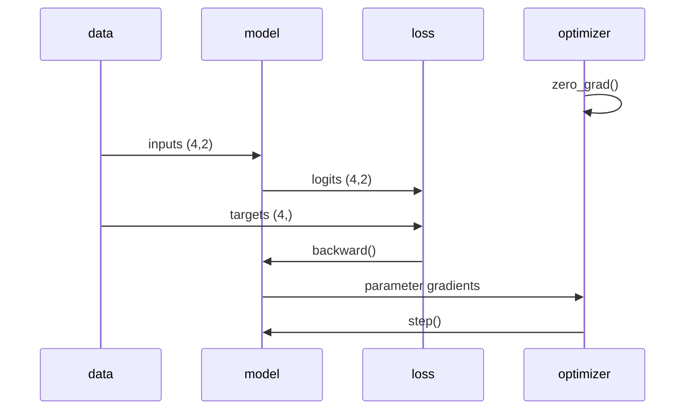

# Introduction to PyTorch

> The familiar module loop becomes a tensor program only after the shapes, dtype, device, and gradient boundaries are explicit.

**Type:** Reference
**Languages:** Python
**Prerequisites:** Lesson 03.10 Mini Framework
**Time:** ~60 minutes

## Learning Objectives

- Map `Linear`, `Sequential`, `MSELoss`/cross-entropy, and `SGD` concepts to PyTorch APIs.
- Read tensor shape, dtype, device, and target-type contracts from a small model.
- Explain the order `zero_grad → forward → loss → backward → step`.
- Keep optional backend code import-safe when PyTorch is not installed.
- Check a four-row classifier for finite loss and a measurable prediction result when the backend exists.

## Same loop, different storage

The mini-framework stores Python scalars in `Parameter` objects. PyTorch stores tensors and records operations for autograd. The conceptual loop is still:

```python
optimizer.zero_grad()
logits = model(inputs)
loss = criterion(logits, targets)
loss.backward()
optimizer.step()
```

For the local fixture, `inputs` has shape `(4, 2)` and `targets` has shape `(4,)` with integer class IDs. `build_model()` creates `Linear(2,4) → Tanh → Linear(4,2)`. `CrossEntropyLoss` expects raw class logits and `torch.long` targets; applying a separate softmax before it would change the intended contract.

Every tensor participating in one operation must share a device. `device_name()` returns `"cpu"` or `"cuda"` only when PyTorch can be resolved; otherwise it returns `"unavailable"`. The lesson does not install packages, download weights, or pretend that a missing backend ran.



## Build It

From `code/`, run:

```bash
python3 main.py
```

If the optional package is available, the bounded demo trains the four-row fixture for 60 CPU-or-device steps and prints the selected device, input shape, accuracy, and final finite loss. If it is unavailable, the same command exits 0 with `PyTorch unavailable; optional tensor path was not executed.` No network or installation is attempted in either branch.

## Use It

1. Inspect `fixture()` and confirm `(4,2)` inputs and `(4,)` integer targets.
2. Call `build_model()` and list the two linear layers' shapes when PyTorch is present.
3. Run `train_demo(steps=5, device="cpu")`; check that the returned loss list is finite.
4. Deliberately move only `x` to a different device in a scratch copy and identify the device mismatch before changing model code.

## Ship It

`outputs/skill-pytorch-patterns.md` is a guarded migration card. It records tensor contracts and the five-step update order, and asks callers to report whether the optional backend was actually available. `outputs/prompt-pytorch-debugger.md` turns shape/device/autograd checks into a short diagnostic intake.

## Exercises

1. Write down the expected logits shape for a batch of five before running `build_model()(x)`.
2. Remove `optimizer.zero_grad()` for two steps in a scratch copy and compare the second gradient with the clean loop.
3. Add an assertion that a non-finite loss aborts before `backward()`; keep the fallback path import-safe.
4. Run the canonical command in an environment without PyTorch and record the explicit fallback line rather than reporting a fabricated accuracy.

## Reference Solution

The fixture has shape `(4,2)`/`(4,)`, the model returns `(4,2)` logits, and the update order clears old gradients before the new backward pass. A live backend returns a finite loss trace; an absent backend returns a clear, zero-exit availability message. The tests exercise both branches without downloading or installing dependencies.
