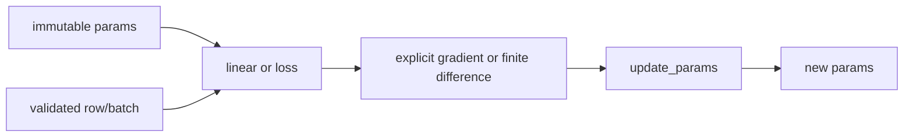

# Functional Transformations Without JAX

> Learn the data-flow ideas behind `grad`, `vmap`, and explicit PRNG keys with a runnable standard-library bridge.

**Type:** Build
**Languages:** Python
**Prerequisites:** Phase 03 Lessons 01-10, basic Python sequences and derivatives
**Time:** ~45 minutes

## Learning Objectives

- Represent a scalar model as an immutable `{"w": ..., "b": ...}` parameter mapping.
- Check feature shapes before applying a functional linear transformation.
- Approximate a derivative with a centered finite difference and state its error trade-off.
- Map one pure function over a batch and keep the batch dimension explicit.
- Split an integer seed deterministically and return updated parameters without mutation.

## Why this bridge exists

JAX is a separate array and transformation library, but it is not in this repository's dependency allowlist. This lesson therefore does not pretend that `jax.grad`, `jax.jit`, or `jax.vmap` ran. Instead, `code/main.py` makes the underlying contracts executable with Python tuples and functions. The names in the table are a conceptual mapping, not interchangeable APIs.

| Transformation idea | Local implementation | What is actually checked |
| --- | --- | --- |
| Explicit functional state | `linear`, `update_params` | parameters enter and leave each call; inputs are not mutated |
| Scalar differentiation | `finite_difference_gradient` | centered estimate `(f(x+ε)-f(x-ε))/(2ε)` |
| Batch mapping | `vmap` | one result per non-empty input value |
| Shape discipline | `shape_checked` | every row has the declared width |
| Explicit randomness | `split_seed`, `random_vector` | the same integer seed gives the same tuple |

## Build It

### 1. Inspect the parameter contract

`linear` accepts a two-field mapping. For `w=(2,-1)`, `b=0.5`, and `x=(3,4)`, it computes `2*3 - 1*4 + 0.5 = 2.5`. A missing field, non-finite number, empty vector, or mismatched width raises `ValueError`; there is no silent broadcasting.

```python
params = {"w": (2.0, -1.0), "b": 0.5}
print(linear(params, (3.0, 4.0)))  # 2.5
```

`update_params` returns a new mapping. With `w=(0,)`, `b=0`, gradient `(-1,-1)`, and learning rate `0.1`, the result is `w=(0.1,)`, `b=0.1`; the original mapping remains unchanged.

### 2. Approximate and map

For `f(x)=x²`, `finite_difference_gradient(f, 3.0)` is approximately `6`. A positive `epsilon` is required because a zero or non-finite step cannot define a centered difference. `vmap(lambda x: x*x, (1,2,3))` returns `(1,4,9)`, one result per row. `shape_checked` wraps a callable and rejects a row whose width is not the configured value.



### 3. Train the local fixture

`train_linear` fits four points for `y=2x+1`: `x=(-1,0,1,2)` and `y=(-1,1,3,5)`. It returns the final parameter mapping and a loss trace. The default 20-step run starts at `9.0` and ends below `0.01` with learning rate `0.1`; these values are local fixture observations, not a benchmark. Both `steps` and the learning rate are checked before the loop.

Run the canonical demo from the lesson's `code/` directory:

```bash
python3 main.py
```

It prints a finite-difference estimate near `6`, squared values `(1.0, 4.0, 9.0)`, two deterministic child seeds, and the initial/final training loss. The final line includes the fitted `w` and `b`.

## Use It

To adapt the bridge, keep the state transitions explicit:

```python
params = {"w": (0.0,), "b": 0.0}
predict = shape_checked(lambda row: linear(params, row), 1)
predictions = vmap(predict, ((-1.0,), (0.0,), (1.0,)))
```

Use `mse` only with a non-empty batch whose rows and targets have equal length. If a model has two features, call `shape_checked(..., 2)` at the boundary. For random initial values, pass a seed into `random_vector`; do not rely on a process-global random state.

The pure functions make a useful review seam: a test can compare `finite_difference_gradient` with an analytic derivative, assert that `update_params` leaves its input unchanged, and check that a batch has one result per input.

## Ship It

The reusable artifact is the functional-parameter review pattern: document the parameter tree, validate shapes at the boundary, pass state in and out, and record the loss trace. Before shipping a larger implementation, retain three acceptance checks:

1. repeated calls with the same seed and inputs produce the same tuples;
2. every update returns finite parameters without mutating the previous mapping;
3. a bounded fixture lowers its measured loss and reports its exact input contract.

The lesson deliberately stops at the bridge. Actual JAX tracing, accelerator compilation, and device placement require a separately approved environment; none is implied by this local artifact.

## Exercises

1. Change `train_linear` to fit `y=3x-2` and record the final parameter tuple after 30 steps. Keep the fixture finite and report whether the loss decreased.
2. Wrap a two-feature linear predictor with `shape_checked(..., 2)`, map it over three rows, and verify that a one-feature row raises `ValueError` before the predictor runs.
3. Compare the centered derivative of `x**3` at `2` with the exact value `12` for `epsilon=1e-3` and `1e-6`. Explain why making epsilon arbitrarily small can expose floating-point cancellation.

## Reference Solution

For Exercise 1, use the same explicit update contract with `xs=((-1,), (0,), (1,), (2,))`, targets `(-5,-2,1,4)`, and gradients computed from the residuals. Accept the solution when the returned trace is finite, its final value is below its initial value, and the parameters are close to `(3,-2)` for this fixture. For Exercise 2, the mapped result must contain three values and the malformed row must fail at the wrapper. For Exercise 3, both estimates should be near `12`, with the larger step usually less sensitive to round-off; the conclusion must distinguish truncation error from floating-point error.
