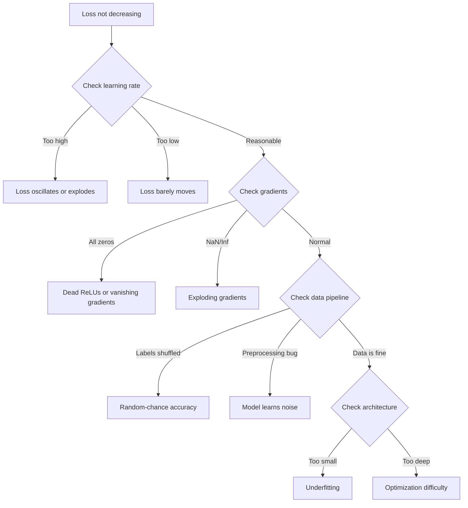
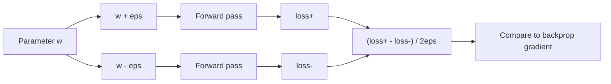
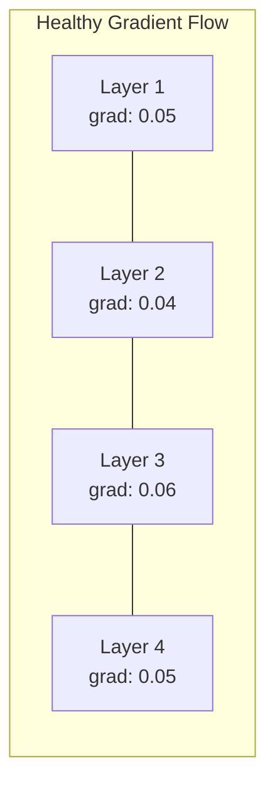
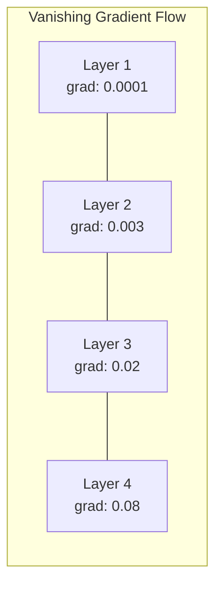
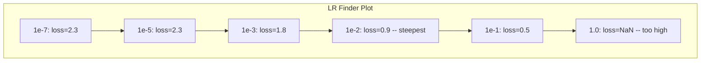

# Debugging Neural Networks

> Your network compiled. It ran. It produced a number. The number is wrong and nothing crashed. Welcome to the hardest kind of debugging -- the kind where there is no error message.

**Type:** Practice
**Languages:** Python, PyTorch
**Prerequisites:** Phase 03 Lessons 01-10 (especially backpropagation, loss functions, optimizers)
**Time:** ~90 minutes

## Learning Objectives

- Diagnose common neural network failures (NaN loss, flat loss curve, overfitting, oscillation) using systematic debugging strategies
- Apply the "overfit one batch" technique to verify that your model architecture and training loop are correct
- Inspect gradient magnitudes, activation distributions, and weight norms to identify vanishing/exploding gradient problems
- Build a debugging checklist that covers data pipeline, model architecture, loss function, optimizer, and learning rate issues

## The Problem

Traditional software crashes when it is broken. A null pointer throws an exception. A type mismatch fails at compile time. An off-by-one error produces a clearly wrong output.

Neural networks do not give you that luxury.

A broken neural network runs to completion, prints a loss value, and outputs predictions. The loss might decrease. The predictions might look plausible. But the model is silently wrong -- learning shortcuts, memorizing noise, or converging to a useless local minimum. Google researchers estimated that 60-70% of ML debugging time is spent on "silent" bugs that produce no errors but degrade model quality.

The difference between a working model and a broken one is often a single misplaced line: a missing `zero_grad()`, a transposed dimension, a learning rate off by 10x. the canonical "Recipe for Training Neural Networks" (2019) opens with this: "The most common neural net mistakes are bugs that don't crash."

This lesson teaches you to find those bugs.

## The Concept

### The Debugging Mindset

Forget print-and-pray debugging. Neural network debugging requires a systematic approach because the feedback loop is slow (minutes to hours per training run) and the symptoms are ambiguous (bad loss could mean 20 different things).

The golden rule: **start simple, add complexity one piece at a time, and verify each piece independently.**



### Symptom 1: Loss Not Decreasing

This is the most common complaint. The training loop runs, epochs tick by, and the loss stays flat or oscillates wildly.

**Wrong learning rate.** Too high: loss oscillates or jumps to NaN. Too low: loss decreases so slowly it looks flat. For Adam, start at 1e-3. For SGD, start at 1e-1 or 1e-2. Always try 3 learning rates spanning 10x each (e.g., 1e-2, 1e-3, 1e-4) before concluding something else is wrong.

**Dead ReLUs.** If a ReLU neuron receives a large negative input, it outputs 0 and its gradient is 0. It never activates again. If enough neurons die, the network cannot learn. Check: print the fraction of activations that are exactly 0 after each ReLU layer. If >50% are dead, switch to LeakyReLU or reduce the learning rate.

**Vanishing gradients.** In deep networks with sigmoid or tanh activations, gradients shrink exponentially as they propagate backward. By the time they reach the first layer, they are ~0. The first layers stop learning. Fix: use ReLU/GELU, add residual connections, or use batch normalization.

**Exploding gradients.** The opposite problem -- gradients grow exponentially. Common in RNNs and very deep networks. Loss jumps to NaN. Fix: gradient clipping (`torch.nn.utils.clip_grad_norm_`), lower learning rate, or add normalization.

### Symptom 2: Loss Decreasing But Model is Bad

The loss goes down. Training accuracy hits 99%. But test accuracy is 55%. Or the model produces nonsensical outputs on real data.

**Overfitting.** The model memorizes training data instead of learning patterns. Gap between training and validation loss grows over time. Fix: more data, dropout, weight decay, early stopping, data augmentation.

**Data leakage.** Test data leaked into training. Accuracy is suspiciously high. Common causes: shuffling before splitting, preprocessing with statistics from the full dataset, duplicate samples across splits. Fix: split first, preprocess second, check for duplicates.

**Label errors.** 5-10% of labels in most real datasets are wrong (Northcutt et al., 2021 -- "Pervasive Label Errors in Test Sets"). The model learns the noise. Fix: use confident learning to find and fix mislabeled examples, or use loss truncation to ignore high-loss samples.

### Symptom 3: NaN or Inf in Loss

The loss value becomes `nan` or `inf`. Training is dead.

**Learning rate too high.** Gradient updates overshoot so far that weights explode. Fix: reduce by 10x.

**log(0) or log(negative).** Cross-entropy loss computes `log(p)`. If your model outputs exactly 0 or a negative probability, the log explodes. Fix: clamp predictions to `[eps, 1-eps]` where `eps=1e-7`.

**Division by zero.** Batch normalization divides by standard deviation. A batch with constant values has std=0. Fix: add epsilon to the denominator (PyTorch does this by default, but custom implementations might not).

**Numerical overflow.** Large activations fed into `exp()` produce Inf. Softmax is especially prone. Fix: subtract the max before exponentiating (the log-sum-exp trick).

### Technique 1: Gradient Checking

Compare your analytical gradients (from backprop) to numerical gradients (from finite differences). If they disagree, your backward pass has a bug.

Numerical gradient for parameter `w`:

```
grad_numerical = (loss(w + eps) - loss(w - eps)) / (2 * eps)
```

Agreement metric (relative difference):

```
rel_diff = |grad_analytical - grad_numerical| / max(|grad_analytical|, |grad_numerical|, 1e-8)
```

If `rel_diff < 1e-5`: correct. If `rel_diff > 1e-3`: almost certainly a bug.



### Technique 2: Activation Statistics

Monitor the mean and standard deviation of activations after each layer during training. Healthy networks maintain activations with mean near 0 and std near 1 (after normalization) or at least bounded.

| Health indicator | Mean | Std | Diagnosis |
|-----------------|------|-----|-----------|
| Healthy | ~0 | ~1 | Network is learning normally |
| Saturated | >>0 or <<0 | ~0 | Activations stuck at extreme values |
| Dead | 0 | 0 | Neurons are dead (all zeros) |
| Exploding | >>10 | >>10 | Activations growing without bound |

### Technique 3: Gradient Flow Visualization

Plot the average gradient magnitude for each layer. In a healthy network, gradient magnitudes should be roughly similar across layers. If early layers have gradients 1000x smaller than later layers, you have vanishing gradients.





### Technique 4: The Overfit-One-Batch Test

The single most important debugging technique in deep learning.

Take one small batch (8-32 samples). Train on it for 100+ iterations. The loss should go to nearly zero and training accuracy should hit 100%. If it does not, your model or training loop has a fundamental bug -- do not proceed to full training.

This test catches:
- Broken loss functions
- Broken backward passes
- Architecture too small to represent the data
- Optimizer not connected to model parameters
- Data and labels misaligned

This takes 30 seconds to run and saves hours of debugging full training runs.

### Technique 5: Learning Rate Finder

Leslie Smith (2017) proposed sweeping the learning rate from very small (1e-7) to very large (10) over one epoch while recording the loss. Plot loss vs learning rate. The optimal learning rate is roughly 10x smaller than the rate where loss starts decreasing fastest.



Best LR in this example: ~1e-3 (one order of magnitude before the steepest point).

### Common PyTorch Bugs

These are the bugs that waste the most collective hours in the PyTorch community:

| Bug | Symptom | Fix |
|-----|---------|-----|
| Forgetting `optimizer.zero_grad()` | Gradients accumulate across batches, loss oscillates | Add `optimizer.zero_grad()` before `loss.backward()` |
| Forgetting `model.eval()` at test time | Dropout and batch norm behave differently, test accuracy varies between runs | Add `model.eval()` and `torch.no_grad()` |
| Wrong tensor shapes | Silent broadcasting produces wrong results, no error | Print shapes after every operation during debugging |
| CPU/GPU mismatch | `RuntimeError: expected CUDA tensor` | Use `.to(device)` on model AND data |
| Not detaching tensors | Computation graph grows forever, OOM | Use `.detach()` or `with torch.no_grad()` |
| In-place operations breaking autograd | `RuntimeError: modified by in-place operation` | Replace `x += 1` with `x = x + 1` |
| Data not normalized | Loss stuck at random-chance level | Normalize inputs to mean=0, std=1 |
| Labels as wrong dtype | Cross-entropy expects `Long`, got `Float` | Cast labels: `labels.long()` |

### The Master Debugging Table

| Symptom | Likely cause | First thing to try |
|---------|-------------|-------------------|
| Loss stuck at -log(1/num_classes) | Model predicting uniform distribution | Check data pipeline, verify labels match inputs |
| Loss NaN after a few steps | Learning rate too high | Reduce LR by 10x |
| Loss NaN immediately | log(0) or division by zero | Add epsilon to log/division operations |
| Loss oscillating wildly | LR too high or batch size too small | Reduce LR, increase batch size |
| Loss decreasing then plateaus | LR too high for fine-tuning phase | Add LR schedule (cosine or step decay) |
| Training acc high, test acc low | Overfitting | Add dropout, weight decay, more data |
| Training acc = test acc = chance | Model not learning anything | Run overfit-one-batch test |
| Training acc = test acc but both low | Underfitting | Bigger model, more layers, more features |
| Gradients all zero | Dead ReLUs or detached computation graph | Switch to LeakyReLU, check `.requires_grad` |
| Out of memory during training | Batch too large or graph not freed | Reduce batch size, use `torch.no_grad()` for eval |


## Further Reading

- Smith, "Cyclical Learning Rates for Training Neural Networks" (2017) -- the paper introducing the learning rate range test (LR finder)
- Northcutt et al., "Pervasive Label Errors in Test Sets Destabilize Machine Learning Benchmarks" (2021) -- demonstrates that 3-6% of labels in ImageNet, CIFAR-10, and other major benchmarks are wrong
- Zhang et al., "Understanding Deep Learning Requires Rethinking Generalization" (2017) -- the paper showing neural networks can memorize random labels, which is why the overfit-one-batch test works
- PyTorch documentation on `torch.autograd.detect_anomaly` and `torch.autograd.set_detect_anomaly` for built-in NaN/Inf detection
