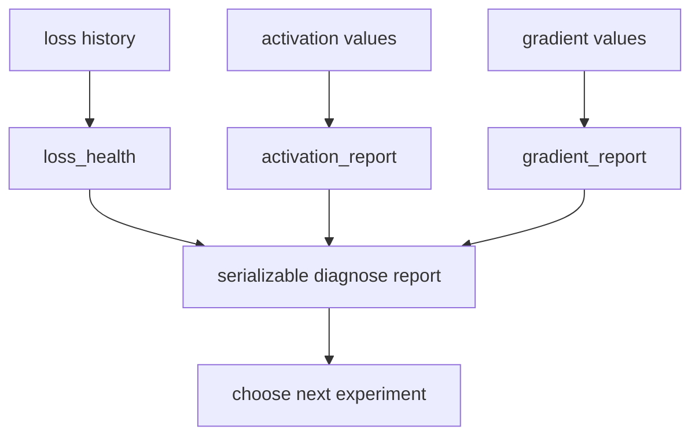

# Debugging Neural Networks with Evidence

> Turn a plausible-looking loss curve into a small, reproducible report about finiteness, activations, gradients, and derivatives.

**Type:** Build
**Languages:** Python
**Prerequisites:** Phase 03 Lessons 01-12, sequences, finite differences, and basic optimization
**Time:** ~45 minutes

## Learning Objectives

- Reject non-finite diagnostic inputs instead of hiding them inside summary statistics.
- Classify a bounded loss history as insufficient, non-finite, non-decreasing, oscillating, or healthy.
- Distinguish dead, exploding, and collapsed activation evidence using explicit local thresholds.
- Report vanishing and exploding gradient magnitudes without conflating them with model accuracy.
- Compare a centered finite-difference derivative with a known analytic result.
- Produce a serializable report that a human or a downstream check can inspect.

## The debugging contract

The implementation in `code/main.py` is intentionally independent of a deep-learning framework. It accepts small Python sequences and returns dictionaries/tuples with stable fields. The canonical run does not import or install PyTorch; `torch_available()` is only an environment probe. This makes a no-backend run useful for checking the diagnostic logic without claiming that a model trained.

| Evidence | Function | Local rule |
| --- | --- | --- |
| loss sequence | `loss_health` | at least two finite values; 20 values compare first/last ten |
| activation sequence | `activation_report` | zero fraction, mean/std, and magnitude threshold |
| gradient sequence | `gradient_report` | absolute mean below `1e-7` or above `100` |
| scalar function | `central_difference` | positive finite epsilon and two finite evaluations |
| combined evidence | `diagnose` | non-empty loss/activation/gradient collections |

These are diagnostic labels for this fixture, not universal scientific cutoffs. A real project should choose thresholds from its model, dtype, and measurement scale.

## Build It

### 1. Check finiteness first

`finite_stats((1,2,3))` returns count, mean, standard deviation, minimum, and maximum. It raises `ValueError` for an empty sequence or a non-finite value. If you need to preserve the fact that an input was bad, call `classify_values` first; it returns `NAN_OR_INF` rather than converting the value into a misleading mean.

```python
print(classify_values((1.0, float("inf"))))  # NAN_OR_INF
print(finite_stats((1.0, 2.0, 3.0))["mean"])  # 2.0
```

### 2. Classify the loss trace

`loss_health` first returns `NOT_ENOUGH_DATA` for a trace with fewer than two points, then `NAN_OR_INF` when any supplied point is non-finite. Alternating recent differences are classified as `OSCILLATING` before trend classification. With the default `window=10`, a trace of at least 20 points compares the final ten-point mean with the first ten-point mean; a final mean at least `0.99` of the first is `NOT_DECREASING`. A shorter trace compares its last value with its first using the same `0.99` rule: a constant or rising short trace is `NOT_DECREASING`, while a strictly falling short trace can be `HEALTHY`. The status says what to inspect next; it does not certify a model.

### 3. Inspect activations and gradients

`activation_report("hidden", values)` records the zero fraction and finite statistics. More than half zeros produces `DEAD_NEURONS`; a magnitude beyond `10` produces `EXPLODING_ACTIVATIONS`; standard deviation below `1e-6` produces `COLLAPSED_ACTIVATIONS`. Multiple issues can coexist. `gradient_report` uses the absolute mean: below `1e-7` is `VANISHING_GRADIENT`, above `100` is `EXPLODING_GRADIENT`.



### 4. Check one derivative

`central_difference(f, x, epsilon)` evaluates `f(x-epsilon)` and `f(x+epsilon)` and divides their difference by `2*epsilon`. For `f(x)=x²` at `x=3`, the result is approximately `6`. The function rejects a non-callable function, non-finite values, and a non-positive epsilon. It checks the diagnostic arithmetic; it does not replace framework autodiff.

Run the bounded canonical demo:

```bash
python3 main.py
```

The local output reports `loss_status=HEALTHY`, healthy activation/gradient issue tuples for the fixture, `central_difference_d_x2_at_3` near `6`, and the boolean torch availability probe. No training accuracy is printed.

## Use It

Pass evidence by name so a report remains interpretable:

```python
report = diagnose(
    losses=(1.0, 0.8, 0.6),
    activations={"hidden": (0.0, 0.5, 1.0)},
    gradients={"output": (0.1, 0.2)},
)
```

The returned `loss_status`, `activation_reports`, and `gradient_reports` can be serialized after converting the tuples if a JSON consumer requires lists. Do not compare a gradient magnitude with an activation mean or call a `HEALTHY` diagnostic a proof of generalization. If the optional framework is present, add framework-specific hooks in a separate adapter and feed their finite summaries into these functions.

## Ship It

The reusable artifact is `outputs/prompt-nn-debugger.md`, which asks for the exact evidence needed before suggesting a fix. Ship a report with:

1. the input shape/field and the first violated finite-value contract;
2. the status plus the exact threshold that produced it;
3. one bounded follow-up command and its expected field;
4. an explicit note when the optional torch path was not executed.

This handoff keeps a silent numerical failure distinguishable from an unavailable environment.

## Exercises

1. Run `diagnose` on the canonical fixture, then replace one activation with `0.0` until `DEAD_NEURONS` appears. Record the zero fraction and explain why the threshold is local to this helper.
2. Check `loss_health((1,1,1,1))` (`NOT_DECREASING`), `loss_health((1,.8,.6,.4))` (`HEALTHY`), and `loss_health((1,.5,1,.5))` (`OSCILLATING`). Then build a 20-value trace whose first ten values average `1.0` and last ten average `1.0`, and verify the same `NOT_DECREASING` priority.
3. Compare `central_difference(lambda x: x**3, 2.0, epsilon=1e-3)` with the analytic derivative `12`. Repeat with `epsilon=1e-6` and report both the approximation and why smaller is not automatically better.

## Reference Solution

Exercise 1 is accepted when the report contains `DEAD_NEURONS` and the recorded fraction is greater than `0.5`; no claim about a trained network is required. For Exercise 2, the constant short trace must not be called healthy, the strictly falling trace may be `HEALTHY`, and the alternating trace must be `OSCILLATING`; the 20-point comparison uses the first/last ten means. For Exercise 3, both results should be close to `12` on this scalar fixture. The explanation should separate finite-difference truncation from floating-point cancellation and include the chosen epsilon.
