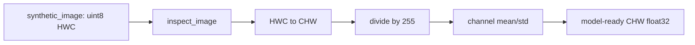

# Image Fundamentals: Pixels, Channels, and Color Spaces

> A vision model only sees the numeric tensor that arrives at its first layer.

**Type:** Build
**Languages:** Python
**Prerequisites:** Phase 01 Lesson 01 (Linear Algebra Intuition)
**Time:** ~45 minutes

## Learning Objectives

- Inspect a deterministic RGB fixture and account for its shape, dtype, range, and channel order.
- Convert between HWC and CHW without changing pixel values.
- Derive grayscale, HSV, and YCbCr values for known RGB colors, including black and achromatic pixels.
- Standardize an image with explicit channel statistics and reverse that transform without byte drift.
- Resize a small array with nearest-neighbor sampling and state what information it cannot recover.

## Why the first tensor matters

An image is a sampled field: a sensor records one value at each location and quantizes that measurement. The local implementation does not decode JPEG or PNG files. `synthetic_image(height, width, seed)` supplies an explicit `uint8` RGB fixture so every observation can be reproduced offline. Its shape is `(H, W, 3)`, its range is `[0, 255]`, and its last axis is ordered red, green, blue.

The same values may be presented to a model as `(3, H, W)`. `hwc_to_chw` only reorders axes; it must not silently normalize, swap channels, or crop. `chw_to_hwc` is the inverse. A batch would add a leading `N` axis, but this lesson deliberately keeps one image visible at a time.



`rgb_to_grayscale` uses the BT.601 weights `0.299, 0.587, 0.114`; it is not an unweighted channel mean. `rgb_to_ycbcr` keeps luma `Y` on the RGB-like scale and offsets the two chroma channels by 128, which is convenient for an 8-bit video-style representation. `rgb_to_hsv` returns hue in degrees `[0, 360]` and saturation/value in `[0, 1]`. At black, hue and saturation are defined as zero because hue is not observable. These functions reject nonfinite values and shapes other than non-empty HWC RGB.

## Build It

From this lesson's `code/` directory run:

```bash
python3 main.py
```

The demo creates an `8x10` fixture with seed `7`, reports `(8, 10, 3)` and `(3, 8, 10)`, and prints whether the layout round-trip is exact. It also reports the grayscale/HSV shapes, the standardized CHW shape, the byte round-trip error, and the shape of a `16x20` nearest-neighbor resize. The ImageNet mean/std constants in `preprocess_imagenet` are a documented convention for a local preprocessing exercise; they do not prove compatibility with a particular model checkpoint.

## Use It

```python
import sys
import numpy as np

sys.path.insert(0, "code")
import main as vision

raw = vision.synthetic_image(4, 6, seed=2)
assert vision.inspect_image(raw)["shape"] == (4, 6, 3)
model_input = vision.preprocess_imagenet(raw)
assert model_input.shape == (3, 4, 6)
restored = vision.deprocess_imagenet(model_input)
assert np.array_equal(restored, raw)
```

The acceptance check is about this fixture's contract, not about visual quality. A real decoder, color profile, crop policy, or interpolation mode must be specified separately when an application adds file I/O.

## Ship It

The reusable handoff is `outputs/prompt-vision-preprocessing-audit.md`. Give it an observed `inspect_image` dictionary, the HWC/CHW shapes, the preprocessing constants, and the maximum byte round-trip error. A reviewer can then check a pipeline without guessing whether a reported `(3, H, W)` tensor came from a channel transpose or from a model-specific transform.

## Exercises

1. Run `synthetic_image(5, 7, seed=4)` and record the exact shape, dtype, and three-channel means from `inspect_image`. Explain why the last axis has length three.
2. Convert that fixture to CHW and back. Then intentionally pass an array shaped `(3, 5, 7)` to `hwc_to_chw`; record the `ValueError` and explain why accepting it would hide a layout bug.
3. Evaluate `rgb_to_grayscale`, `rgb_to_ycbcr`, and `rgb_to_hsv` on `[[[255,0,0], [0,255,0], [0,0,255], [0,0,0]]]`. Predict the hue of the three primary colors, the black pixel's saturation, and the red pixel's luma before running the code.
4. Standardize the fixture, deprocess it, and assert exact equality. Resize a `2x2` array to `4x6`; identify which input value appears at the bottom-right and why nearest-neighbor interpolation cannot create a new intermediate color.

## Reference Solution

For seed `4`, `synthetic_image(5, 7)` has shape `(5, 7, 3)` and `hwc_to_chw` has shape `(3, 5, 7)`. The primary-color probe yields hues `0, 120, 240` degrees, while black has `(0, 0, 0)` HSV. `preprocess_imagenet` followed by `deprocess_imagenet` returns the original `uint8` fixture exactly because the inverse uses the same constants and rounds back to bytes. A valid handoff records these observed fields and rejects malformed channel axes rather than silently coercing them.
