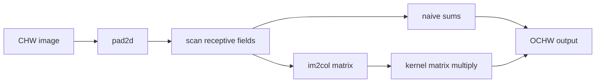

# Convolutions from Scratch

> A convolutional layer is a shared dot product over local image neighborhoods.

**Type:** Build
**Languages:** Python
**Prerequisites:** Phase 04 Lesson 01 (Image Fundamentals), Phase 03 Lesson 03 (Backpropagation)
**Time:** ~60 minutes

## Learning Objectives

- Distinguish mathematical convolution from the cross-correlation used by the local layer.
- Calculate output height and width from kernel, padding, stride, and dilation.
- Implement the same CHW operation with nested loops and an `im2col` matrix multiplication.
- Explain how padding and stride change border coverage and spatial resolution.
- Compute a stack's receptive-field side length and verify it on a small fixture.

## The operation

`conv2d_naive` and `conv2d_im2col` accept one finite CHW input and an OCHW weight tensor. The first axis of the weights is output channel, the second is input channel. At each output position the implementation multiplies the selected patch by the kernel in the same orientation. That is cross-correlation; a mathematical convolution would flip the kernel first. The distinction matters for asymmetric filters such as `KERNELS["sobel_x"]`.

For one spatial axis, the effective kernel width with dilation `D` is `D*(K-1)+1`. The output formula is:

```text
H_out = floor((H + 2P - D*(K-1) - 1) / S) + 1
```

The function `output_size` rejects a footprint that cannot fit and rejects non-positive stride/kernel values. `pad2d` adds zeros only around the final two axes. `im2col` records each receptive field as one column in scan order `(y, x)`, then the vectorized implementation multiplies flattened OCHW kernels by that matrix. Equal results are a regression invariant, not an assumption about floating-point bit identity.



`max_pool2d` uses the same output-size arithmetic but takes a maximum rather than a learned weighted sum. Its padded border uses `-inf` for floating-point inputs and the dtype minimum for integer inputs, so an out-of-image value cannot beat a real negative pixel. `receptive_field` tracks both the current jump between neighboring features and the pixels seen by a feature after a sequence of `(kernel, stride[, dilation])` layers.

## Build It

Run:

```bash
python3 main.py
```

The demo compares the loop and `im2col` paths on a `(3, 9, 11)` fixture with four output channels, stride two, and padding two. It then applies `sobel_x` to a left/right step, prints the formula for three `H=32` settings, and evaluates a three-layer receptive field. The output is a small audit trail: shape, maximum numerical difference, edge response, and integer shape calculations.

## Use It

```python
import sys
import numpy as np

sys.path.insert(0, "code")
import main as conv

x = np.arange(25, dtype=np.float32).reshape(1, 5, 5)
w = np.ones((1, 1, 3, 3), dtype=np.float32)
y = conv.conv2d_im2col(x, w, padding=1)
assert y.shape == (1, 5, 5)
assert np.allclose(y, conv.conv2d_naive(x, w, padding=1))
```

This is a single-sample educational kernel. A production implementation also defines batching, memory layout, device placement, and gradient behavior; those are not silently supplied here.

## Ship It

`outputs/skill-conv-shape-calculator.md` is the handoff for reviewing a layer specification. It requires `H`, `K`, `P`, `S`, and `D`, reports the effective footprint and output shape, and flags a non-fitting configuration. `outputs/prompt-cnn-architect.md` asks a reviewer to compare the naive and `im2col` results before optimizing a real layer.

## Exercises

1. With `x=np.arange(25).reshape(1,5,5)` and a `3x3` all-ones kernel, calculate `conv2d_naive(x,w,padding=0)[0,0,0]` by hand. Check that it is the sum of the first nine input values.
2. Change only `stride` from one to two for a `7x8` input and a `3x2` kernel. Predict both output dimensions using `output_size`, then inspect `im2col(...)[0].shape`.
3. Compare `KERNELS["sobel_x"]` and its left-right flipped version on `synthetic_step_image(8)`. Explain why this code is cross-correlation rather than kernel-flipped convolution.
4. Use `receptive_field([(3,1), (3,2), (3,1)])` and `receptive_field([(3,1,2)])`. State which layer changes the jump and which changes the footprint without downsampling.

## Reference Solution

For the `5x5` all-ones example the first valid patch sums `0+1+2+5+6+7+10+11+12 = 54`. For `H=7,K=3,P=0,S=2`, `output_size` gives `3`; for `W=8,K=2` it gives `4`. The loop and `im2col` paths agree within floating-point tolerance, while a flipped Sobel kernel reverses the sign of the edge response. The three-layer field is nine pixels wide, and a single `3x3` kernel at dilation two sees a five-pixel span.
