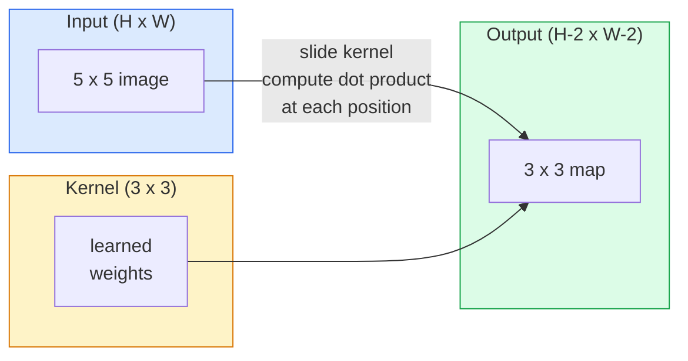
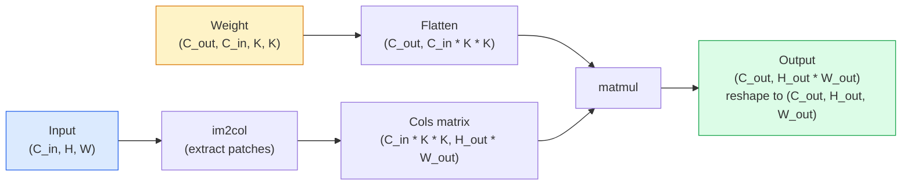

# Convolutions from Scratch

> A convolution is a tiny dense layer you slide across an image, sharing the same weights at every location.

**Type:** Build
**Languages:** Python
**Prerequisites:** Phase 3 (Deep Learning Core), Phase 4 Lesson 01 (Image Fundamentals)
**Time:** ~75 minutes

## Learning Objectives

- Implement 2D convolution from scratch using only NumPy, including the nested-loop version and a vectorised `im2col` version
- Compute output spatial size for any combination of input size, kernel size, padding, and stride, and justify the `(H - K + 2P) / S + 1` formula
- Hand-design kernels (edge, blur, sharpen, Sobel) and explain why each one produces the pattern of activations it does
- Stack convolutions into a feature extractor and connect the depth-of-the-stack to the size of the receptive field

## The Problem

A fully connected layer on a 224x224 RGB image would need 224 * 224 * 3 = 150,528 input weights per neuron. A single hidden layer with 1,000 units is already 150 million parameters — before you have learnt anything useful. Worse, that layer has no notion that a dog in the top-left and a dog in the bottom-right are the same pattern. It treats every pixel position as independent, which is exactly wrong for images: translating a cat by three pixels should not force the network to relearn the concept.

The two properties an image model needs are **translation equivariance** (the output shifts when the input shifts) and **parameter sharing** (the same feature detector runs everywhere). Dense layers give you neither. Convolution gives you both for free.

Convolution was not invented for deep learning. It is the same operation that powers JPEG compression, Gaussian blur in Photoshop, edge detection in industrial vision, and every audio filter ever shipped. The reason CNNs dominated ImageNet from 2012 to 2020 is that convolution is the correct prior for data where nearby values are related and the same pattern can appear anywhere.

## The Concept

### One kernel, sliding

A 2D convolution takes a small weight matrix called the kernel (or filter), slides it across the input, and at each location computes the sum of element-wise products. That sum becomes one output pixel.



A concrete 3x3 example on a 5x5 input (no padding, stride 1):

```
Input X (5 x 5):                Kernel W (3 x 3):

  1  2  0  1  2                   1  0 -1
  0  1  3  1  0                   2  0 -2
  2  1  0  2  1                   1  0 -1
  1  0  2  1  3
  2  1  1  0  1

The kernel slides across every valid 3 x 3 window. Output Y is 3 x 3:

 Y[0,0] = sum( W * X[0:3, 0:3] )
 Y[0,1] = sum( W * X[0:3, 1:4] )
 Y[0,2] = sum( W * X[0:3, 2:5] )
 Y[1,0] = sum( W * X[1:4, 0:3] )
 ... and so on
```

That one formula — **shared weights, locality, sliding window** — is the entire idea. Everything else is bookkeeping.

### Output size formula

Given input spatial size `H`, kernel size `K`, padding `P`, stride `S`:

```
H_out = floor( (H - K + 2P) / S ) + 1
```

Memorise this. You will compute it dozens of times per architecture.

| Scenario | H | K | P | S | H_out |
|----------|---|---|---|---|-------|
| Valid conv, no padding | 32 | 3 | 0 | 1 | 30 |
| Same conv (preserves size) | 32 | 3 | 1 | 1 | 32 |
| Downsample by 2 | 32 | 3 | 1 | 2 | 16 |
| Pool 2x2 | 32 | 2 | 0 | 2 | 16 |
| Large receptive field | 32 | 7 | 3 | 2 | 16 |

"Same padding" means pick P so that H_out == H when S == 1. For odd K, that is P = (K - 1) / 2. That is why 3x3 kernels dominate — they are the smallest odd kernel that still has a centre.

### Padding

Without padding, every convolution shrinks the feature map. Stack 20 of them and your 224x224 image becomes 184x184, which wastes compute on the border and complicates residual connections that need matching shapes.

```
Zero padding (P = 1) on a 5 x 5 input:

  0  0  0  0  0  0  0
  0  1  2  0  1  2  0
  0  0  1  3  1  0  0
  0  2  1  0  2  1  0       Now the kernel can centre on pixel
  0  1  0  2  1  3  0       (0, 0) and still have three rows and
  0  2  1  1  0  1  0       three columns of values to multiply.
  0  0  0  0  0  0  0
```

Modes you meet in practice: `zero` (most common), `reflect` (mirror the edge, avoids hard borders in generative models), `replicate` (copy the edge), `circular` (wrap around, used in toroidal problems).

### Stride

Stride is the step size of the slide. `stride=1` is the default. `stride=2` halves the spatial dimensions and is the classic way to downsample inside a CNN without a separate pooling layer — every modern architecture (ResNet, ConvNeXt, MobileNet) uses strided convs in place of max-pool somewhere.

```
Stride 1 on a 5 x 5 input, 3 x 3 kernel:

  starts: (0,0) (0,1) (0,2)        -> output row 0
          (1,0) (1,1) (1,2)        -> output row 1
          (2,0) (2,1) (2,2)        -> output row 2

  Output: 3 x 3

Stride 2 on the same input:

  starts: (0,0) (0,2)              -> output row 0
          (2,0) (2,2)              -> output row 1

  Output: 2 x 2
```

### Multiple input channels

Real images have three channels. A 3x3 convolution on an RGB input is actually a 3x3x3 volume: one 3x3 slice per input channel. At each spatial position, you multiply and sum across all three slices and add a bias.

```
Input:   (C_in,  H,  W)        3 x 5 x 5
Kernel:  (C_in,  K,  K)        3 x 3 x 3 (one kernel)
Output:  (1,     H', W')       2D map

For a layer that produces C_out output channels, you stack C_out kernels:

Weight:  (C_out, C_in, K, K)   e.g. 64 x 3 x 3 x 3
Output:  (C_out, H', W')       64 x 3 x 3

Parameter count: C_out * C_in * K * K + C_out   (the + C_out is biases)
```

That last line is the one you will calculate when planning a model. A 64-channel 3x3 conv on a 3-channel input has `64 * 3 * 3 * 3 + 64 = 1,792` parameters. Cheap.

### The im2col trick

Nested loops are easy to read but slow. GPUs want big matrix multiplies. The trick: flatten every receptive-field window of the input into one column of a big matrix, flatten the kernel into a row, and the whole convolution becomes a single matmul.



Every production conv implementation is some variant of this plus cache-tiling tricks (direct conv, Winograd, FFT conv for large kernels). Understand im2col and you understand the core.

### Receptive field

A single 3x3 conv looks at 9 input pixels. Stack two 3x3 convs and a neuron in the second layer looks at 5x5 input pixels. Three 3x3 convs give 7x7. In general:

```
RF after L stacked K x K convs (stride 1) = 1 + L * (K - 1)

With strides:   RF grows multiplicatively with stride along each layer.
```

The entire reason "3x3 all the way down" works (VGG, ResNet, ConvNeXt) is that two 3x3 convs see the same input area as one 5x5 conv but with fewer parameters and an extra non-linearity in between.


## Further Reading

- [A guide to convolution arithmetic for deep learning (Dumoulin & Visin, 2016)](https://arxiv.org/abs/1603.07285) — the definitive diagrams of padding/stride/dilation that every course quietly copies
- [CS231n: Convolutional Neural Networks for Visual Recognition](https://cs231n.github.io/convolutional-networks/) — the canonical lecture notes, including the original im2col explanation
- [The Annotated ConvNet (fast.ai)](https://nbviewer.org/github/fastai/fastbook/blob/master/13_convolutions.ipynb) — a notebook that walks from manual convolution to a trained digit classifier
- [Receptive Field Arithmetic for CNNs (Dang Ha The Hien)](https://distill.pub/2019/computing-receptive-fields/) — the paper-quality interactive explainer of receptive field calculations

## Exercises

1. **Establish a baseline.** Run the lesson demo, then capture the inputs, outputs, and one invariant that demonstrates this objective: Implement 2D convolution from scratch using only NumPy, including the nested-loop version and a vectorised `im2col` version.
2. **Change one variable.** Modify a single input or parameter and use the resulting evidence to investigate this objective: Compute output spatial size for any combination of input size, kernel size, padding, and stride, and justify the `(H - K + 2P) / S + 1` formula.
3. **Probe an edge case.** Predict the result before running it, compare prediction with observation, and explain the discrepancy while applying this objective: Hand-design kernels (edge, blur, sharpen, Sobel) and explain why each one produces the pattern of activations it does.

## Reference Solution

Use the canonical [main.py](../code/main.py) as the executable baseline. A complete solution records a successful run, identifies the invariant tied to “Implement 2D convolution from scratch using only NumPy, including the nested-loop version and a vectorised `im2col` version,” and changes only one variable for the comparison. The edge-case result must distinguish the prediction from the observation, explain the cause using “Hand-design kernels (edge, blur, sharpen, Sobel) and explain why each one produces the pattern of activations it does,” and cite a repeatable check rather than relying on visual inspection alone.

## Guided Demo

Use the [10–15 minute guided demo](demo.md) to predict an invariant, run the canonical entrypoint, change one variable, and probe a failure case.
