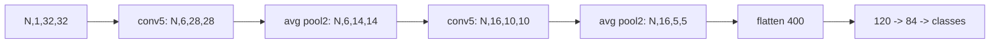

# CNNs: LeNet to ResNet Shape Reasoning

> Architecture names are useful only when their tensor transitions and skip contracts are explicit.

**Type:** Build
**Languages:** Python
**Prerequisites:** Phase 04 Lesson 02 (Convolutions from Scratch), Phase 03 Lesson 05 (Regularization)
**Time:** ~55 minutes

## Learning Objectives

- Trace the spatial and channel dimensions of a LeNet-5-style network on a `32x32` grayscale input.
- Separate a convolution's cross-correlation, nonlinearity, pooling, flattening, and dense-head contracts.
- Explain why a residual addition requires identical tensor shapes or a projection shortcut.
- Use parameter-count formulas to compare small LeNet, VGG-like, and ResNet-like configurations.
- Recognize this lesson's NumPy shape/value probes as architectural checks, not pretrained model implementations.

## Architecture as a shape contract

The code is intentionally framework-free. `conv2d_nchw`, `avg_pool2d`, `relu`, and `dense` are small NumPy primitives; `lenet_shape_trace` computes the classic sequence without allocating a trainable network. This keeps the important transitions visible when Torch is unavailable. It does not reproduce historical initialization, training accuracy, batch normalization, or a complete VGG/ResNet implementation.

For the default input `(N=1,C=1,H=32,W=32)`, a valid `5x5` convolution produces `28x28`, `avg_pool2d(kernel=2)` produces `14x14`, the second valid `5x5` convolution produces `10x10`, and the second pool produces `5x5`. With 16 channels, flattening therefore yields `16*5*5 = 400` features. The head maps `400 -> 120 -> 84 -> 10`.



`residual_add(main, shortcut)` represents the addition after a residual branch. Both arrays must be finite, non-empty, and have the same complete `(N,C,H,W)` shape. If the branch changes channel count or stride, a real ResNet uses a projection; this local function rejects mismatched shapes rather than hiding that architectural decision. `model_parameter_counts` applies explicit kernel and bias formulas to small named configurations so a reviewer can check how a head change affects only the final terms.

## Build It

Run:

```bash
python3 main.py
```

The output lists every LeNet trace entry, local parameter counts for three small configurations, and an identity residual check. Read the trace in order and verify `400` before accepting the dense head. The code's convolution is cross-correlation, consistent with Lesson 02; the architecture names describe patterns, not a claim that the local arrays are drop-in checkpoints.

## Use It

```python
import sys
import numpy as np

sys.path.insert(0, "code")
import main as cnn

x = np.ones((1, 1, 32, 32), dtype=np.float32)
w = np.ones((6, 1, 5, 5), dtype=np.float32)
feature = cnn.avg_pool2d(cnn.relu(cnn.conv2d_nchw(x, w)), 2)
assert feature.shape == (1, 6, 14, 14)
```

When reviewing a residual block, compare the complete `(N,C,H,W)` tuple, not only height and width. A matching spatial size with different channels is still an invalid addition.

## Ship It

`outputs/skill-residual-block-reviewer.md` is a shape gate: it records main/shortcut tuples and requires an explicit projection when they differ. `outputs/prompt-backbone-selector.md` records the intended input channels, downsampling points, head class count, and parameter-count calculation. These artifacts are useful before wiring a framework model or loading weights.

## Exercises

1. Run `lenet_shape_trace((2,1,32,32), num_classes=7)` and write down the two entries that change from the default trace. Explain why the flatten width does not depend on batch size or class count.
2. Use an all-ones `(1,1,4,4)` input and a `3x3` all-ones kernel without padding. Calculate the upper-left output value, then compare it with the padded case.
3. Try `residual_add(np.zeros((1,8,8,8)), np.zeros((1,16,8,8)))`. Record the error and specify the projection's required output shape if the shortcut starts with eight channels.
4. Change `num_classes` from 10 to 7 in `model_parameter_counts`. Identify the exact head terms that change and explain why convolutional terms remain constant.

## Reference Solution

The batch-two trace starts with `(2,1,32,32)` and ends with `(2,7)`; the intermediate `flatten` remains `(2,400)`. An unpadded all-ones `3x3` patch sums to nine, while a corner in the padded result sees zero-filled neighbors. The residual test must reject `(1,8,8,8)+(1,16,8,8)` until a projection produces 16 channels. Only the final `84*classes + classes` terms change when the class count changes.
