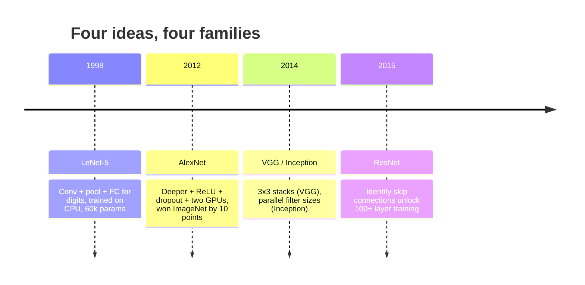
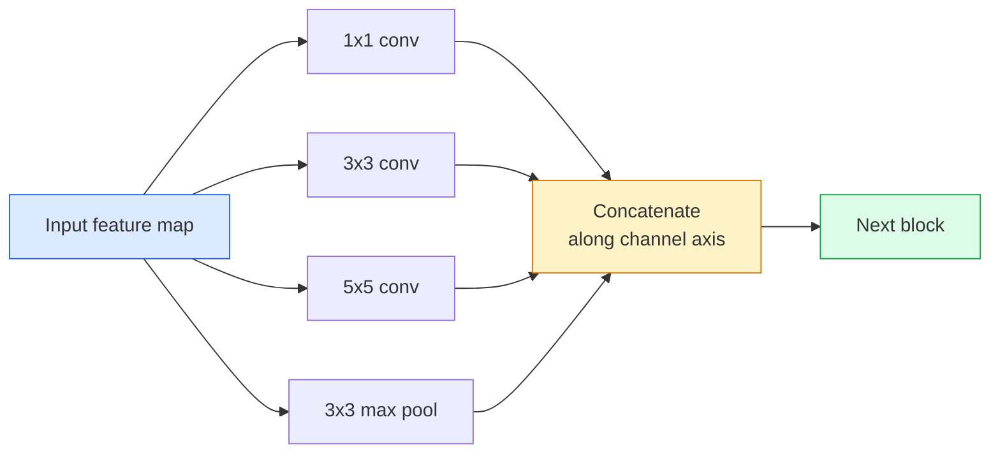
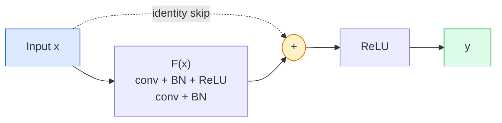

# CNNs — LeNet to ResNet

> Every major CNN of the last thirty years is the same conv–nonlinearity–downsample recipe with one new idea bolted on. Learn the ideas in order.

**Type:** Build
**Languages:** Python
**Prerequisites:** Phase 3 Lesson 11 (PyTorch), Phase 4 Lesson 01 (Image Fundamentals), Phase 4 Lesson 02 (Convolutions from Scratch)
**Time:** ~75 minutes

## Learning Objectives

- Trace the architectural lineage LeNet-5 -> AlexNet -> VGG -> Inception -> ResNet and state the single new idea each family contributed
- Implement LeNet-5, a VGG-style block, and a ResNet BasicBlock in PyTorch, each under 40 lines
- Explain why residual connections turn a 1,000-layer network from untrainable into state-of-the-art
- Read a modern backbone (ResNet-18, ResNet-50) and predict its output shape, receptive field, and parameter count before looking at the source

## The Problem

In 2011, the best ImageNet classifier scored around 74% top-5 accuracy. In 2012 AlexNet scored 85%. In 2015 ResNet scored 96%. No new data. No new GPU generation. The gains came from architecture ideas. A working vision engineer has to know which idea came from which paper because every production backbone you ship in 2026 is a recombination of those same pieces — and because the ideas keep transferring: grouped convs went from CNNs to transformers, residual connections went from ResNet to every LLM in existence, batch normalisation lives in diffusion models.

Studying these networks in order also immunises you against a common mistake: reaching for the biggest available model when a LeNet-sized network would solve the problem. MNIST does not need a ResNet. Knowing the scaling curve of each family tells you where to sit on it.

## The Concept

### The four ideas that changed vision



Nothing else in classical vision mattered as much as these four jumps.

### LeNet-5 (1998)

Yann LeCun's digit recogniser. 60,000 parameters. Two conv-pool blocks, two fully connected layers, tanh activations. It defined the template every CNN inherits:

```
input (1, 32, 32)
  conv 5x5 -> (6, 28, 28)
  avg pool 2x2 -> (6, 14, 14)
  conv 5x5 -> (16, 10, 10)
  avg pool 2x2 -> (16, 5, 5)
  flatten -> 400
  dense -> 120
  dense -> 84
  dense -> 10
```

Everything the modern world calls a CNN — alternating convolutions and downsampling feeding a small classifier head — is LeNet with more layers, bigger channels, and better activations.

### AlexNet (2012)

Three changes that together broke ImageNet:

1. **ReLU** instead of tanh. Gradients stop vanishing. Training speeds up by a factor of six.
2. **Dropout** in the fully connected head. Regularisation becomes a layer, not a trick.
3. **Depth and width**. Five conv layers, three dense layers, 60M parameters, trained on two GPUs with the model split across them.

The paper's Figure 2 still shows the GPU split as two parallel streams. That parallelism was a hardware workaround, not an architectural insight — but the three ideas above are still in every model you use.

### VGG (2014)

VGG asked: what happens if you only use 3x3 convolutions and you go deep?

```
stack:   conv 3x3 -> conv 3x3 -> pool 2x2
repeat:  16 or 19 conv layers
```

Two 3x3 convs see the same 5x5 input area as one 5x5 conv but with fewer parameters (2*9*C^2 = 18C^2 vs 25*C^2) and an extra ReLU in between. VGG turned this observation into an entire architecture. The simplicity — one block type, repeated — made it the reference point for everything that came after.

Cost: 138M parameters, slow to train, expensive at inference.

### Inception (2014, same year)

Google's answer to "what kernel size should I use?" was: all of them, in parallel.



Each branch specialises — 1x1 for channel mixing, 3x3 for local texture, 5x5 for larger patterns, pooling for shift-invariant features — and the concat lets the next layer pick whichever branch is useful. Inception v1 used 1x1 convolutions inside each branch as a bottleneck to keep parameter counts sane.

### The degradation problem

By 2015, VGG-19 worked and VGG-32 did not. Depth was supposed to help, but past ~20 layers both training and test loss got worse. That is not overfitting. That is the optimiser failing to find useful weights because gradients shrink multiplicatively through every layer.

```
Plain deep network:
  y = f_L( f_{L-1}( ... f_1(x) ... ) )

Gradient wrt early layer:
  dL/dW_1 = dL/dy * df_L/df_{L-1} * ... * df_2/df_1 * df_1/dW_1

Each multiplicative term has magnitude roughly (weight magnitude) * (activation gain).
Stack 100 of them with gains < 1 and the gradient is effectively zero.
```

VGG worked at 19 layers because batch norm (published simultaneously) kept activations well-scaled. But even batch norm could not rescue depth beyond 30-ish layers.

### ResNet (2015)

He, Zhang, Ren, Sun proposed one change that fixed everything:

```
standard block:   y = F(x)
residual block:   y = F(x) + x
```

The `+ x` means the layer can always choose to do nothing by driving `F(x)` to zero. A 1,000-layer ResNet is now at most as bad as a 1-layer network, because every extra block has a trivial escape hatch. With that guarantee, the optimiser is willing to make every block *slightly* useful — and slightly useful, stacked 100 times, is state-of-the-art.



Two variants of the block show up everywhere:

- **BasicBlock** (ResNet-18, ResNet-34): two 3x3 convs, skip around both.
- **Bottleneck** (ResNet-50, -101, -152): 1x1 down, 3x3 middle, 1x1 up, skip around the trio. Cheaper when channel counts are high.

When the skip has to cross a downsample (stride=2), the identity path is replaced with a 1x1 stride=2 conv to match shapes.

### Why residuals matter beyond vision

The idea was not really about image classification. It was about turning deep networks from "cross-your-fingers and hope gradients survive" into a reliable, scalable engineering tool. Every transformer you will read about next phase has the exact same skip connection in every block. Without ResNet, there is no GPT.


## Further Reading

- [Deep Residual Learning for Image Recognition (He et al., 2015)](https://arxiv.org/abs/1512.03385) — the ResNet paper; every figure is worth studying
- [Very Deep Convolutional Networks (Simonyan & Zisserman, 2014)](https://arxiv.org/abs/1409.1556) — the VGG paper; still the best reference for "why 3x3"
- [ImageNet Classification with Deep CNNs (Krizhevsky et al., 2012)](https://papers.nips.cc/paper_files/paper/2012/hash/c399862d3b9d6b76c8436e924a68c45b-Abstract.html) — AlexNet; the paper that ended the hand-crafted-feature era
- [Going Deeper with Convolutions (Szegedy et al., 2014)](https://arxiv.org/abs/1409.4842) — Inception v1; the parallel-filter idea that still shows up in vision transformers

## Exercises

1. **Establish a baseline.** Run the lesson demo, then capture the inputs, outputs, and one invariant that demonstrates this objective: Trace the architectural lineage LeNet-5 -> AlexNet -> VGG -> Inception -> ResNet and state the single new idea each family contributed.
2. **Change one variable.** Modify a single input or parameter and use the resulting evidence to investigate this objective: Implement LeNet-5, a VGG-style block, and a ResNet BasicBlock in PyTorch, each under 40 lines.
3. **Probe an edge case.** Predict the result before running it, compare prediction with observation, and explain the discrepancy while applying this objective: Explain why residual connections turn a 1,000-layer network from untrainable into state-of-the-art.

## Reference Solution

Use the canonical [main.py](../code/main.py) as the executable baseline. A complete solution records a successful run, identifies the invariant tied to “Trace the architectural lineage LeNet-5 -> AlexNet -> VGG -> Inception -> ResNet and state the single new idea each family contributed,” and changes only one variable for the comparison. The edge-case result must distinguish the prediction from the observation, explain the cause using “Explain why residual connections turn a 1,000-layer network from untrainable into state-of-the-art,” and cite a repeatable check rather than relying on visual inspection alone.
