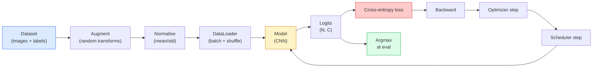

# Image Classification

> A classifier is a function from pixels to a probability distribution over classes. Everything else is plumbing.

**Type:** Build
**Languages:** Python
**Prerequisites:** Phase 2 Lesson 09 (Model Evaluation), Phase 3 Lesson 10 (Mini Framework), Phase 4 Lesson 03 (CNNs)
**Time:** ~75 minutes

## Learning Objectives

- Build an end-to-end image classification pipeline on CIFAR-10: dataset, augmentation, model, training loop, evaluation
- Explain the role of each component (dataloader, loss, optimizer, scheduler, augmentation) and predict how breaking any one of them manifests in the loss curve
- Implement mixup, cutout, and label smoothing from scratch and justify when each is worth adding
- Read a confusion matrix and a per-class precision/recall table to diagnose dataset and model failures beyond aggregate accuracy

## The Problem

Every vision task that ships reduces to image classification at some level. Detection classifies regions. Segmentation classifies pixels. Retrieval ranks by similarity to class centroids. Getting classification right — the dataset loop, the augmentation policy, the loss, the evaluation — is the skill that transfers to every other task in the phase.

Most classification bugs are not in the model. They live in the pipeline: a broken normalisation, an unshuffled training set, augmentation that distorts labels, a validation split contaminated by training data, a learning rate that silently diverges after epoch 30. A CNN that would hit 93% on CIFAR-10 with a correct setup commonly scores 70-75% with a broken one, and the loss curve looks plausible the whole time.

This lesson wires the entire pipeline by hand so every part is inspectable. You will not use anything from `torchvision.datasets` that could hide a bug.

## The Concept

### The classification pipeline



Every line in this loop is where a bug can live. Cross-entropy takes raw logits, not softmax outputs, so any `model(x).softmax()` before the loss quietly computes the wrong gradient. Augmentations apply to inputs only, not labels — except for mixup, which mixes both. `optimizer.zero_grad()` must happen once per step; skipping it accumulates gradients and looks like a wildly unstable learning rate. Each of those bugs flattens the learning curve without throwing an error.

### Cross-entropy, logits, and softmax

A classifier produces `C` numbers per image called logits. Applying softmax converts them into a probability distribution:

```
softmax(z)_i = exp(z_i) / sum_j exp(z_j)
```

Cross-entropy measures the negative log probability of the correct class:

```
CE(z, y) = -log( softmax(z)_y )
        = -z_y + log( sum_j exp(z_j) )
```

The right-hand form is the numerically stable one (log-sum-exp). PyTorch's `nn.CrossEntropyLoss` fuses softmax + NLL in one op and takes raw logits directly. Applying softmax yourself first is almost always a bug — you compute log(softmax(softmax(z))), a meaningless quantity.

### Why augmentation works

A CNN has inductive bias for translation (from weight sharing) but no built-in invariance to crops, flips, colour jitter, or occlusion. The only way to teach it those invariances is to show it pixels that exercise them. Every random transform during training is a way of saying: "these two images have the same label; learn the features that ignore the difference."

```
Original crop:  "dog facing left"
Flip:           "dog facing right"       <- same label, different pixels
Rotate(+15):    "dog, slight tilt"
Colour jitter:  "dog in warmer light"
RandomErasing:  "dog with patch missing"
```

The rule: augmentation must preserve the label. Cutout and rotation on a digit can flip "6" into "9"; for that dataset you use smaller rotation ranges and pick augmentations that respect digit-specific invariances.

### Mixup and cutmix

Ordinary augmentation transforms pixels but keeps labels one-hot. **Mixup** and **cutmix** break that by interpolating both.

```
Mixup:
  lambda ~ Beta(a, a)
  x = lambda * x_i + (1 - lambda) * x_j
  y = lambda * y_i + (1 - lambda) * y_j

Cutmix:
  paste a random rectangle of x_j into x_i
  y = area-weighted mix of y_i and y_j
```

Why it helps: the model stops memorising spiky one-hot targets and learns to interpolate between classes. Training loss goes up, test accuracy goes up. It is the single cheapest robustness upgrade for any classifier.

### Label smoothing

A cousin of mixup. Instead of training against `[0, 0, 1, 0, 0]`, train against `[eps/C, eps/C, 1-eps, eps/C, eps/C]` for a small `eps` like 0.1. Stops the model from producing arbitrarily sharp logits and improves calibration at almost no cost. Built into `nn.CrossEntropyLoss(label_smoothing=0.1)` since PyTorch 1.10.

### Evaluation beyond accuracy

Aggregate accuracy hides imbalance. A 90-10 binary classifier that always predicts the majority class scores 90%. The tools that actually tell you what is happening:

- **Per-class accuracy** — one number per class; immediately surfaces underperforming categories.
- **Confusion matrix** — C x C grid with row i col j = count of true class i predicted as class j; the diagonal is correct, the off-diagonals are where your model lives.
- **Top-1 / Top-5** — whether the correct class is in the top 1 or top 5 predictions; Top-5 matters for ImageNet because classes like "Norwich terrier" vs "Norfolk terrier" are genuinely ambiguous.
- **Calibration (ECE)** — does a 0.8 confidence prediction get it right 80% of the time? Modern networks are systematically over-confident; fix with temperature scaling or label smoothing.


## Further Reading

- [CS231n: Training Neural Networks](https://cs231n.github.io/neural-networks-3/) — still the clearest tour of the training pipeline at a single page
- [Bag of Tricks for Image Classification (He et al., 2019)](https://arxiv.org/abs/1812.01187) — every small trick that together adds 3-4% to ResNet accuracy on ImageNet
- [mixup: Beyond Empirical Risk Minimization (Zhang et al., 2017)](https://arxiv.org/abs/1710.09412) — the original mixup paper; three pages of theory plus convincing experiments
- [Why temperature scaling matters (Guo et al., 2017)](https://arxiv.org/abs/1706.04599) — the paper that proved modern networks are miscalibrated and fixed it with one scalar parameter

## Exercises

1. **Establish a baseline.** Run the lesson demo, then capture the inputs, outputs, and one invariant that demonstrates this objective: Build an end-to-end image classification pipeline on CIFAR-10: dataset, augmentation, model, training loop, evaluation.
2. **Change one variable.** Modify a single input or parameter and use the resulting evidence to investigate this objective: Explain the role of each component (dataloader, loss, optimizer, scheduler, augmentation) and predict how breaking any one of them manifests in the loss curve.
3. **Probe an edge case.** Predict the result before running it, compare prediction with observation, and explain the discrepancy while applying this objective: Implement mixup, cutout, and label smoothing from scratch and justify when each is worth adding.

## Reference Solution

Use the canonical [main.py](../code/main.py) as the executable baseline. A complete solution records a successful run, identifies the invariant tied to “Build an end-to-end image classification pipeline on CIFAR-10: dataset, augmentation, model, training loop, evaluation,” and changes only one variable for the comparison. The edge-case result must distinguish the prediction from the observation, explain the cause using “Implement mixup, cutout, and label smoothing from scratch and justify when each is worth adding,” and cite a repeatable check rather than relying on visual inspection alone.
