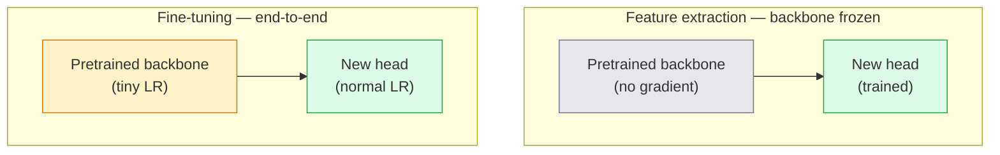

# Transfer Learning & Fine-Tuning

> Somebody else spent a million GPU hours teaching a network what edges, textures, and object parts look like. You should borrow those features before training your own.

**Type:** Build
**Languages:** Python
**Prerequisites:** Phase 4 Lesson 03 (CNNs), Phase 4 Lesson 04 (Image Classification)
**Time:** ~75 minutes

## Learning Objectives

- Distinguish feature extraction from fine-tuning and pick the right one based on dataset size, domain distance, and compute budget
- Load a pretrained backbone, replace its classifier head, and train only the head to a working baseline in under 20 lines
- Progressively unfreeze layers with discriminative learning rates so early generic features get smaller updates than late task-specific ones
- Diagnose the three common failures: feature drift from too-high LR on unfrozen blocks, BN statistics collapse on tiny datasets, and catastrophic forgetting

## The Problem

Training a ResNet-50 on ImageNet costs around 2,000 GPU-hours. Very few teams have that budget for every task they ship. What almost every team actually ships is a pretrained backbone with a new head trained on a few hundred or few thousand task-specific images.

This is not a shortcut. The first conv block of any ImageNet-trained CNN learns edges and Gabor-like filters. The next few blocks learn textures and simple motifs. The middle blocks learn object parts. The final blocks learn combinations that start to look like the 1,000 ImageNet categories. The first 90% of that hierarchy transfers almost unchanged to medical imaging, industrial inspection, satellite data, and every other vision task — because nature has a limited vocabulary of edges and textures. The last 10% is what you actually train.

Getting transfer right has three bugs waiting for you: destroying pretrained features with a too-high learning rate, starving the model of information by freezing too much, and letting BatchNorm's running statistics drift toward a tiny dataset that the rest of the network never learnt from. This lesson walks each of them on purpose.

## The Concept

### Feature extraction vs fine-tuning

Two regimes, picked by how much you trust the pretrained features and how much data you have.



Rules of thumb:

| Dataset size | Domain distance | Recipe |
|--------------|-----------------|--------|
| < 1k images | close to ImageNet | Freeze backbone, train head only |
| 1k-10k | close | Freeze first 2-3 stages, fine-tune the rest |
| 10k-100k | any | Fine-tune end-to-end with discriminative LR |
| 100k+ | far | Fine-tune everything; consider training from scratch if domain is far enough |

"Close to ImageNet" roughly means natural RGB photos with object-like content. Medical CT scans, overhead satellite imagery, and microscopy are far domains — the features still help, but you will need to let more layers adapt.

### Why freezing works at all

The ImageNet features a CNN learns are not specialised to the 1,000 categories. They are specialised to the statistics of natural images: edges at specific orientations, textures, contrast patterns, shape primitives. Those statistics are stable across almost every visual domain a human can name. That is why a model trained on ImageNet and evaluated zero-shot on CIFAR-10 with just a new linear head (no fine-tuning of the backbone) reaches 80%+ accuracy. The head is learning which of the already-learnt features to weight for this task.

### Discriminative learning rates

When you do unfreeze, early layers should train slower than late layers. Early layers encode generic features that you want to preserve; late layers encode task-specific structure that you need to move a lot.

```
Typical recipe:

  stage 0 (stem + first group): lr = base_lr / 100    (mostly fixed)
  stage 1:                       lr = base_lr / 10
  stage 2:                       lr = base_lr / 3
  stage 3 (last backbone group): lr = base_lr
  head:                          lr = base_lr  (or slightly higher)
```

In PyTorch this is just a list of parameter groups passed to the optimizer. One model, five learning rates, zero extra code.

### The BatchNorm problem

BN layers hold `running_mean` and `running_var` buffers that were computed on ImageNet. If your task has a different pixel distribution — different lighting, different sensor, different colour space — those buffers are wrong. Three options in order of preference:

1. **Fine-tune with BN in train mode.** Let BN update its running statistics along with everything else. Default choice when the task dataset is medium-sized (>= 5k examples).
2. **Freeze BN in eval mode.** Keep the ImageNet statistics and train only the weights. Correct when your dataset is small enough that BN's moving average would be noisy.
3. **Replace BN with GroupNorm.** Removes the moving-average problem entirely. Used in detection and segmentation backbones where batch size per GPU is tiny.

Getting this wrong silently tanks accuracy by 5-15%.

### Head design

The classifier head is 1-3 linear layers plus an optional dropout. Every torchvision backbone ships a default head that you replace:

```
backbone.fc = nn.Linear(backbone.fc.in_features, num_classes)          # ResNet
backbone.classifier[1] = nn.Linear(..., num_classes)                    # EfficientNet, MobileNet
backbone.heads.head = nn.Linear(..., num_classes)                       # torchvision ViT
```

For small datasets, a single linear layer is usually enough. Adding a hidden layer (Linear -> ReLU -> Dropout -> Linear) helps when the task distribution is farther from the backbone's training distribution.

### Layer-wise LR decay

A smoother version of discriminative LR used in modern fine-tuning (BEiT, DINOv2, ViT-B fine-tunes). Instead of grouping layers into stages, give every layer a slightly smaller LR than the one above it:

```
lr_layer_k = base_lr * decay^(L - k)
```

With decay = 0.75 and L = 12 transformer blocks, the first block trains at `0.75^11 ≈ 0.04x` the head's LR. Matters more for transformer fine-tunes than for CNNs, where stage-grouped LRs are usually enough.

### What to evaluate

Transfer-learning runs need two numbers you would not track on a scratch run:

- **Pretrained-only accuracy** — the head's accuracy with the backbone frozen. This is your floor.
- **Fine-tuned accuracy** — the same model after end-to-end training. This is your ceiling.

If fine-tuned is less than pretrained-only, you have a learning-rate or BN bug. Always print both.


## Use It

For most real tasks, `torchvision.models` + three lines is enough. The heavier machinery above matters when you run into the problems that library defaults cannot fix.

```python
from torchvision.models import resnet50, ResNet50_Weights

model = resnet50(weights=ResNet50_Weights.IMAGENET1K_V2)
model.fc = nn.Linear(model.fc.in_features, num_classes)
optimizer = torch.optim.AdamW(model.parameters(), lr=1e-4, weight_decay=1e-4)
```

Two other production-grade defaults:

- `timm` ships ~800 pretrained vision backbones with a consistent API (`timm.create_model("resnet50", pretrained=True, num_classes=10)`). For any fine-tune beyond the torchvision zoo, it is the standard.
- For transformers, `transformers.AutoModelForImageClassification.from_pretrained(name, num_labels=N)` gives you ViT / BEiT / DeiT with the same loading semantics as text models.

## Ship It

This lesson produces:

- `outputs/prompt-fine-tune-planner.md` — a prompt that picks feature-extraction vs progressive vs end-to-end fine-tuning based on dataset size, domain distance, and compute budget.
- `outputs/skill-freeze-inspector.md` — a skill that, given a PyTorch model, reports which parameters are trainable, which BatchNorm layers are in eval mode, and whether the optimizer is actually being fed the trainable parameters.


## Key Terms

| Term | What people say | What it actually means |
|------|----------------|----------------------|
| Feature extraction | "Freeze and train head" | Backbone parameters frozen, only the new classifier head receives gradient |
| Fine-tuning | "Retrain end-to-end" | All parameters trainable, usually with much smaller LR than scratch training |
| Discriminative LR | "Smaller LR for early layers" | Optimizer parameter groups where early-stage LR is a fraction of late-stage LR |
| Layer-wise LR decay | "Smooth LR gradient" | Per-layer LR multiplied by decay^(L - k); common in transformer fine-tunes |
| Catastrophic forgetting | "The model lost ImageNet" | A too-high LR overwrites pretrained features before the new task signal is learnt |
| BN statistics drift | "Running mean is wrong" | BatchNorm running_mean/var computed on a different distribution than the current task, silently hurting accuracy |
| Linear probe | "Frozen backbone + linear head" | Evaluation of pretrained features — accuracy of the best linear classifier on top of the frozen representation |
| Catastrophic collapse | "Everything predicts one class" | Happens when fine-tuning with an LR high enough to destroy features before gradients from the head can stabilise |

## Further Reading

- [How transferable are features in deep neural networks? (Yosinski et al., 2014)](https://arxiv.org/abs/1411.1792) — the paper that quantified feature transferability across layers
- [Universal Language Model Fine-tuning (ULMFiT, Howard & Ruder, 2018)](https://arxiv.org/abs/1801.06146) — the original discriminative LR / progressive unfreezing recipe; the ideas transfer directly to vision
- [timm documentation](https://huggingface.co/docs/timm) — the reference for modern vision backbones and the exact fine-tune defaults they were trained with
- [A Simple Framework for Linear-Probe Evaluation (Kornblith et al., 2019)](https://arxiv.org/abs/1805.08974) — why linear-probe accuracy matters and how to report it correctly
