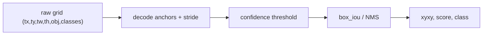

# Object Detection: YOLO Geometry and NMS

> Detection turns a dense grid of raw numbers into a short list of boxes, scores, and classes.

**Type:** Build
**Languages:** Python
**Prerequisites:** Phase 04 Lesson 02 (Convolutions from Scratch), Phase 04 Lesson 04 (Image Classification)
**Time:** ~65 minutes

## Learning Objectives

- Validate absolute `xyxy` boxes and compute pairwise intersection-over-union.
- Encode a box center/size relative to a grid cell and decode it back with an anchor.
- Assign one target anchor and class vector for a local object fixture.
- Combine coordinate, objectness, no-objectness, and class losses with a stable BCE-with-logits expression.
- Apply confidence filtering and deterministic non-maximum suppression to raw head output.

## Raw head to detections

The local implementation is a NumPy geometry lab, not a current YOLO model or benchmark. A raw cell/anchor row has `(tx, ty, tw, th, objectness_logit, class_logits...)`. `decode` applies sigmoid to the center offsets, exponentiates bounded width/height logits, and uses the anchor and stride to return an absolute `(x1,y1,x2,y2)` box. `encode` performs the inverse for a box whose center is inside the selected half-open cell: `[cell*stride, (cell+1)*stride)`. A center exactly on the upper boundary belongs to the next cell.

`box_iou` validates finite positive-width boxes and returns a matrix with shape `(N,M)`. `nms` sorts scores descending with the original index as a tie-breaker, keeps the first box, and suppresses later boxes whose IoU exceeds the threshold. `postprocess` validates both thresholds before scanning candidates, including when the candidate set is empty. This helper is class-agnostic; class-aware NMS is a separate policy and is not silently implied.



`assign_targets` chooses the anchor with the largest width/height IoU, sets objectness to one, and writes a one-hot class target. `yolo_loss` expects prediction and target arrays shaped `(grid_h, grid_w, anchors, 5+C)` plus a boolean object mask. It averages each named component and combines them with nonnegative weights. An empty positive mask is valid; a malformed shape is not.

## Build It

Run:

```bash
python3 main.py
```

The demo encodes `[18,20,50,68]` in cell `(1,1)` with stride `32` and anchor `(32,48)`, prints the round-trip error, assigns it to a `(4,4,3)` grid, computes the finite loss for zero logits, and postprocesses one raised raw cell. If two boxes select the same cell/anchor slot, `assign_targets` raises rather than silently combining or overwriting their class targets. The output is a local geometry audit; it does not establish detector recall or a production confidence threshold.

## Use It

```python
import sys
import numpy as np
sys.path.insert(0, "code")
import main as yolo

anchors = [(16, 24), (32, 48)]
box = np.array([18, 20, 50, 68], dtype=float)
encoded = yolo.encode(box, 1, 1, 32, anchors[1])
decoded = yolo.decode(encoded, 1, 1, 32, anchors[1])
assert np.allclose(decoded, box)
```

Keep coordinate units explicit. `box_iou` and the encode/decode path use absolute pixels; anchors and stride must use the same units. Normalized `[0,1]` boxes require a different, explicit adapter.

## Ship It

`outputs/skill-anchor-designer.md` captures anchor widths/heights, stride, target-cell assignment, and the round-trip error. `outputs/prompt-detection-metric-reader.md` records IoU and NMS thresholds as policy inputs, then asks whether the output box, score, and class arrays agree in length. Neither artifact claims that one threshold is universal.

## Exercises

1. Compute IoU for `[0,0,10,10]` and `[5,0,15,10]`. Verify `1/3` with `box_iou` and explain why touching boxes have zero intersection.
2. Encode/decode `[18,20,50,68]` for cell `(1,1)`, stride `32`, anchor `(32,48)`. Inspect the four encoded values and confirm the center offsets are logits, not pixel coordinates.
3. Call `assign_targets` with two boxes in different cells and inspect `mask.sum()` and the one-hot class slice. Then try a class equal to `num_classes` and keep the `ValueError`.
4. Create two overlapping boxes with equal scores. Run `nms` twice and verify the lower original index wins the tie. Explain why stable ordering matters when results are cached or compared in tests.

## Reference Solution

The partial-overlap pair has IoU `50/150 = 1/3`, and the encode/decode fixture returns the original box to floating-point precision. A target assignment sets one object mask entry, objectness one, and exactly one class bit. NMS keeps the first index for an equal-score overlap. Zero raw logits produce finite BCE components because the stable expression avoids `log(sigmoid(0))` directly; invalid boxes, anchors, classes, and shapes are rejected before arithmetic.
