# Object Detection — YOLO from Scratch

> Detection is classification plus regression, run at every position in a feature map, then cleaned up with non-maximum suppression.

**Type:** Build
**Languages:** Python
**Prerequisites:** Phase 4 Lesson 03 (CNNs), Phase 4 Lesson 04 (Image Classification), Phase 4 Lesson 05 (Transfer Learning)
**Time:** ~75 minutes

## Learning Objectives

- Explain the grid-and-anchor design that turns detection into a dense prediction problem and state what every number in the output tensor means
- Compute Intersection-over-Union between boxes and implement non-maximum suppression from scratch
- Build a minimal YOLO-style head on top of a pretrained backbone, including the classification, objectness, and box-regression losses
- Read a detection metric row (precision@0.5, recall, mAP@0.5, mAP@0.5:0.95) and pick which knob to turn next

## The Problem

Classification says "this image is a dog." Detection says "there is a dog at pixels (112, 40, 280, 210), there is a cat at (400, 180, 560, 310), and nothing else in the frame." That one structural change — predicting a variable number of labelled boxes instead of one label per image — is what every autonomous system, every surveillance product, every document layout parser, and every factory vision line depends on.

Detection is also where every engineering trade-off in vision shows up at once. You want boxes that are accurate (regression head), you want the right class for each box (classification head), you want the model to know when there is nothing to detect (objectness score), and you want exactly one prediction per real object (non-maximum suppression). Miss any of these and the pipeline either misses objects, reports hallucinated boxes, or predicts the same object fifteen times in slightly different positions.

YOLO (You Only Look Once, Redmon et al. 2016) was the design that made all of this run in real time by doing it with a single forward pass of a conv net, and the same structural decisions are still the backbone of modern detectors (YOLOv8, YOLOv9, YOLO-NAS, RT-DETR). Learn the core and every variant becomes a rearrangement of the same parts.

## The Concept

### Detection as dense prediction

A classifier outputs C numbers per image. A YOLO-style detector outputs `(S x S x (5 + C))` numbers per image, where S is the spatial grid size.

```mermaid
flowchart LR
    IMG["Input 416x416 RGB"] --> BB["Backbone<br/>(ResNet, DarkNet, ...)"]
    BB --> FM["Feature map<br/>(C_feat, 13, 13)"]
    FM --> HEAD["Detection head<br/>(1x1 convs)"]
    HEAD --> OUT["Output tensor<br/>(13, 13, B * (5 + C))"]
    OUT --> DEC["Decode<br/>(grid + sigmoid + exp)"]
    DEC --> NMS["Non-max suppression"]
    NMS --> RESULT["Final boxes"]

    style IMG fill:#dbeafe,stroke:#2563eb
    style HEAD fill:#fef3c7,stroke:#d97706
    style NMS fill:#fecaca,stroke:#dc2626
    style RESULT fill:#dcfce7,stroke:#16a34a
```



Each of the `S * S` grid cells predicts `B` boxes. For each box:

- 4 numbers describe geometry: `tx, ty, tw, th`.
- 1 number is the objectness score: "is there an object centred in this cell?"
- C numbers are class probabilities.

Total per cell: `B * (5 + C)`. For VOC with `S=13, B=2, C=20`, that is 50 numbers per cell.

### Why grids and anchors

Plain regression would predict `(x, y, w, h)` for every object as an absolute coordinate. That is hard for a conv network because translating the image should not translate all predictions by the same amount — each object is spatially anchored. The grid answers this by assigning each ground-truth box to the grid cell its centre falls in; only that cell is responsible for that object.

Anchors address a second problem. A 3x3 conv cannot easily regress a 500-pixel-wide box out of a 16-pixel receptive field feature cell. Instead, we pre-define `B` prior box shapes (anchors) per cell and predict small deltas from each anchor. The model learns to pick the right anchor and nudge it rather than regress from nothing.

```
Anchor box priors (example for 416x416 input):

  small:   (30,  60)
  medium:  (75,  170)
  large:   (200, 380)

At each grid cell, every anchor emits (tx, ty, tw, th, obj, c_1, ..., c_C).
```

Modern detectors often use FPN with different anchor sets per resolution — small anchors on shallow high-resolution maps, large anchors on deep low-resolution maps. Same idea, more scales.

### Decoding predictions

The raw `tx, ty, tw, th` are not box coordinates; they are regression targets to be transformed before plotting:

```
centre x  = (sigmoid(tx) + cell_x) * stride
centre y  = (sigmoid(ty) + cell_y) * stride
width     = anchor_w * exp(tw)
height    = anchor_h * exp(th)
```

`sigmoid` keeps centre offsets inside the cell. `exp` lets the width scale freely from the anchor without a sign flip. `stride` scales the grid coordinates back to pixels. This decode step is the same in every YOLO version since v2.

### IoU

Detection's universal similarity metric between two boxes:

```
IoU(A, B) = area(A intersect B) / area(A union B)
```

IoU = 1 means identical; IoU = 0 means no overlap. IoU between the prediction and the ground-truth box is what decides whether a prediction counts as a true positive (typically IoU >= 0.5). IoU between two predictions is what NMS uses to deduplicate.

### Non-maximum suppression

A conv network trained on adjacent anchors will often predict overlapping boxes for the same object. NMS keeps the highest-confidence prediction and deletes any other prediction with IoU above a threshold.

```
NMS(boxes, scores, iou_threshold):
    sort boxes by score descending
    keep = []
    while boxes not empty:
        pick the top-scoring box, add to keep
        remove every box with IoU > iou_threshold to the picked box
    return keep
```

Typical threshold: 0.45 for object detection. Recent detectors replace standard NMS with `soft-NMS`, `DIoU-NMS`, or learn the suppression directly (RT-DETR) but the structural purpose is the same.

### The loss

YOLO loss is three losses added with weights:

```
L = lambda_coord * L_box(pred, target, where obj=1)
  + lambda_obj   * L_obj(pred, 1,     where obj=1)
  + lambda_noobj * L_obj(pred, 0,     where obj=0)
  + lambda_cls   * L_cls(pred, target, where obj=1)
```

Only cells that contain an object contribute to the box-regression and classification losses. Cells without objects contribute only to the objectness loss (teaching the model to stay silent). `lambda_noobj` is usually small (~0.5) because the vast majority of cells are empty and would otherwise dominate the total loss.

Modern variants swap MSE box loss for CIoU / DIoU (which optimise IoU directly), use focal loss for class imbalance, and balance objectness with quality focal loss. The three-component structure is unchanged.

### Detection metrics

Accuracy does not transfer to detection. Four numbers that do:

- **Precision@IoU=0.5** — of the predictions counted as positives, how many are actually correct.
- **Recall@IoU=0.5** — of the real objects, how many did we find.
- **AP@0.5** — precision-recall curve area at IoU threshold 0.5; one number per class.
- **mAP@0.5:0.95** — average of AP over IoU thresholds 0.5, 0.55, ..., 0.95. The COCO metric; strictest and most informative.

Report all four. A detector that is strong on mAP@0.5 but weak on mAP@0.5:0.95 is localising roughly but not tightly; fix with better box-regression loss. A detector with high precision and low recall is too conservative; lower the confidence threshold or increase the objectness weight.


## Further Reading

- [YOLOv1: You Only Look Once (Redmon et al., 2016)](https://arxiv.org/abs/1506.02640) — the founding paper; every YOLO since is a refinement of this structure
- [YOLOv3 (Redmon & Farhadi, 2018)](https://arxiv.org/abs/1804.02767) — the paper that introduced multi-scale FPN-style heads; still the clearest diagram
- [Ultralytics YOLOv8 docs](https://docs.ultralytics.com) — the current production reference; covers dataset formats, augmentations, training recipes
- [The Illustrated Guide to Object Detection (Jonathan Hui)](https://jonathan-hui.medium.com/object-detection-series-24d03a12f904) — best plain-English tour of the full detector zoo; priceless for understanding how DETR, RetinaNet, FCOS, and YOLO relate
