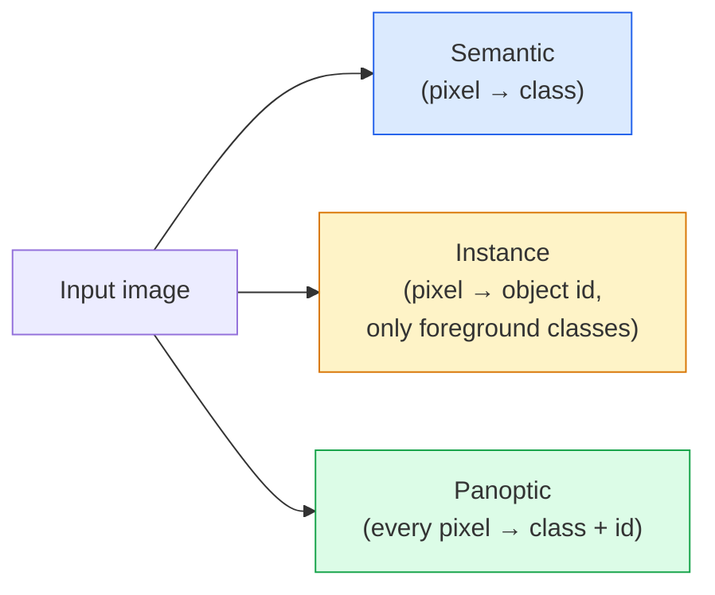
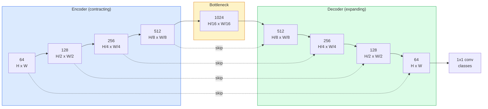

# Semantic Segmentation — U-Net

> Segmentation is classification at every pixel. U-Net makes it work by pairing a downsampling encoder with an upsampling decoder and wiring skip connections between them.

**Type:** Build
**Languages:** Python
**Prerequisites:** Phase 4 Lesson 03 (CNNs), Phase 4 Lesson 04 (Image Classification)
**Time:** ~75 minutes

## Learning Objectives

- Distinguish semantic, instance, and panoptic segmentation and pick the right task for a given problem
- Build a U-Net from scratch in PyTorch with encoder blocks, a bottleneck, a decoder with transposed convolutions, and skip connections
- Implement pixel-wise cross-entropy, Dice loss, and the combined loss that is the current default for medical and industrial segmentation
- Read IoU and Dice metrics per class and diagnose whether a bad score comes from small-object recall, boundary accuracy, or class imbalance

## The Problem

Classification outputs one label per image. Detection outputs a handful of boxes per image. Segmentation outputs one label per pixel. For an input of size `H x W`, the output is a tensor of shape `H x W` (semantic) or `H x W x N_instances` (instance). That is millions of predictions per image, not one.

The structure of segmentation is why it powers almost every dense-prediction vision product: medical imaging (tumour masks), autonomous driving (road, lane, obstacle), satellite (building footprints, crop boundaries), document parsing (layout zones), robotics (graspable regions). None of those tasks can be solved by putting a box around the object; they need the exact silhouette.

The architectural problem is simple to state and not simple to solve: you need the network to see the global context of an image (what kind of scene is this) and the local pixel detail (exactly which pixel is road vs pavement) simultaneously. A standard CNN compresses spatially to gain context, which throws away the detail. U-Net was the design that got both.

## The Concept

### Semantic vs instance vs panoptic



- **Semantic** says "this pixel is road, that pixel is car." Two cars next to each other collapse into a single blob.
- **Instance** says "this pixel is car #3, that pixel is car #5." Ignores background stuff ("stuff" = sky, road, grass).
- **Panoptic** unifies both: every pixel gets a class label, every instance gets a unique id, stuff and things both segmented.

This lesson covers semantic. The next lesson (Mask R-CNN) covers instance.

### The U-Net shape



The encoder halves spatial resolution four times and doubles channels. The decoder reverses: doubles spatial resolution four times and halves channels. The skip connections concatenate matching encoder features with decoder features at every resolution. The final 1x1 conv maps `64 -> num_classes` at full resolution.

Why skip connections are necessary: the decoder has seen only small feature maps by the time it tries to output pixel-level predictions. Without the skips it cannot localise edges accurately because that information was compressed away in the encoder. Skip connections hand it the high-resolution feature maps the encoder computed on the way down.

### Transposed vs bilinear upsample

The decoder has to expand spatial dimensions. Two options:

- **Transposed convolution** (`nn.ConvTranspose2d`) — learnable upsample. Historical U-Net default. Can produce checkerboard artifacts if stride and kernel size do not divide evenly.
- **Bilinear upsample + 3x3 conv** — smooth upsample followed by a conv. Fewer artifacts, fewer parameters, now the modern default.

Both appear in the wild. For a first U-Net, bilinear is safer.

### Cross-entropy on a pixel grid

For semantic segmentation with C classes, the model output is `(N, C, H, W)`. The target is `(N, H, W)` with integer class IDs. Cross-entropy is identical to the classification case, just applied at every spatial position:

```
Loss = mean over (n, h, w) of -log( softmax(logits[n, :, h, w])[target[n, h, w]] )
```

`F.cross_entropy` in PyTorch handles this shape natively. No reshape needed.

### Dice loss and why you need it

Cross-entropy treats every pixel equally. That is wrong when one class dominates the frame (medical imaging: 99% background, 1% tumour). The network can score 99% accuracy by predicting background everywhere and still be useless.

Dice loss solves this by directly optimising the overlap between predicted and true mask:

```
Dice(p, y) = 2 * sum(p * y) / (sum(p) + sum(y) + epsilon)
Dice_loss = 1 - Dice
```

where `p` is the sigmoid/softmax probability map for a class and `y` is the binary ground-truth mask. The loss is zero only when the overlap is perfect. Because it is ratio-based, class imbalance is irrelevant.

In practice, use the **combined loss**:

```
L = L_cross_entropy + lambda * L_dice       (lambda ~ 1)
```

Cross-entropy gives stable gradients early in training; Dice focuses the tail of training on actually matching the mask shape. This combination is the medical-imaging default and hard to beat on any class-imbalanced dataset.

### Evaluation metrics

- **Pixel accuracy** — percent of pixels predicted correctly. Cheap. Broken on imbalanced data for the same reason as accuracy in classification.
- **IoU per class** — intersection over union for each class's mask; average across classes = mIoU.
- **Dice (F1 on pixels)** — similar to IoU; `Dice = 2 * IoU / (1 + IoU)`. Medical imaging prefers Dice, driving community prefers IoU; they are monotonically related.
- **Boundary F1** — measures how close predicted boundaries are to ground-truth boundaries, penalising even small shifts. Important for high-precision tasks like semiconductor inspection.

**Worked example (hypothetical).** Mean IoU can hide one class at 15% when nine others are at 85%. Report IoU per class, not just mIoU.

### Input resolution trade-off

U-Net's encoder halves resolution four times, so the input must be divisible by 16. Medical images are often 512x512 or 1024x1024. Autonomous-driving crops are 2048x1024. The memory cost of U-Net scales with `H * W * C_max`, and at 1024x1024 with 1024 bottleneck channels the forward pass already uses gigabytes of VRAM.

Two standard workarounds:
1. Tile the input — process 256x256 tiles with overlap and stitch.
2. Replace the bottleneck with dilated convolutions that keep spatial resolution higher but widen receptive field (the DeepLab family).

For a first model, a 256x256 input with a 64-channel-base U-Net trains comfortably on 8 GB VRAM.


## Further Reading

- [U-Net: Convolutional Networks for Biomedical Image Segmentation (Ronneberger et al., 2015)](https://arxiv.org/abs/1505.04597) — the original paper; the figure everyone copies is on page 2
- [Fully Convolutional Networks (Long et al., 2015)](https://arxiv.org/abs/1411.4038) — the paper that first made segmentation an end-to-end conv problem
- [segmentation_models_pytorch](https://github.com/qubvel/segmentation_models.pytorch) — the reference for production segmentation; every standard architecture plus every standard loss
- [Lessons learned from training SOTA segmentation (kaggle.com competitions)](https://www.kaggle.com/code/iafoss/carvana-unet-pytorch) — a walkthrough of why TTA, pseudo-labeling, and class weights matter on real data
