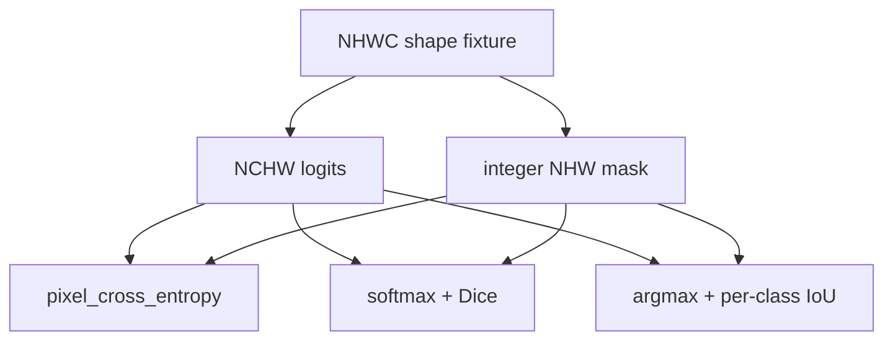

# Semantic Segmentation: U-Net Shape and Mask Metrics

> Semantic segmentation assigns a class to every pixel, so shape and metric contracts are part of the model.

**Type:** Build
**Languages:** Python
**Prerequisites:** Phase 04 Lesson 03 (CNNs: LeNet to ResNet), Phase 04 Lesson 04 (Image Classification)
**Time:** ~65 minutes

## Learning Objectives

- Distinguish a semantic mask from instance IDs and image-level labels.
- Keep logits in NCHW and targets in integer NHW while computing a stable pixel cross-entropy.
- Derive macro Dice overlap from softmax probabilities and one-hot masks.
- Interpret per-class IoU, including `NaN` for a class absent from both prediction and target.
- Trace the spatial changes and skip resolutions of a compact U-Net without hiding rounding requirements.

## Dense prediction contracts

The local fixture contains NHWC images and integer NHW masks. Class `0` is background; the remaining classes are simple circles or squares placed by a seeded generator. It is intentionally small and synthetic. `softmax` expects a non-empty class axis and subtracts the maximum logit per pixel. `pixel_cross_entropy` therefore accepts logits `(N,C,H,W)` and labels `(N,H,W)`, while `dice_loss` uses the same shapes to form soft probabilities and one-hot masks.



Dice is calculated per class and averaged. The epsilon is positive and finite, so an all-zero denominator cannot create a division warning. IoU is different: when a class has no predicted or true pixels, its union is zero and the result is `NaN`, allowing a caller to exclude that class from a macro average instead of calling absence a perfect score. `combined_loss` returns both component values and a weighted sum; `lam` is nonnegative.

This lesson does not train a PyTorch U-Net. `double_conv` is a shape-preserving NumPy analogue made of two edge-padded local mean filters and ReLUs. `unet_shape_trace` records encoder downsampling, a bottleneck, and decoder resolutions. It requires height and width divisible by `2**levels`; a real implementation must choose an explicit crop/interpolation policy for other sizes.

## Build It

Run:

```bash
python3 main.py
```

The run creates four `32x32` images, builds three-channel logits, prints the finite cross-entropy/Dice components and per-class IoU, verifies the shape-preserving local block, and prints a two-level `(1,3,64,64)` trace. These values are observations from the local fixture, not medical segmentation claims.

## Use It

```python
import sys
import numpy as np
sys.path.insert(0, "code")
import main as segmentation

images, masks = segmentation.synthetic_segmentation(2, 16, 3, seed=4)
logits = np.zeros((2, 3, 16, 16), dtype=float)
loss, parts = segmentation.combined_loss(logits, masks, 3)
assert np.isfinite(loss)
assert segmentation.double_conv(logits).shape == logits.shape
```

For a real dataset, keep the mask integer and aligned with the image after every crop/resize. Interpolating class IDs with a smooth image interpolator creates labels that are not classes; nearest-neighbor is the appropriate policy for a categorical mask.

## Ship It

`outputs/skill-segmentation-mask-inspector.md` records image/mask/logit shapes, class counts, IoU values, and absent-class handling. `outputs/prompt-segmentation-task-picker.md` asks whether the task is semantic or instance segmentation and whether the requested metric excludes undefined classes. The artifacts make the local semantics reusable without implying a model was trained.

## Exercises

1. Build logits for a `2x2` binary mask with `+12` for the target class and `-12` for the other class. Confirm `dice_loss` is near zero and explain why the target is NHW rather than one-hot NCHW at the API boundary.
2. Set both prediction and target to background for a two-class `2x2` mask. Read `iou_per_class`; explain why class one is `NaN` rather than zero or one.
3. Change `lam` from `0` to `0.5` in `combined_loss` and verify the returned total equals `cross_entropy + lam*dice_loss`. Try `lam=-1` and preserve the validation error.
4. Trace `unet_shape_trace((1,3,32,32), levels=2, base=8)`. Match each decoder resolution to its encoder skip and then try height `30` to see why the divisibility contract is explicit.

## Reference Solution

Confident matching binary logits produce a Dice loss close to zero. A background-only mask gives class-zero IoU `1` and class-one `NaN` because its union is empty. The combined loss is exactly the two returned components with the requested nonnegative weight. For a two-level trace, encoder resolutions are `32` then `16`, the bottleneck is `8`, and the decoder returns to `16` and `32`; a height of `30` is rejected rather than silently cropping a skip connection.
