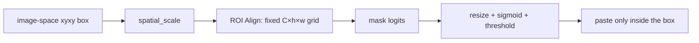

# Instance Segmentation: Align RoIs, Then Paste Masks

> An instance mask is useful only when its pixels stay aligned with the box that selected them.

**Type:** Build
**Languages:** Python
**Prerequisites:** Phase 04 Lesson 06 (Object Detection — YOLO), Phase 04 Lesson 07 (Semantic Segmentation)
**Time:** ~55 minutes

## Learning Objectives

- Distinguish an instance mask from a semantic mask and a detection box.
- Map absolute image-space boxes onto a feature map with an explicit spatial scale.
- Explain why bin-center bilinear sampling gives every RoI a fixed tensor shape.
- Paste a small mask-logit grid back into its box without changing pixels outside that box.
- Compute stable mask BCE and IoU while validating coordinate and target contracts.

## The local contract

Mask R-CNN combines a detector with a small mask head for each selected RoI. This lesson isolates the geometry around that head. It does not download weights, instantiate `torchvision`, or claim to run a trained Mask R-CNN. The implementation is a NumPy fixture that makes the detector-to-mask boundary inspectable.
Its `synthetic_scene(height, width)` helper requires both axes to be at least
8: the fixed box starts at `(x=2,y=3)` and must still have a positive end
coordinate. At the exact `8×8` boundary it returns box `[2,3,3,4]` and a
one-pixel mask, so a passing scene is never silently empty.

Boxes use absolute `xyxy` image coordinates with positive width and height. `roi_align` receives a `(C,H,W)` feature map and a `spatial_scale`: a scale of `0.5` means that an 8-pixel image coordinate is at feature coordinate 4. Each output bin samples its center with bilinear interpolation, so all boxes become `(C, output_height, output_width)` tensors without silently swapping x and y.



`paste_mask` uses the box's integer-covered region and bilinearly resizes logits there. Pixels outside the region remain false. `mask_bce_with_logits` computes

```text
max(logit, 0) - logit * target + log1p(exp(-abs(logit)))
```

instead of taking a logarithm of a saturated sigmoid. `mask_iou` compares two already-pasted boolean masks; an empty-vs-empty comparison is defined as `1.0` for this local report.

## Build It

Run from the lesson's `code/` directory:

```bash
python3 main.py
```

The demo creates a two-channel 16×20 feature fixture and one rectangle, pools it to `(1,2,3,4)`, pastes a `(1,4,5)` mask-logit grid, and reports the BCE and mask IoU. The printed values are local observations. They are not recall, AP, or evidence of a trained detector.

## Use It

```python
import sys
import numpy as np

sys.path.insert(0, "code")
import main as instance

feature = np.arange(16, dtype=float).reshape(1, 4, 4)
pooled = instance.roi_align(feature, [[0, 0, 8, 8]], output_size=2, spatial_scale=0.5)
assert pooled.shape == (1, 1, 2, 2)
```

Keep the coordinate systems in the handoff: image-space boxes belong in the report, while feature-space sampling is derived from `spatial_scale`. If a production model uses padding, resized images, or normalized boxes, record that adapter before comparing masks.

## Ship It

`outputs/skill-mask-rcnn-head-swapper.md` is now a local mask-head contract checklist: it records box coordinates, RoI shape, mask resolution, and paste policy without pretending to build a framework model. `outputs/prompt-instance-vs-semantic-router.md` asks whether a task needs one mask per object or one class mask for the whole image.

## Exercises

1. Use a `(1,4,4)` feature map containing `0..15` and the image-space box `[0,0,8,8]` with `spatial_scale=0.5`. Predict the four bin-center samples and compare them with `roi_align(..., output_size=2)`.
2. Paste a 2×2 grid of logits equal to `10` into `[2,3,6,7]` on a 10×10 image. Verify that exactly the 4×4 box region is true and that a neighboring pixel remains false.
3. Evaluate `mask_bce_with_logits` on logits `[[[1000,-1000]]]` and targets `[[[1,0]]]`. Explain why the stable expression remains finite.
4. Call `synthetic_scene(8,8)` and verify its one-pixel mask; then try
   `synthetic_scene(7,8)` and preserve the explicit size error. Create two 4×4
   boolean masks with one-pixel overlap, record the IoU, and state what an
   empty-vs-empty mask means in this artifact.

## Reference Solution

For the 4×4 feature map, image coordinates `[0,0,8,8]` map to feature coordinates `[0,0,4,4]`; 2×2 bin centers are `(1,1)`, `(1,3)`, `(3,1)`, and `(3,3)`, yielding `5,7,13,15` for the row-major ramp. The 2×2 positive mask fills 16 pixels in the requested box and no pixels outside it. The smallest accepted synthetic scene is `8×8`; its derived box `[2,3,3,4]` covers one pixel, while a `7×8` scene is rejected before constructing an invalid box. Extreme correct logits contribute values near zero without overflow. IoU is intersection divided by union, while the local empty-vs-empty convention is explicitly `1.0` rather than an accidental division by zero.
