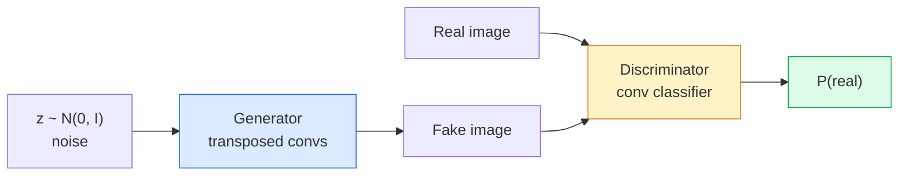
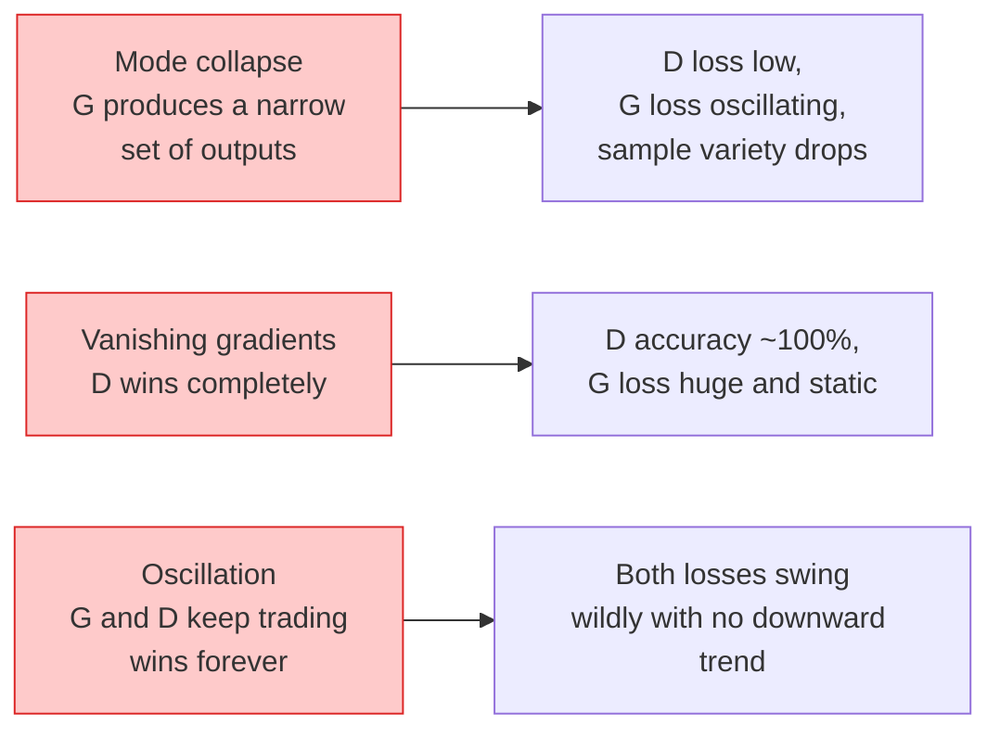

# Image Generation — GANs

> A GAN is two neural networks in a fixed game. One draws, one critiques. They get better together until the drawings fool the critic.

**Type:** Build
**Languages:** Python
**Prerequisites:** Phase 4 Lesson 03 (CNNs), Phase 3 Lesson 06 (Optimizers), Phase 3 Lesson 07 (Regularization)
**Time:** ~75 minutes

## Learning Objectives

- Explain the minimax game between generator and discriminator and why the equilibrium corresponds to p_model = p_data
- Implement a DCGAN in PyTorch and get it to generate coherent 32x32 synthetic images in under 60 lines
- Stabilise GAN training with the three standard tricks: non-saturating loss, spectral norm, TTUR (two-timescale update rule)
- Read training curves that distinguish healthy convergence from mode collapse, oscillation, and discriminator-wins-completely

## The Problem

Classification teaches a network to map images to labels. Generation inverts the problem: sample new images that look like they came from the same distribution. There is no "correct" output you can diff against; there is only a distribution you want to mimic.

The standard loss functions (MSE, cross-entropy) cannot measure "did this sample come from the real distribution." Minimising per-pixel error produces blurry averages, not realistic samples. The breakthrough was to learn the loss: train a second network whose job is to tell real from fake, and use its judgement to push the generator.

GANs (Goodfellow et al., 2014) defined that framework. By 2018 StyleGAN was producing 1024x1024 faces indistinguishable from photographs. Diffusion models have since taken the throne on quality and controllability, but every trick that makes diffusion practical — normalisation choices, latent spaces, feature losses — was first understood on GANs.

## The Concept

### The two networks



The **generator** G takes a vector of noise `z` and outputs an image. The **discriminator** D takes an image and outputs a single scalar: the probability that the image is real.

### The game

G wants D to be wrong. D wants to be right. Formally:

```
min_G max_D  E_x[log D(x)] + E_z[log(1 - D(G(z)))]
```

Read right to left: D is maximising accuracy on real (`log D(real)`) and fake (`log (1 - D(fake))`) images. G is minimising D's accuracy on fakes — it wants `D(G(z))` to be high.

Goodfellow proved that this minimax has a global equilibrium where `p_G = p_data`, D outputs 0.5 everywhere, and the Jensen-Shannon divergence between generated and real distributions is zero. The hard part is getting there.

### Non-saturating loss

The form above is numerically unstable. Early in training, `D(G(z))` is near zero for every fake, so `log(1 - D(G(z)))` has vanishing gradients with respect to G. The fix: flip G's loss.

```
L_D = -E_x[log D(x)] - E_z[log(1 - D(G(z)))]
L_G = -E_z[log D(G(z))]                          # non-saturating
```

Now when `D(G(z))` is near zero, G's loss is large and its gradient is informative. Every modern GAN trains with this variant.

### DCGAN architecture rules

Radford, Metz, Chintala (2015) distilled years of failed experiments into five rules that make GAN training stable:

1. Replace pooling with strided convs (both nets).
2. Use batch norm in both generator and discriminator, except output of G and input of D.
3. Remove fully connected layers on deeper architectures.
4. G uses ReLU on all layers except output (tanh for output in [-1, 1]).
5. D uses LeakyReLU (negative_slope=0.2) on all layers.

Every modern conv-based GAN (StyleGAN, BigGAN, GigaGAN) still starts from these rules and replaces pieces one at a time.

### Failure modes and their signatures



- **Mode collapse**: G finds one image that fools D and produces only that. Fix: add minibatch discrimination, spectral norm, or label-conditioning.
- **Discriminator wins**: D becomes too strong too fast, G's gradients vanish. Fix: smaller D, lower D learning rate, or apply label smoothing on the real labels.
- **Oscillation**: the two nets trade wins without ever approaching equilibrium. Fix: TTUR (D learns faster than G by a factor of 2-4), or switch to Wasserstein loss.

### Evaluation

GANs have no ground truth, so how do you know they are working?

- **Sample inspection** — just look at 64 samples at the end of every epoch. Non-negotiable.
- **FID (Fréchet Inception Distance)** — distance between Inception-v3 feature distributions of real and generated sets. Lower is better. Community standard.
- **Inception Score** — older, more brittle; prefer FID.
- **Precision/Recall for generative models** — measures quality (precision) and coverage (recall) separately. More informative than FID alone.

For a small synthetic-data run, sample inspection is enough.


## Further Reading

- [Generative Adversarial Networks (Goodfellow et al., 2014)](https://arxiv.org/abs/1406.2661) — the paper that started it all
- [DCGAN (Radford, Metz, Chintala, 2015)](https://arxiv.org/abs/1511.06434) — the architecture rules that made GANs trainable
- [Spectral Normalization for GANs (Miyato et al., 2018)](https://arxiv.org/abs/1802.05957) — the single most useful stabilisation trick
- [StyleGAN3 (Karras et al., 2021)](https://arxiv.org/abs/2106.12423) — the SOTA GAN; reads like a greatest-hits album of every trick from the last decade
