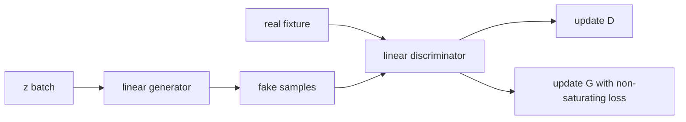

# GANs: Two Objectives, Two Update Boundaries

> A GAN is a coupled game: the discriminator learns a test while the generator learns to pass it.

**Type:** Build
**Languages:** Python
**Prerequisites:** Phase 03 Lesson 03 (Backpropagation), Phase 04 Lesson 04 (Image Classification)
**Time:** ~55 minutes

## Learning Objectives

- Write stable binary cross-entropy losses directly from logits.
- Distinguish the minimax generator objective from the non-saturating training objective.
- Keep discriminator and generator gradients on separate update boundaries.
- Trace a scalar generator and discriminator without confusing the toy fixture with an image GAN.
- Use seeded batches and finite-loss checks to diagnose a short adversarial run.

## The local game

This lesson uses a one-dimensional GAN because the loss signs are easier to inspect than a convolutional image model. The generator maps a latent scalar `z` to `fake = g_weight*z + g_bias`. The discriminator maps a scalar sample to a logit `d_weight*sample + d_bias`. Real samples come from a small normal fixture centered near `2.0`; this is a local target distribution, not a dataset claim.

For a discriminator, real labels are one and fake labels are zero:

```text
L_D = mean(softplus(-real_logit)) + mean(softplus(fake_logit))
```

The original minimax generator value is
`E[log(1-D(G(z)))] = -mean(softplus(fake_logit))`. If treated as the scalar
objective for gradient descent, its derivative is `-sigmoid(fake_logit)`, so a
step raises a fake logit. For a strongly negative logit that derivative is
nearly zero, which is the saturation problem. In practice the local update
uses the non-saturating objective:

```text
L_G_non_sat = mean(softplus(-fake_logit))
```

Both expressions use the same stable `softplus(x)=max(x,0)+log1p(exp(-abs(x)))` identity. `generator_loss_minimax` reports the original minimax value (which is non-positive), namely `-mean(softplus(fake_logit))`, while `gan_step` deliberately optimizes `generator_loss_non_saturating`; one should not be swapped into an explanation merely because both mention the discriminator.



`gan_step` computes the discriminator gradients using fake values as a detached batch, updates `d_weight`/`d_bias`, then computes the generator gradient through the updated discriminator. It does not use a framework optimizer, spectral normalization, image convolutions, or a claim about convergence.

## Build It

Run from `code/`:

```bash
python3 main.py
```

The demo runs 80 seeded scalar steps and prints finite final losses, parameters, and a fake-batch mean. The acceptance condition is that the run is deterministic and bounded; a short adversarial trace is not a quality score.

## Use It

```python
import sys
import numpy as np

sys.path.insert(0, "code")
import main as gan

real = np.array([1.5, 2.0, 2.2])
z = np.array([-1.0, 0.0, 1.0])
params = {"g_weight": 0.15, "g_bias": -0.5, "d_weight": 0.2, "d_bias": 0.0}
params, losses = gan.gan_step(params, real, z)
assert np.isfinite([losses["d_loss"], losses["g_loss"]]).all()
```

When moving to an image GAN, preserve this order: discriminator fake samples are detached for the discriminator update, then the generator receives a fresh discriminator evaluation. Report image range, batch shape, and both loss definitions before interpreting a curve.

## Ship It

`outputs/skill-dcgan-scaffold.md` is a loss-and-update checklist for a future convolutional implementation. `outputs/prompt-gan-training-triage.md` asks for the update order, logit ranges, separate optimizer state, and a bounded fixture run. Neither artifact suggests installing a framework or downloading a checkpoint.

## Exercises

1. Evaluate the original minimax value and the non-saturating loss on logits
   `[-4,0,1]`. Use a centered finite difference at `-8` to show that the
   minimax derivative is negative (gradient descent raises the fake logit) but
   much smaller in magnitude than the non-saturating derivative.
2. Derive the discriminator logit gradients for one real value `r` and one fake value `f`: `sigmoid(d(r))-1` and `sigmoid(d(f))`. Check the signs in `gan_step`.
3. Run `gan_step` once and compare `g_weight` and `d_weight` before and after. Identify which batch is detached conceptually and why the generator still uses the discriminator's current weight.
4. Run `train_toy_gan(steps=12,batch_size=8,seed=3)` twice. Compare both loss histories and record the finite-value acceptance check; do not call the final fake mean an image-quality metric.

## Reference Solution

For logits `[-4,0,1]`, the original minimax value is
`-mean(softplus(logit))`, while `softplus(-logit)` is the non-saturating loss
used by `gan_step`. At `logit=-8`, a finite difference of the minimax value is
negative, so subtracting that gradient increases the logit; its magnitude is
approximately `sigmoid(-8)`, much smaller than the non-saturating magnitude
`1-sigmoid(-8)`. The discriminator gradients have the real-minus-one and fake
probabilities shown above. A step changes both parameter groups, but the
discriminator sees the generator output as a detached value before its own
update. Repeating the same seeded 12-step run gives identical histories and
finite values, which is the useful local regression—not evidence that the toy
game has converged.
