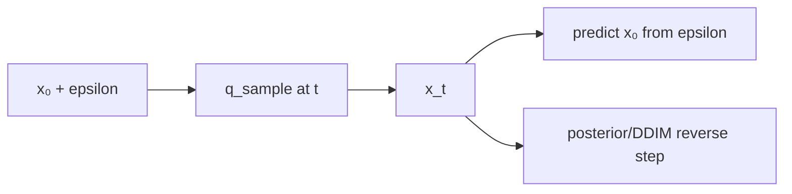

# Diffusion: Forward Noise and Reverse Algebra

> A sampler is a sequence of indexed equations; the timestep contract matters as much as the neural network.

**Type:** Build
**Languages:** Python
**Prerequisites:** Phase 03 Lesson 03 (Backpropagation), Phase 04 Lesson 01 (Image Fundamentals)
**Time:** ~65 minutes

## Learning Objectives

- Construct a finite beta schedule and its cumulative alpha products.
- Derive `q_sample(x0,t,noise)` from the closed-form forward process.
- Recover `x0` from a noisy sample when the predicted noise is known.
- Distinguish a DDPM posterior mean from a deterministic DDIM-style step.
- Validate timestep, shape, beta, and guidance parameters before arithmetic.

## The schedule

The lesson uses a small linear schedule only to make the numbers inspectable. For each timestep `t`, `beta_t` is the injected variance, `alpha_t=1-beta_t`, and `alpha_bar_t=∏_{s≤t} alpha_s`. `precompute_schedule` stores these arrays plus the posterior coefficients.

The forward process has a closed form:

```text
x_t = sqrt(alpha_bar_t) * x_0 + sqrt(1-alpha_bar_t) * epsilon
```

where `epsilon` is standard normal noise supplied by the caller. `predict_x0_from_eps` inverts this equation. This is not a trained denoiser: the demo supplies the same noise to demonstrate the identity exactly.



`posterior_mean(x_t,x0,t)` uses the two stored coefficients multiplying the clean and noisy states. `ddim_step` first estimates `x0`, then combines it with the predicted direction at an earlier timestep. This equation fixture intentionally implements only the deterministic `eta=0` path: it rejects positive, boolean, and non-finite `eta` rather than pretending to be a stochastic DDIM sampler. A caller needing DDPM noise must provide that separate reverse-step contract explicitly.

`timestep_embedding` supplies sinusoidal features for a future time-conditioned network. `synthetic_circles` returns a tiny NCHW fixture in `[-1,1]`; it is used to exercise shapes, not to claim a generative result.

## Build It

Run from `code/`:

```bash
python3 main.py
```

The demo builds a 20-step schedule, noises one 8×8 circle at timestep 7, reconstructs it with the known noise, and performs one deterministic DDIM-style step. The reconstruction error should be at floating-point roundoff. No U-Net is trained and no image is sampled from a checkpoint.

## Use It

```python
import sys
import numpy as np

sys.path.insert(0, "code")
import main as diffusion

schedule = diffusion.precompute_schedule(diffusion.linear_beta_schedule(10, 1e-3, 0.02))
x0 = np.zeros((1, 1, 4, 4))
noise = np.ones_like(x0)
noisy = diffusion.q_sample(x0, 5, noise, schedule)
assert np.allclose(diffusion.predict_x0_from_eps(noisy, 5, noise, schedule), x0)
```

In a real training loop, the model predicts `epsilon`, `x0`, or a velocity target according to the chosen parameterization. Record that choice, the schedule length, and the valid timestep range; silently mixing targets makes a loss curve uninterpretable.

## Ship It

`outputs/skill-noise-schedule-designer.md` records betas, alpha bars, endpoint behavior, and a valid timestep range. `outputs/prompt-diffusion-sampler-picker.md` asks whether a caller needs stochastic DDPM sampling or deterministic `eta=0` stepping. Both artifacts label the NumPy path as equation-level evidence, not a production image generator.

## Exercises

1. For `T=10`, `beta_start=1e-3`, and `beta_end=0.02`, verify that `alpha_bar` decreases and remains positive. Explain why the final timestep is noisier than the first.
2. Use a 1×1 clean sample, noise `2`, and timestep `0`. Compute `q_sample` from the two stored square-root coefficients and compare with the function.
3. Reconstruct a random `(2,1,3,3)` batch with the exact noise passed to `q_sample`. Measure the maximum error and explain why this is an algebra test rather than evidence about a denoiser.
4. Call `ddim_step` twice with `eta=0` and the same arrays. Then try
   `eta=0.1`, `eta=True`, `t_prev >= t`, and an out-of-range timestep;
   preserve the explicit errors rather than adding an implicit random draw.

## Reference Solution

`alpha_bar` is a cumulative product of values below one, so it decreases. At timestep zero, `q_sample` uses almost all of `x0` and a small noise coefficient. Passing the exact noise to `predict_x0_from_eps` recovers every clean element up to floating-point roundoff. The local `eta=0` DDIM-style step is repeatable; positive, boolean, or non-finite `eta` is rejected because no stochastic noise argument exists. A non-earlier `t_prev` also violates the reverse path. These checks validate the sampler algebra; they do not train or evaluate a U-Net.
