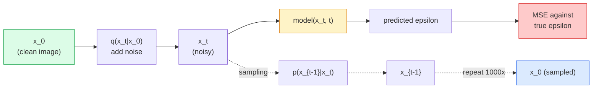

# Image Generation — Diffusion Models

> A diffusion model learns to denoise. Train it to remove a tiny bit of noise from a noisy image, repeat that backwards a thousand times, and you have an image generator.

**Type:** Build
**Languages:** Python
**Prerequisites:** Phase 4 Lesson 07 (U-Net), Phase 1 Lesson 06 (Probability), Phase 3 Lesson 06 (Optimizers)
**Time:** ~75 minutes

## Learning Objectives

- Derive the forward noising process `x_0 -> x_1 -> ... -> x_T` and explain why the closed-form `q(x_t | x_0)` holds for any t
- Implement a DDPM-style training objective that regresses the noise added at each step, and a sampler that walks back from pure noise to an image
- Build a time-conditioned U-Net (small enough to train on CPU) that predicts the noise for any timestep
- Explain the difference between DDPM and DDIM sampling, and when each is appropriate (Lesson 23 covers flow matching and rectified flow in depth)

## The Problem

GANs generate one-shot: noise in, image out, one forward pass. They are fast and hard to train. Diffusion models generate iteratively: start from pure noise, denoise in small steps, image emerges. They are slow and easy to train. For the last five years the latter property has dominated: any small team can train a diffusion model and get reasonable samples; GAN training is a craft you learn over years of failed runs.

Beyond training stability, diffusion's iterative structure is what unlocks everything modern image generation does: text conditioning, inpainting, image editing, super-resolution, controllable style. Each step of the sampling loop is a place to inject a new constraint. That hook is why Stable Diffusion, Imagen, DALL-E 3, Midjourney, and every controllable image model you will use are all diffusion-based.

This lesson builds the minimal DDPM: forward noising, backward denoising, training loop. The next lesson (Stable Diffusion) wires it into a production system with a VAE, a text encoder, and classifier-free guidance.

## The Concept

### The forward process

Take an image `x_0`. Add a tiny amount of Gaussian noise to get `x_1`. Add a tiny amount more to get `x_2`. Keep going for T steps until `x_T` is nearly indistinguishable from pure Gaussian noise.

```
q(x_t | x_{t-1}) = N(x_t; sqrt(1 - beta_t) * x_{t-1},  beta_t * I)
```

`beta_t` is a small variance schedule, typically linear from 0.0001 to 0.02 over T=1000 steps. Each step slightly shrinks the signal and injects fresh noise.

### The closed-form jump

Adding noise one step at a time is a Markov chain, but the math folds: you can sample `x_t` directly from `x_0` in one step.

```
Define alpha_t = 1 - beta_t
Define alpha_bar_t = prod_{s=1..t} alpha_s

Then:
  q(x_t | x_0) = N(x_t; sqrt(alpha_bar_t) * x_0,  (1 - alpha_bar_t) * I)

Equivalently:
  x_t = sqrt(alpha_bar_t) * x_0 + sqrt(1 - alpha_bar_t) * epsilon
  where epsilon ~ N(0, I)
```

This single equation is the whole reason diffusion is practical. During training you pick a random `t`, sample `x_t` directly from `x_0`, and train in one step — no simulation of the full Markov chain needed.

### The reverse process

The forward process is fixed. The reverse process `p(x_{t-1} | x_t)` is what the neural network learns. Diffusion models do not predict `x_{t-1}` directly; they predict the noise `epsilon` added at step t, and the math derives `x_{t-1}` from it.



### The training loss

For every training step:

1. Sample a real image `x_0`.
2. Sample a timestep `t` uniformly from [1, T].
3. Sample noise `epsilon ~ N(0, I)`.
4. Compute `x_t = sqrt(alpha_bar_t) * x_0 + sqrt(1 - alpha_bar_t) * epsilon`.
5. Predict `epsilon_theta(x_t, t)` with the network.
6. Minimise `|| epsilon - epsilon_theta(x_t, t) ||^2`.

That is it. The neural network learns to predict the noise at any timestep. The loss is MSE. There is no adversarial game, no collapse, no oscillation.

### The sampler (DDPM)

To generate: start from `x_T ~ N(0, I)` and walk backwards one step at a time.

```
for t = T, T-1, ..., 1:
    eps = model(x_t, t)
    x_{t-1} = (1 / sqrt(alpha_t)) * (x_t - (beta_t / sqrt(1 - alpha_bar_t)) * eps) + sqrt(beta_t) * z
    where z ~ N(0, I) if t > 1, else 0
return x_0
```

The key is that even though the reverse conditional is not known in closed form in general, for this specific Gaussian forward process it is. The ugly-looking coefficients are what Bayes' rule gives you.

### Why 1000 steps

The forward noise schedule is chosen so each step adds just enough noise that the reverse step is nearly Gaussian. Too few steps and the reverse step is far from Gaussian, the network cannot model it well. Too many steps and sampling becomes expensive with diminishing gain. T=1000 with a linear schedule is the DDPM default.

### DDIM: 20x faster sampling

Training is the same. Sampling changes. DDIM (Song et al., 2020) defines a deterministic reverse process that skips timesteps without retraining. Sampling in 50 steps with DDIM gives near-1000-step DDPM quality. Every production system uses DDIM or an even faster variant (DPM-Solver, Euler ancestral).

### Time conditioning

The network `epsilon_theta(x_t, t)` needs to know which timestep it is denoising. Modern diffusion models inject `t` via sinusoidal time embeddings (same idea as positional encoding in transformers) that get added to feature maps at every U-Net level.

```
t_embedding = sinusoidal(t)
feature_map += MLP(t_embedding)
```

Without time conditioning the network has to guess the noise level from the image itself, which works but is much less sample-efficient.


## Use It

For production work, use `diffusers`:

```python
from diffusers import DDPMScheduler, UNet2DModel

unet = UNet2DModel(sample_size=32, in_channels=3, out_channels=3, layers_per_block=2)
scheduler = DDPMScheduler(num_train_timesteps=1000)
```

The library ships ready-made schedulers (DDPM, DDIM, DPM-Solver, Euler, Heun), configurable U-Nets, pipelines for text-to-image and image-to-image, and LoRA fine-tuning helpers.

For research, `k-diffusion` (Katherine Crowson) has the most faithful reference implementations and the best sampling variants.

## Ship It

This lesson produces:

- `outputs/prompt-diffusion-sampler-picker.md` — a prompt that picks DDPM / DDIM / DPM-Solver / Euler based on quality target, latency budget, and conditioning type.
- `outputs/skill-noise-schedule-designer.md` — a skill that produces a linear, cosine, or sigmoid beta schedule given T and target corruption level, plus diagnostic plots of signal-to-noise ratio over time.


## Key Terms

| Term | What people say | What it actually means |
|------|----------------|----------------------|
| Forward process | "Add noise over time" | Fixed Markov chain that corrupts an image into Gaussian noise over T steps |
| Reverse process | "Denoise step by step" | Learned distribution that walks back from noise to image |
| Epsilon prediction | "Predict the noise" | The training target: `epsilon_theta(x_t, t)` predicts the noise added at step t |
| Beta schedule | "Noise amounts" | Sequence of T small variances that define how much noise enters per step |
| alpha_bar_t | "Cumulative retain factor" | Product of (1 - beta_s) up to time t; bigger t means less signal left |
| DDPM sampler | "Ancestral, stochastic" | Samples each x_{t-1} from its conditional Gaussian; 1000 steps |
| DDIM sampler | "Deterministic, fast" | Rewrites sampling as a deterministic ODE; 20-100 steps with similar quality |
| Time conditioning | "Tell the model which t" | Sinusoidal embedding of t injected into the U-Net so it knows the noise level |

## Further Reading

- [Denoising Diffusion Probabilistic Models (Ho et al., 2020)](https://arxiv.org/abs/2006.11239) — the paper that made diffusion practical and beat GANs on FID
- [Improved DDPM (Nichol & Dhariwal, 2021)](https://arxiv.org/abs/2102.09672) — cosine schedule and v-parameterisation
- [DDIM (Song, Meng, Ermon, 2020)](https://arxiv.org/abs/2010.02502) — the deterministic sampler that made real-time inference possible
- [Elucidating the Design Space of Diffusion (Karras et al., 2022)](https://arxiv.org/abs/2206.00364) — a unified view of every diffusion design choice; current best reference
