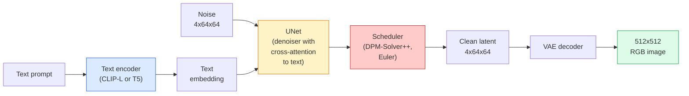

# Stable Diffusion — Architecture & Fine-Tuning

> Stable Diffusion is a DDPM that runs in the latent space of a pretrained VAE, conditioned on text via cross-attention, sampled with a fast deterministic ODE solver, and steered by classifier-free guidance.

**Type:** Learn + Use
**Languages:** Python
**Prerequisites:** Phase 4 Lesson 10 (Diffusion), Phase 7 Lesson 02 (Self-Attention)
**Time:** ~75 minutes

## Learning Objectives

- Trace the five pieces of a Stable Diffusion pipeline: VAE, text encoder, U-Net, scheduler, safety checker — and what each of them actually does
- Explain latent diffusion and why training in a 4x64x64 latent space (instead of a 3x512x512 image) reduces compute by 48x without quality loss
- Use `diffusers` to generate images, run image-to-image, inpainting, and ControlNet-guided generation
- Fine-tune Stable Diffusion with LoRA on a small custom dataset and load the LoRA adapter at inference

## The Problem

Training a DDPM directly on 512x512 RGB images is expensive. Every training step backprops through a U-Net that sees 3x512x512 = 786,432 input values, and sampling takes 50+ forward passes through that same U-Net. At the quality level of Stable Diffusion 1.5 (released 2022), pixel-space diffusion would need roughly 256 GPU-months of training and 10-30 seconds per image on a consumer GPU.

The trick that made open-weight text-to-image practical was **latent diffusion** (Rombach et al., CVPR 2022). Train a VAE that maps a 3x512x512 image to a 4x64x64 latent tensor and back, then do the diffusion in that latent space. Compute drops by `(3*512*512)/(4*64*64) = 48x`. Sampling drops from tens of seconds to under two seconds on the same GPU.

Almost every modern image-generation model — SDXL, SD3, FLUX, HunyuanDiT, Wan-Video — is a latent diffusion model with variations on the autoencoder, the denoiser (U-Net or DiT), and the text conditioning. Learn Stable Diffusion and you have learnt the template.

## The Concept

### The pipeline



- **VAE** — frozen autoencoder. Encoder turns image into latents (used for img2img and training). Decoder turns latents back into an image.
- **Text encoder** — CLIP text encoder (SD 1.x/2.x), CLIP-L + CLIP-G (SDXL), or T5-XXL (SD3/FLUX). Produces a sequence of token embeddings.
- **U-Net** — the denoiser. Has cross-attention layers that attend from latents to the text embedding at every resolution level.
- **Scheduler** — the sampling algorithm (DDIM, Euler, DPM-Solver++). Picks sigmas, blends predicted noise back into the latent.
- **Safety checker** — optional NSFW / illegal-content filter on the output image.

### Classifier-free guidance (CFG)

Plain text conditioning learns `epsilon_theta(x_t, t, c)` for every prompt `c`. CFG trains the same network with `c` dropped 10% of the time (replaced by an empty embedding), giving a single model that predicts both the conditional and the unconditional noise. At inference:

```
eps = eps_uncond + w * (eps_cond - eps_uncond)
```

`w` is the guidance scale. `w=0` is unconditional, `w=1` is plain conditional, `w>1` pushes the output toward being "more conditioned on the prompt" at the cost of diversity. SD default is `w=7.5`.

CFG is the reason text-to-image works at production quality. Without it, prompts bias the output weakly; with it, prompts dominate.

### Latent space geometry

The VAE's 4-channel latent is not just a compressed image. It is a manifold where arithmetic roughly corresponds to semantic edits (prompt engineering + interpolation both live here), and where the diffusion U-Net has been trained to spend its entire modelling budget. Decoding a random 4x64x64 latent does not produce a random-looking image — it produces garbage, because only a specific submanifold of latents decodes to valid images.

Two consequences:

1. **Img2img** = encode image to latent, add partial noise, run the denoiser, decode. Image structure survives because encoding is near-invertible; content changes based on the prompt.
2. **Inpainting** = same as img2img but the denoiser only updates masked regions; unmasked regions are kept at the encoded latent.

### The U-Net architecture

The SD U-Net is a big version of the TinyUNet from Lesson 10 with three additions:

- **Transformer blocks** at every spatial resolution, containing self-attention + cross-attention to the text embedding.
- **Time embedding** via MLP on sinusoidal encoding.
- **Skip connections** between encoder and decoder at matching resolutions.

Total parameters in SD 1.5: ~860M. SDXL: ~2.6B. FLUX: ~12B. The jump in params is mostly in attention layers.

### LoRA fine-tuning

Full fine-tuning of Stable Diffusion needs 20+ GB of VRAM and updates 860M parameters. LoRA (Low-Rank Adaptation) keeps the base model frozen and injects small rank-decomposition matrices into the attention layers. A LoRA adapter for SD is typically 10-50 MB, trains in 10-60 minutes on a single consumer GPU, and loads at inference time as a drop-in modification.

```
Original: W_q : (d_in, d_out)   frozen
LoRA:     W_q + alpha * (A @ B)   where A : (d_in, r), B : (r, d_out)

r is typically 4-32.
```

LoRA is how almost every community fine-tune is distributed. CivitAI and Hugging Face host millions of them.

### Schedulers you will see

- **DDIM** — deterministic, ~50 steps, simple.
- **Euler ancestral** — stochastic, 30-50 steps, slightly more creative samples.
- **DPM-Solver++ 2M Karras** — deterministic, 20-30 steps, production default.
- **LCM / TCD / Turbo** — consistency models and distilled variants; 1-4 steps at the cost of some quality.

Swapping schedulers is a one-line change in `diffusers` and sometimes fixes sample issues without any retraining.


## Further Reading

- [High-Resolution Image Synthesis with Latent Diffusion (Rombach et al., 2022)](https://arxiv.org/abs/2112.10752) — the Stable Diffusion paper; includes every ablation that justifies the design
- [Classifier-Free Diffusion Guidance (Ho & Salimans, 2022)](https://arxiv.org/abs/2207.12598) — the CFG paper
- [LoRA: Low-Rank Adaptation of Large Language Models (Hu et al., 2021)](https://arxiv.org/abs/2106.09685) — LoRA was NLP-first; it transferred to SD with almost no changes
- [diffusers documentation](https://huggingface.co/docs/diffusers) — the reference for every SD / SDXL / SD3 / FLUX pipeline
