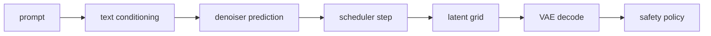

# Stable Diffusion: Latents, Guidance, and Honest Boundaries

> A diffusion pipeline is a set of contracts between text, latent, denoiser, scheduler, and safety components.

**Type:** Reference
**Languages:** Python
**Prerequisites:** Phase 04 Lesson 10 (Image Generation — Diffusion), Phase 04 Lesson 05 (Transfer Learning)
**Time:** ~50 minutes

## Learning Objectives

- Explain why a latent pipeline records a spatial downsampling factor and channel count.
- Compute classifier-free guidance from unconditional and conditional predictions.
- Inspect a scheduler sigma sequence without confusing it with a denoiser.
- Describe a low-rank LoRA update and validate its matrix shapes.
- Separate an offline architecture ledger from an actual Stable Diffusion checkpoint run.

## What this lesson does

Stable Diffusion is commonly described as a text-conditioned latent diffusion pipeline: a text encoder creates conditioning, a denoiser predicts a diffusion update, a scheduler chooses the reverse step, a VAE maps images to and from a smaller latent grid, and a safety component applies a policy. The repository's dependency contract deliberately keeps this lesson offline. `main.py` imports only NumPy and implements the bookkeeping that can be tested without a model file.

The local latent adapter uses mean pooling, not a learned VAE. For an image `(N,C,H,W)` and factor `f`, `latent_shape` requires `H` and `W` divisible by `f` and returns `(N,latent_channels,H/f,W/f)`. `encode_latent` requires `latent_channels >= C` and adds extra channels as a mean when requested; this is a fixture convention, not a claim about any specific released checkpoint.

Classifier-free guidance combines two predictions:

```text
guided = unconditional + guidance_scale * (conditional - unconditional)
```

The `guidance_scale` is a finite, non-boolean policy input. It is not a universal quality setting, and the function does not generate an image. `lora_update` applies `base + scale * (up @ down)` when `down` has shape `(rank,in_features)` and `up` has shape `(out_features,rank)`; all matrix dimensions and `scale` must be meaningful and finite.



The manifest labels the text encoder, denoiser, and safety check as contract-only components. `scheduler_sigmas(num_steps,start,end)` requires at least two steps and includes both supplied endpoints exactly. There is no `diffusers` import, no network access, no weights download, and no generated PNG to mistake for Stable Diffusion inference.

## Build It

Run from `code/`:

```bash
python3 main.py
```

The demo maps a `(1,3,32,32)` image to a `(1,4,4,4)` latent using factor 8, combines two prediction tensors with guidance scale 5, applies a rank-2 LoRA update, and prints a five-component ledger. These are local shape and matrix observations.

## Use It

```python
import sys
import numpy as np

sys.path.insert(0, "code")
import main as sd

latent = sd.encode_latent(np.zeros((1, 3, 8, 8)), downsample_factor=2, latent_channels=4)
guided = sd.classifier_free_guidance(np.zeros_like(latent), np.ones_like(latent), 3.0)
assert latent.shape == guided.shape == (1, 4, 4, 4)
```

For a real pipeline handoff, record the checkpoint's own VAE scaling and scheduler configuration instead of copying the local factor or guidance value. The lesson's numbers are illustrative fixture assumptions.

## Ship It

`outputs/prompt-sd-pipeline-planner.md` is an offline component handoff: it records latent shape, conditioning, scheduler, and safety ownership. `outputs/skill-lora-training-setup.md` records the low-rank matrix contract and what must be checked before attaching LoRA parameters to a framework module. Neither artifact recommends installing a prohibited SDK.

## Exercises

1. Compute `latent_shape((2,3,32,32),8,4)` and explain why a 30-pixel height is rejected. Also verify that an input with five channels cannot be compressed into only four latent channels by this fixture.
2. With unconditional zeros and conditional ones, evaluate guidance scales 0, 1, and 5. State which scale reproduces the unconditional prediction and which reaches 5.
3. Multiply a `(4,2)` `up` matrix by a `(2,4)` `down` matrix. Verify that the result has the same `(4,4)` shape as `base` and identify the rank bound of the update. Try an empty matrix and preserve the explicit error.
4. Read `pipeline_manifest()` and label each component as implemented fixture or contract-only. Explain why the output is not evidence of image generation.

## Reference Solution

The factor-8 shape is `(2,4,4,4)` and a 30-pixel spatial axis cannot be divided into equal factor-8 cells. Guidance 0 returns unconditional, guidance 1 returns conditional, and guidance 5 extrapolates five conditional-minus-unconditional differences. The LoRA product is `(4,4)` with rank at most 2 and empty factors are rejected. A scheduler with two steps returns exactly `[start,end]`; one step is rejected because it cannot represent both endpoints. The manifest identifies the scheduler as a NumPy sigma fixture and the safety component as not implemented; no model or image was loaded.
