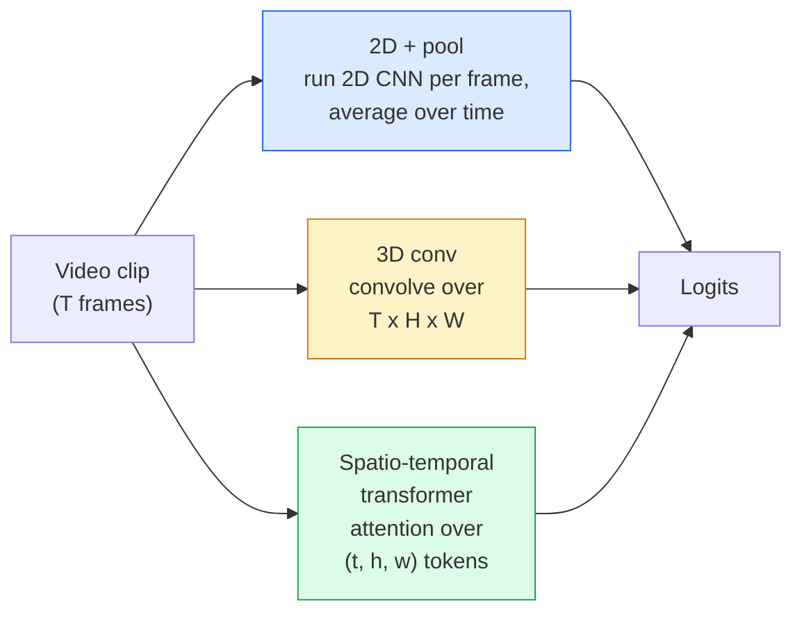

# Video Understanding — Temporal Modeling

> A video is a sequence of images plus the physics that connects them. Every video model either treats time as an extra axis (3D conv), a sequence to attend over (transformer), or a feature to extract once and pool (2D+pool).

**Type:** Learn + Build
**Languages:** Python
**Prerequisites:** Phase 4 Lesson 03 (CNNs), Phase 4 Lesson 04 (Image Classification)
**Time:** ~45 minutes

## Learning Objectives

- Distinguish the three main video-modelling approaches (2D+pool, 3D conv, spatio-temporal transformer) and predict their cost and accuracy trade-offs
- Implement frame sampling, temporal pooling, and a 2D+pool baseline classifier in PyTorch
- Explain why I3D's "inflated" 3D kernels transfer well from ImageNet weights and what a factorised (2+1)D conv does differently
- Read the standard action-recognition datasets and metrics: Kinetics-400/600, UCF101, Something-Something V2; top-1 accuracy at the clip and video level

## The Problem

A 30-second video at 30 fps is 900 images. Naively, video classification is image classification run 900 times followed by some kind of aggregation. That works when the action is visible in almost every frame (sports, cooking, exercise videos) and fails badly when the action is defined by motion itself: "pushing something from left to right" looks like two still objects in every single frame.

The core question for every video architecture is: when does temporal structure get modelled, and how? The answer drives everything else — compute cost, pretraining strategy, whether you can reuse ImageNet weights, what datasets the model trains on.

This lesson is deliberately shorter than the static-image lessons. The core image machinery is already in place, and video understanding is mostly about the temporal story: sampling, modelling, and aggregating.

## The Concept

### The three architectural families

### 2D + pool

Take a 2D CNN (ResNet, EfficientNet, ViT). Run it independently on every sampled frame. Average (or max-pool, or attention-pool) the per-frame embeddings. Feed the pooled vector to a classifier.

Pros:
- ImageNet pretraining transfers directly.
- Simplest to implement.
- Cheap: T frames * single-image inference cost.

Cons:
- Cannot model motion. Action = aggregate of appearances.
- Temporal pooling is order-invariant; "open door" and "close door" look the same.

When to use: appearance-heavy tasks, transfer learning on small video datasets, initial baselines.

### 3D convolutions

Replace 2D (H, W) kernels with 3D (T, H, W) kernels. The network convolves over both space and time. Early family: C3D, I3D, SlowFast.

I3D trick: take a pretrained 2D ImageNet model, "inflate" each 2D kernel by copying it along a new time axis. A 3x3 2D conv becomes a 3x3x3 3D conv. This gives the 3D model strong pretrained weights instead of training from scratch.

Pros:
- Directly models motion.
- I3D inflation gives free transfer learning.

Cons:
- T/8 more FLOPs than the 2D counterpart (for temporal kernel of 3 stacked 3 times).
- Temporal kernels are small; long-range motion needs a pyramid or dual-stream approach.

When to use: action recognition where motion is the signal (Something-Something V2, Kinetics with motion-heavy classes).

### Spatio-temporal transformers

Tokenise the video into a grid of space-time patches and attend across all of them. TimeSformer, ViViT, Video Swin, VideoMAE.

Attention patterns that matter:
- **Joint** — one big attention over (t, h, w). Quadratic in `T*H*W`; expensive.
- **Divided** — two attentions per block: one over time, one over space. Linear-ish scaling.
- **Factorised** — time attention alternates with space attention across blocks.

Pros:
- SOTA accuracy on every major benchmark.
- Transfers from image transformers (ViT) via patch inflation.
- Supports long-context video via sparse attention.

Cons:
- Compute-hungry.
- Requires careful attention pattern choice or runtime balloons.

When to use: large datasets, high-fidelity video understanding, multi-modal video+text tasks.

### Frame sampling

A 10-second clip at 30 fps is 300 frames; feeding all 300 to any model is wasteful. Standard strategies:

- **Uniform sampling** — pick T frames evenly across the clip. Default for 2D+pool.
- **Dense sampling** — random contiguous T-frame window. Common for 3D convs because motion requires neighbouring frames.
- **Multi-clip** — sample multiple T-frame windows from the same video, classify each, average predictions at test time.

T is usually 8, 16, 32, or 64. Higher T = more temporal signal at more compute.

### Evaluation

Two levels:
- **Clip-level accuracy** — model sees one T-frame clip, reports top-k.
- **Video-level accuracy** — average clip-level predictions across multiple clips per video; higher and more stable.

Always report both. A model that scores 78% clip / 82% video is relying heavily on test-time averaging; one that scores 80% / 81% is more robust per-clip.

### Datasets you will meet

- **Kinetics-400 / 600 / 700** — the general-purpose action dataset. 400k clips; YouTube URLs (many now dead).
- **Something-Something V2** — motion-defined actions ("moving X from left to right"). Cannot be solved by 2D+pool.
- **UCF-101**, **HMDB-51** — older, smaller, still reported.
- **AVA** — action *localisation* in space and time; harder than classification.

## Further Reading

- [I3D: Quo Vadis, Action Recognition (Carreira & Zisserman, 2017)](https://arxiv.org/abs/1705.07750) — introduces inflation and the Kinetics dataset
- [R(2+1)D: A Closer Look at Spatiotemporal Convolutions (Tran et al., 2018)](https://arxiv.org/abs/1711.11248) — factorised conv, still a strong baseline
- [TimeSformer: Is Space-Time Attention All You Need? (Bertasius et al., 2021)](https://arxiv.org/abs/2102.05095) — the first strong video transformer
- [VideoMAE (Tong et al., 2022)](https://arxiv.org/abs/2203.12602) — masked autoencoder pretraining for video; current dominant pretraining recipe
