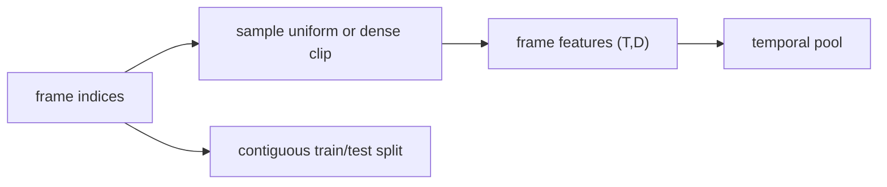

# Video Understanding: Sample Time Before Modeling It

> A video model sees a sequence; a careless split or sampler can erase that sequence before the model starts.

**Type:** Build
**Languages:** Python
**Prerequisites:** Phase 04 Lesson 03 (CNNs: LeNet to ResNet Shape Reasoning), Phase 03 sequence-shape concepts
**Time:** ~55 minutes

## Learning Objectives

- Keep video axes and temporal indices explicit when sampling frames.
- Compare uniform coverage with a contiguous dense clip.
- Pool frame features without mixing samples across a temporal batch.
- Inflate a 2D kernel into a temporal kernel while preserving its spatial average.
- Split time contiguously so future frames cannot leak into a training fixture.

## Temporal contracts

The lesson is a NumPy temporal-geometry lab, not a pretrained video classifier. `sample_uniform(total,T)` returns `T` valid indices spread over the full sequence; if a sequence is shorter than `T`, its last frame is repeated to preserve the requested length. `sample_dense(total,T,rng)` returns one contiguous clip when enough frames exist, using a seeded `numpy.random.Generator`; another `rng` object is rejected explicitly.



`temporal_pool` accepts non-empty `(T,D)` or `(N,T,D)` arrays and averages only the selected time indices; an empty batch is rejected rather than returned as a misleading summary. It never treats a feature dimension as time. `temporal_split` returns `[0,boundary)` and `[boundary,N)` and requires a strictly interior, non-boolean `train_fraction`; this is a simple forecasting-style boundary, not a claim that every video task must use chronological validation.

Inflating a 2D kernel `(out,in,H,W)` to `(out,in,K_t,H,W)` repeats the spatial kernel over time and divides by `K_t`. Summing the temporal slices therefore recovers the original kernel. `conv2plus1d_parameter_count` reports the two-factor parameter formula for a spatial convolution followed by a temporal one; it does not instantiate a framework layer.

## Build It

Run from `code/`:

```bash
python3 main.py
```

The demo samples 8 frames from a 30-frame sequence, pools a small `(T,D)` feature matrix, inflates a `(4,3,3,3)` kernel, and prints the non-overlapping temporal split. No frame backbone or weights are loaded.

## Use It

```python
import sys
import numpy as np

sys.path.insert(0, "code")
import main as video

indices = video.sample_dense(20, 5, np.random.default_rng(3))
features = np.arange(20 * 4, dtype=float).reshape(20, 4)
summary = video.temporal_pool(features, indices)
assert summary.shape == (4,)
```

Before training a video model, record whether the split is by video, scene, or time. A frame-level random split can put near-duplicate frames on both sides and make a metric look better without testing temporal generalization.

## Ship It

`outputs/skill-frame-sampler-auditor.md` records total frames, requested count, index range, repetition policy, and seed. `outputs/prompt-video-architecture-picker.md` asks whether a task needs frame pooling, a 3D kernel, or a temporal transformer based on the required temporal interaction—not on a model name alone.

## Exercises

1. Compute `sample_uniform(10,4)` and check `[0,2,5,7]`. Explain why all indices remain below 10.
2. Run `sample_dense(20,5,default_rng(3))` twice and verify a contiguous, identical clip. Compare its temporal span with uniform sampling.
3. Inflate an all-ones `(2,3,3,3)` kernel with `time_kernel=5`. Sum along the time axis and verify the original kernel returns.
4. Split 10 frames at `train_fraction=0.6`. Confirm that the last training index is 5, the first test index is 6, and no index appears in both sets. Explain how this prevents a simple future-frame leak.

## Reference Solution

Uniform sampling of 10 frames into four slots gives floors of `0,2.5,5,7.5`, hence `[0,2,5,7]`. The dense sampler produces one seeded contiguous range. Kernel inflation repeats each spatial slice five times and divides by five, so its time sum equals the 2D kernel. A 60% split places indices 0–5 in training and 6–9 in test; the boundary is the evidence that the two sets do not overlap.
