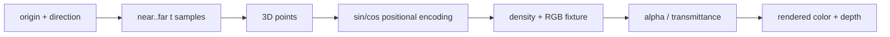

# NeRF Principles: Rays, Encoding, and Volume Rendering

> A radiance field becomes an image only after densities are accumulated along camera rays.

**Type:** Build
**Languages:** Python
**Prerequisites:** Phase 04 Lesson 01 (Image Fundamentals), Phase 04 Lesson 10 (Image Generation — Diffusion)
**Time:** ~60 minutes

## Learning Objectives

- Sample ordered 3D points along rays between near and far bounds.
- Expand 3D positions with multi-frequency sinusoidal encoding.
- Convert density and intervals into alpha, transmittance, and rendering weights.
- Check that colors, depths, and opacity remain finite and bounded.
- Separate this NumPy volume-rendering fixture from a trained NeRF or point-cloud loader.

## Ray sampling

`sample_ray_points` accepts matching `(R,3)` origins and directions. For
`S >= 2` samples it returns points `o_r + t_s d_r` and an increasing `t_vals`
vector spanning `[near,far]`, with the two exact endpoints included. A single
sample cannot represent both bounds and is rejected. The implementation uses
one shared depth grid for all rays so the tensor shape is easy to inspect. A
production renderer may stratify samples per ray; that policy is not hidden
here.

`positional_encoding` maps each 3D coordinate to sine and cosine values at frequencies `2^l*pi` for `l=0..L-1`. A position with three coordinates therefore becomes `3*2*L` features. It is a representation function, not a learned scene.



## Volume rendering

For a segment of length `delta`, density `sigma` becomes opacity `alpha=1-exp(-sigma*delta)`. The weight for sample `i` is its alpha times the transmittance of all earlier samples:

```text
T_i = product(j < i, 1 - alpha_j)
weight_i = T_i * alpha_i
color = sum_i(weight_i * rgb_i)
depth = sum_i(weight_i * t_i)
```

The local implementation uses the final interval length again as a finite terminal segment and can add a background color for the remaining opacity. It requires nonnegative density, RGB in `[0,1]`, and strictly increasing depths. This avoids an implicit infinite-distance convention while retaining the front-to-back reasoning.

## Build It

Run from `code/`:

```bash
python3 main.py
```

The demo samples one forward ray at 32 depths, encodes the points at four levels, evaluates a Gaussian-shaped density fixture, and prints rendered RGB, depth, and total weight. No scene is learned and no 3D asset is loaded.

## Use It

```python
import sys
import numpy as np

sys.path.insert(0, "code")
import main as nerf

points, t_vals = nerf.sample_ray_points([[0,0,0]], [[0,0,1]], 2, 6, 16)
sigma, rgb = nerf.density_fixture(t_vals)
color, depth, weights = nerf.volume_render(sigma, rgb, t_vals, background=np.zeros(3))
assert color.shape == (3,)
assert float(weights.sum()) <= 1.0
```

For a real NeRF, record camera intrinsics/extrinsics, ray normalization, positional-encoding levels, and the model's density activation. A volume-rendering equation cannot recover a missing camera convention.

## Ship It

`outputs/skill-point-cloud-loader.md` is a point-cloud-versus-ray checklist: it states when point samples are inputs and when a renderer needs camera rays instead. `outputs/prompt-3d-task-router.md` asks for camera pose, depth bounds, sample count, and output type before choosing a field or point representation.

## Exercises

1. Sample `t=[2,4,6]` on a ray from the origin in the positive z direction. Write the three 3D points and check the returned shape `(1,3,3)` and exact endpoints. Then request `n_samples=1` and preserve the explicit error.
2. Evaluate `positional_encoding(np.zeros((1,3)), levels=4)`. Count the 24 features and identify the sine and cosine halves.
3. Render four zero-density samples over `t=[0,1,2,3]` with background `[0.2,0.3,0.4]`. Verify zero weights and exactly the background color.
4. Set the first density to 10 and the remaining densities to zero. Check that the first weight dominates and that the total weight remains at most one.

## Reference Solution

The z coordinates are 2, 4, and 6, so the sampled points are `[0,0,2]`, `[0,0,4]`, and `[0,0,6]`; the first and last values are exactly `near` and `far`. `n_samples=1` is rejected because the endpoint-spanning contract needs at least two values. Four encoding levels produce `3*2*4=24` values; zeros map to zero sine features and one cosine features. Zero density leaves full transmittance, so the background is returned. A high first density consumes most opacity before later samples, while the cumulative weights remain bounded by one.
