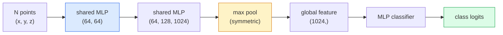

# 3D Vision — Point Clouds & NeRFs

> 3D vision comes in two flavours. Point clouds are the sensor's raw output. NeRFs are the learned volumetric field. Both answer "what is where in space."

**Type:** Learn + Build
**Languages:** Python
**Prerequisites:** Phase 4 Lesson 03 (CNNs), Phase 1 Lesson 12 (Tensor Operations)
**Time:** ~45 minutes

## Learning Objectives

- Distinguish explicit (point cloud, mesh, voxel) and implicit (signed distance field, NeRF) 3D representations and when each is used
- Understand PointNet's symmetric-function trick that makes a neural network permutation-invariant over an unordered set of points
- Trace a NeRF forward pass: ray casting, volumetric rendering, positional encoding, MLP density+colour head
- Use `nerfstudio` or `instant-ngp` for pretrained 3D reconstruction from a small set of posed images

## The Problem

A camera produces a 2D image. A LIDAR produces a set of 3D points with no ordering. A structure-from-motion pipeline produces a sparse cloud of 3D keypoints. A NeRF reconstructs an entire 3D scene from a handful of posed images. All of these are "vision" but none of them look like the dense tensor a CNN wants.

3D vision matters because almost every high-value robot task runs in 3D: grasping, obstacle avoidance, navigation, AR occlusion, 3D content capture. A vision engineer who only understands 2D images is locked out of the fastest-growing slice of the field (AR/VR content, robotics, autonomous driving stacks, NeRF-based 3D reconstruction for real-estate or construction).

The two representations dominate for different reasons. Point clouds are what sensors give you for free. NeRFs and their successors (3D Gaussian splatting, neural SDFs) are what you get when you ask a neural network to learn a scene.

## The Concept

### Point clouds

A point cloud is an unordered set of N points in R^3, optionally each with features (colour, intensity, normal).

```
cloud = [
  (x1, y1, z1, r1, g1, b1),
  (x2, y2, z2, r2, g2, b2),
  ...
  (xN, yN, zN, rN, gN, bN),
]
```

No grid, no connectivity. Two properties make this hard for neural networks:

- **Permutation invariance** — the output must not depend on point order.
- **Variable N** — a single model must handle clouds of different sizes.

PointNet (Qi et al., 2017) solved both with one idea: apply a shared MLP to every point, then aggregate with a symmetric function (max pool). The result is a fixed-size vector that does not depend on order.

```
f(P) = max_{p in P} MLP(p)
```

This is the entire core of PointNet. Deeper variants (PointNet++, Point Transformer) add hierarchical sampling and local aggregation but the symmetric-function trick is unchanged.

### The PointNet architecture



"Shared MLP" means the same MLP runs on every point independently. Implemented as a 1x1 conv over the point dimension for efficiency.

### Neural Radiance Fields (NeRFs)

NeRFs (Mildenhall et al., 2020) took the question "can we reconstruct a 3D scene from N photos?" and answered with a neural network that is the scene. The network maps `(x, y, z, viewing_direction)` to `(density, colour)`. Rendering a new view is a ray-casting loop over this network.

```
NeRF MLP:  (x, y, z, theta, phi) -> (sigma, r, g, b)

To render a pixel (u, v) of a new view:
  1. Cast a ray from the camera through pixel (u, v)
  2. Sample points along the ray at distances t_1, t_2, ..., t_N
  3. Query the MLP at each point
  4. Composite the colours weighted by (1 - exp(-sigma * dt))
  5. The sum is the rendered pixel colour
```

A loss compares the rendered pixel to the ground-truth pixel in the training photos. Backprop through the rendering step updates the MLP. No 3D ground truth, no explicit geometry — the scene is stored in the MLP weights.

### Positional encoding in NeRF

A vanilla MLP on `(x, y, z)` cannot represent high-frequency details because MLPs are spectrally biased toward low frequencies. NeRF fixes this by encoding each coordinate into a Fourier feature vector before the MLP:

```
gamma(p) = (sin(2^0 pi p), cos(2^0 pi p), sin(2^1 pi p), cos(2^1 pi p), ...)
```

Up to L=10 frequency levels. This is the same trick transformers use for positions, and it appears again in diffusion time conditioning (Lesson 10). Without it, NeRFs look blurry.

### Volumetric rendering

```
C(r) = sum_i T_i * (1 - exp(-sigma_i * delta_i)) * c_i

T_i  = exp(- sum_{j<i} sigma_j * delta_j)
delta_i = t_{i+1} - t_i
```

`T_i` is transmittance — how much light survives to point i. `(1 - exp(-sigma_i * delta_i))` is the opacity at point i. `c_i` is the colour. The final pixel is a weighted sum along the ray.

### What replaced NeRFs

Pure NeRFs are slow to train (hours) and slow to render (seconds per image). The lineage since:

- **Instant-NGP** (2022) — hash-grid encoding replaces the MLP's position input; trains in seconds.
- **Mip-NeRF 360** — handles unbounded scenes and anti-aliasing.
- **3D Gaussian Splatting** (2023) — replaces the volumetric field with millions of 3D Gaussians; trains in minutes, renders in real time. The current production default.

Almost every real NeRF product in 2026 is actually 3D Gaussian splatting. The mental model is still NeRF.

### Datasets and benchmarks

- **ShapeNet** — classification and segmentation of 3D CAD models as point clouds.
- **ScanNet** — real indoor scans for segmentation.
- **KITTI** — outdoor LIDAR point clouds for autonomous driving.
- **NeRF Synthetic** / **Blended MVS** — posed-image datasets for view synthesis.
- **Mip-NeRF 360** dataset — unbounded real scenes.


## Use It

For real work:

- `nerfstudio` (Tancik et al.) — the current reference library for NeRF / Instant-NGP / Gaussian Splatting. Command-line plus a web viewer.
- `pytorch3d` (Meta) — differentiable rendering, point-cloud utilities, mesh ops.
- `open3d` — point cloud processing, registration, visualisation.

For deployment, 3D Gaussian splatting has largely replaced pure NeRFs because it renders 100x faster. The reconstruction quality is comparable.

## Ship It

This lesson produces:

- `outputs/prompt-3d-task-router.md` — a prompt that routes to the right 3D representation (point cloud, mesh, voxel, NeRF, Gaussian splat) based on task and input data.
- `outputs/skill-point-cloud-loader.md` — a skill that writes a PyTorch `Dataset` for .ply / .pcd / .xyz files with correct normalisation, centring, and point sampling.


## Key Terms

| Term | What people say | What it actually means |
|------|----------------|----------------------|
| Point cloud | "3D points from LIDAR" | Unordered set of (x, y, z) + optional features per point |
| PointNet | "First neural net on point clouds" | Shared MLP per point + symmetric (max) pool; permutation-invariant by construction |
| NeRF | "MLP that is the scene" | Network mapping (x, y, z, dir) to (density, colour); rendered by ray casting |
| Positional encoding | "Fourier features" | Encode each coordinate into sin/cos at multiple frequencies to overcome MLP low-frequency bias |
| Volumetric rendering | "Ray integration" | Composite samples along a ray into a single pixel using transmittance and alpha |
| Instant-NGP | "Hash-grid NeRF" | Replaces NeRF's coordinate MLP with a multi-resolution hash grid; 100-1000x faster |
| 3D Gaussian splatting | "Millions of Gaussians" | Scene = collection of 3D Gaussians; renders in real time, trains in minutes |
| SDF | "Signed distance field" | Function returning signed distance to the nearest surface; another implicit representation |

## Further Reading

- [PointNet (Qi et al., 2017)](https://arxiv.org/abs/1612.00593) — the permutation-invariant classifier
- [NeRF (Mildenhall et al., 2020)](https://arxiv.org/abs/2003.08934) — the paper that made 3D reconstruction from photos a neural-net problem
- [Instant-NGP (Müller et al., 2022)](https://arxiv.org/abs/2201.05989) — hash grids, 1000x speedup
- [3D Gaussian Splatting (Kerbl et al., 2023)](https://arxiv.org/abs/2308.04079) — the architecture that replaced NeRFs in production
